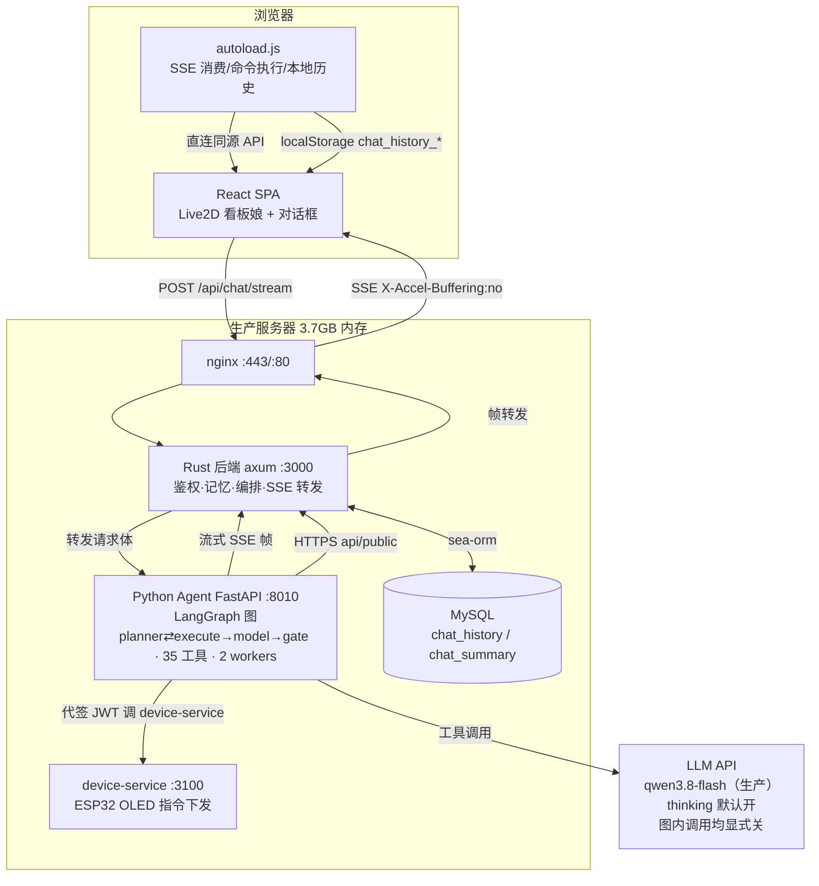
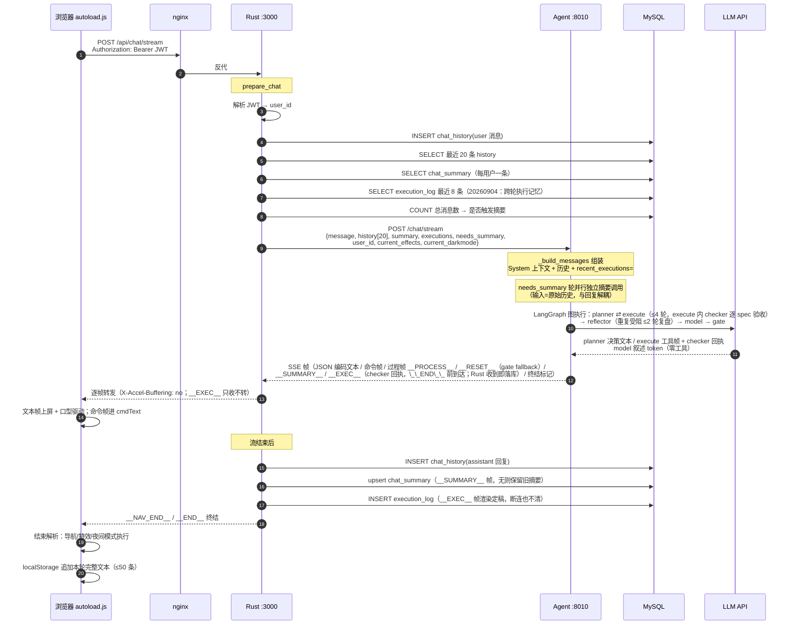
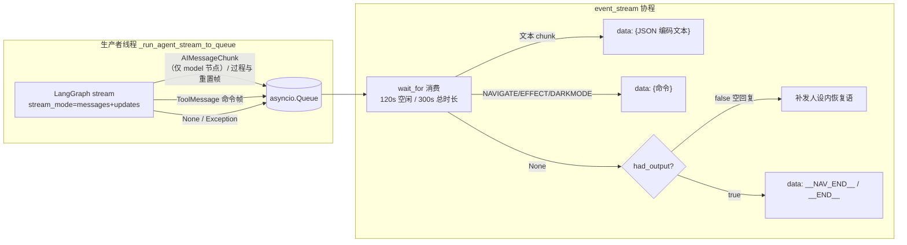
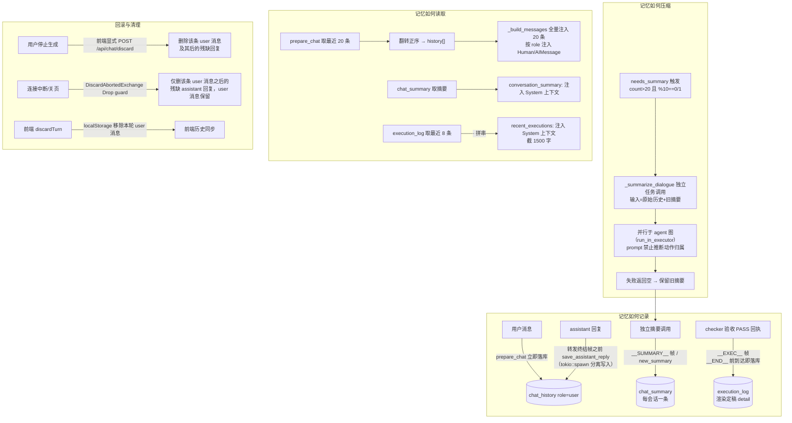
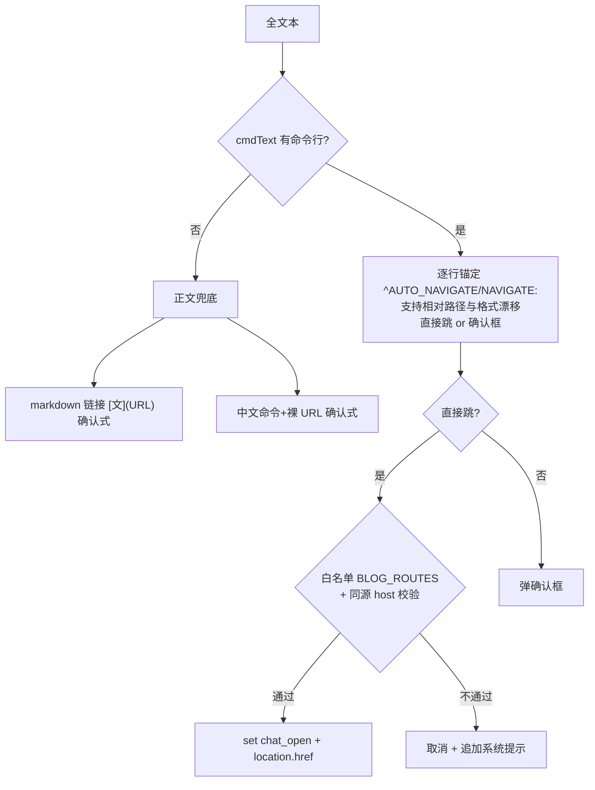

# Saudade Blog AI Agent（泠月喵）架构文档

> 面向维护者的全链路技术文档。覆盖看板娘对话系统的每一个环节：组件拓扑、一次对话的完整时序、
> 记忆机制（记录 / 压缩 / 存储 / 读取 / 回滚）、工具系统、防幻觉与可靠性加固、超时体系、配置与部署。
> 最后更新：2026-09-22（**20260922 标签/分类写能力补全**：①**写工具面从"三件"扩到"九件"**
> ——新增 `update_tag` / `delete_tag` / `create_category` / `update_category` / `delete_category`，
> 加上既有的 `create_tag` / `set_article_status` / `set_article_tags`（+ `list_admin_notes` 读侧），
> 工具总数 22 → **35**（含后台只读与侧任务工具），见 §5 / §5.3。
> ②**父标签 id 的真通道 = 名字通道**：planner 在写技能里写**名字**，工具在 execute 阶段用
> `agent/adminops.py` 的 `find_tag` 对着**实时标签字典**确定性解析成 id；解不出（查无此名/
> 歧义/层级不符）一律**响亮零写**，绝不猜、绝不新建。技能描述里 `$list_tags[N].tagKey` 形态的
> 示例已删（写轮永远满足不了它），`$ref` 机制本身保留。
> ③**解不出的引用必须响亮**：`agent/refs.py::resolve_args` 改**递归**（此前嵌套引用既解析不出、
> 又会让 `_confirm_popup` 拒绝签发令牌）；写技能分支引用一律**原样透传**（旧行为是把
> `"$list_tags[3].tagKey"` 静默变成 `None`、注记还肯定地写下「（一级标签）」）。
> ④父仓新增 `POST /api/protected/tag/move`（换父级 / 一级↔二级互转，原子、可逆）——
> **这是唯一能批量改写文章数据的在线接口**，边界见父仓 `docs/security-boundary.md`；
> id 策略 keepId 优先、不可证明安全时回落 newId（后者要重写 `note.tags`）。
> ⑤**技能名 ≠ 工具名**（分类三件：技能 `category_*` / 工具 `*_category`）——混用会产生
> "未知工具"错误帧、整轮零弹窗；已在 `test_tag_admin.py` ⑧ 用"工具名 ∈ 注册表"锁死。
> 验证：`test_tag_admin.py`（离线）+ golden 92 条（新增 4 条写类用例，**不做真写**）+
> 活体探针腿 ⑪–⑮（`eval/probe_admin_write.py`，统一"读到连接关闭才算干净收尾"）。
> 上版：2026-09-20（**20260920 七项**：①调用者身份与权限模型——新增 `agent/principal.py`
> （身份的唯一构造点）+ `agent/authz.py`（scope 词汇表 / 工具→scope 声明表 / 角色→授予表 /
> 唯一判据 `check()`），execute 在调用工具**之前**过判据，默认 shadow 只记不拦；角色只来自
> Rust 侧 60 秒身份断言的 `role` 声明，**role=None 即身份不明、零权限**（不默认放行）。
> 这是"秘书类功能"的地基，设计与前置需求见 `docs/secretary.md`。
> ②gate 命令前缀判据补**元讨论豁免**（提及 ≠ 发命令，前后端两侧配套：`_cmd_prefix_directive`
> ↔ `stripMentionSpans`）。③golden 补 `forbid_fallback` 正断言，堵住"走了兜底却判 PASS"的盲区。
> ④RAG 供给端候选**相对断崖**截断（`rag/search.py` 的 `_CLIFF_RATIO=0.25`，只截断不改排序）。
> ⑤**写操作的事前同意**（秘书前置需求 ③ 的 agent 侧）——权限之后再加一道确定性判据：
> 需确认的 scope（`CONSENT_SCOPES = {write.content}`）未获**用户本轮消息**明确确认 →
> 产 `__ERROR__: 待确认[consent_required]` 帧、**不调用工具**；用错误帧形态是为了让 gate
> 5a（错误帧 + 完成式声称 → fallback）自动生效，叙述侧说不成"已发布"。当前 38 个工具里
> 没有一个是 `write.content`，所以这条闸**空转**（等第一个写工具，声明表驱动、不用改代码）。
> ⚠️ 本轮排查出一个**静默安全事故**并已修：`graph.py` 顶部一旦写 `from __future__ import
> annotations`，注解变字符串 ⇒ langgraph 的 config 参数注入失效 ⇒ 节点内的断连/写操作检查
> **静默失效**（无报错，只有一条没人看的 UserWarning）；详见 `docs/问题记录.md` §1.3，
> 回归锁 = `test_authz.py` 第 ⑧ 节）。
> ⑥**两条侧任务收成模块**（`agent/moderator.py` / `agent/summarizer.py`，此前是 `server.py`
> 里的内联适配层、零测试、不可信文本裸插值）：各自带不可信输入围栏 + 输出白名单 + 明确
> 失败取向（审核 fail-open、摘要 fail-empty），`test_side_tasks.py`（48 项）进 CI 门禁。
> ⑦**超长文章分节渲染与按节取回**（新增 `agent/sections.py`，见 §5.2）——全文帧不再逐字
> 无声硬截断；`get_article_detail(section=…)` 提供取回手段；索引/渲染/取回三处共用同一套
> 节边界。回归锁 = `test_sections.py`（68 项）。
> 上上版：2026-09-19（**20260919 参数引用**：§6.5 新增 `$<工具>[<序号>].<字段>` 参数绑定——
> 下一步的参数取值由 execute 从结构化返回里绑，不再靠模型从 300 字截断帧里"读出来再抄"；
> 见 `agent/refs.py`、`AgentState.tool_data`、planner 规则 3b）。
> 更早：2026-09-03（**20260903 架构裁决同步——planner 全权**：§1/§3/§6.5 改为现行拓扑
> planner ⇄ execute → model → gate；reflector（LLM 质检 + REVISE）/ 自由 ReAct / tools_node 授权
> 执行已废除；历史机制描述均就地标注"20260903 前形态"保留为踩坑记录；§2 目录注释、§7 LLM 调用
> 清单同步；先前 0901-0902 状态（声称闸三族/时间锚/chat-* 拆分/生产模型）内容不变）。

---

## 1. 系统总览

博客的 AI 能力由 **三个独立进程** 协作完成，用户看到的"看板娘"是它们加一个前端脚本的合体：

- **React 前端**（浏览器）：看板娘 Live2D 形象 + 对话框 UI + SSE 消费 + 命令执行器。
- **Rust 后端**（axum，端口 3000）：鉴权、记忆落库、对话编排、SSE 转发、中断清理。**记忆的唯一权威来源**。
- **Python Agent**（FastAPI，端口 8010）：LangGraph 图执行（20260903 拓扑 planner ⇄ execute → model → gate，§6.5）、LLM 调用、38 个工具。**无状态**，记忆全靠请求体注入。
- **MySQL**：`chat_history`（消息流水）、`chat_summary`（每用户压缩摘要）。
- **device-service**（端口 3100，独立服务）：IoT 设备（ESP32 OLED）指令下发，agent 以对话用户身份代签 JWT 调用。



**核心设计原则**：Python Agent **不持有任何对话状态**（每请求独立 thread_id、进程内 MemorySaver 形同虚设），
一切连续性由 Rust 从 MySQL 读取后注入请求体实现。这是刻意的架构取舍——曾经 MemorySaver 线程累积导致
长对话上下文与 worker 内存无限膨胀，最终被整体抛弃（详见 §4.6）。

**关键设计决策速览**（每一条都是线上踩坑后的取舍，事故细节见 docs/问题记录.md）：

| 决策 | 取舍 | 踩过的坑（详见对应章节） |
|---|---|---|
| 记忆权威在 DB，agent 无状态 | 每请求独立 thread_id + 请求体注入 20 条历史 + 滚动摘要 | MemorySaver 线程累积 → 上下文/worker 内存无限膨胀（§4.6） |
| SSE 帧 JSON 编码 + `\n\n` 分隔 | 文本内换行不破坏帧边界；帧协议三端同步 | 曾按行分隔被文本换行破坏（§3.2⑤） |
| 摘要独立任务调用（模型对记忆无写权限） | 摘要由后端独立调用生成（与回复解耦），模型永不输出 SUMMARY 行 | 曾把摘要生成指令注入对话消息流 → 模型在回复里编造"成功调用工具"污染记忆（§4.3） |
| 决策-执行分离（20260903 planner 全权；曾用强制路由/模型自主调用） | planner 唯一决策（选技能/填参/给调用清单）→ execute 确定性执行 → model 零工具叙述 → gate 确定性检查收尾；前端命令白名单兜底保留 | 执行器自由度（自选工具/自拟参数/跳过检索直接答）是幻觉事故族根因——补检查无效，直接收走自由度（§6.5）；导航/显示强制路由历史见 §6.3 |
| 命令走"工具返回 → 独立帧 → 前端执行" | 模型只负责调工具，命令由前端按显式意图执行 | 模型"表演调用"把命令写进正文（§6.2） |
| 分层超时体系 | LLM 120s + 空闲 120s + 总时长 300s + recursion_limit 30 + 16 线程 | LLM 挂起占满线程池 → 全体对话排队卡死（§6.4） |
| 空回复/中断兜底 | 后端补发人设内恢复语 + Rust 空回复不存库 + 中断 Drop 清理 | qwen 偶发空内容 / 客户端中断 → 前端"卡死"表象（§3.2⑤⑦ §4.4） |

---

## 2. 组件与目录

> 本文档存放于 agent 仓库（`BigLeopardCat/saudade-blog-agent`）。除本仓库结构外，
> 全链路还涉及**宿主仓库 Saudade-Blog**（博客），以下标注 `Saudade-Blog/` 前缀的路径均相对其根目录。

```
本仓库（saudade-blog-agent）    # ★ Python Agent（独立 git 仓库，推送即 CI 评测门禁 + 部署；线上改动重启 systemd 服务生效）
├── server.py                  # FastAPI 入口：/chat、/chat/stream、/health；trace_id 中间件；流式编排
├── agent/
│   ├── graph.py               # ★ 手写 LangGraph 图（1427 行，20260912 拆分后）：State/契约/声称闸 + planner(唯一决策) ⇄ execute(确定性执行) → (reflector) → model(零工具叙述) → gate(确定性检查) + 条件边路由
│   ├── decisions.py           # ★ 确定性决策层（522 行，零 LLM）：快道（当前文章读取/特效切换/导航/屏幕显示）+ 动作意图扫描（intent_hints 原料）+ 检索候选裁决（标题相关性）+ 终局计划（轮次上限/复盘终局/拦截收尾）——被 graph.py 节点调用，反向外移函数按原名 re-export
│   ├── context.py             # 上下文组装（209 行，纯函数叶子层）：消息文本提取（多模态兼容）/page_ctx/页面操作指南（GUESTBOOK_GUIDE、SITE_GUIDE）/工具帧摘要/checker 回执摘要
│   ├── agent.py               # create_agent：手写图入口（build_graph，planner ⇄ execute → model → gate）
│   ├── memory.py              # get_checkpointer：MemorySaver 兼容存根（实际不承担记忆，见 §4.6）
│   ├── principal.py           # ★ 调用者身份（20260920）：Principal(uid, role, source)——身份的唯一构造点，秘书类功能地基（docs/secretary.md）
│   ├── authz.py               # ★ 权限模型（20260920）：scope 词汇表 + 工具→scope 声明表 + 角色→授予表 + 唯一判据 check()；默认 shadow 只记不拦
│   ├── skills.py              # ★ 技能注册表：20 技能静态定义（12 只读/动作 + 8 写技能，写技能带 roles=admin）+ NAV_MAP 导航映射（业务唯一数据源）
│   ├── adminops.py            # ★ 后台写操作域（20260921-22）：标签/分类索引与**名字→id 解析**（find_tag/find_category）+ 移动/降级校验（move_verdict）+ 确认卡文本 + 色名映射；能算的不交给 LLM
│   ├── refs.py                # ★ `$<工具>[<序号>].<字段>` 参数引用（20260919）：递归遍历 + 五个错误码——解不出的引用必须响亮（20260922 改递归）
│   ├── confirm.py             # ★ 待确认令牌（20260921）：无状态 HMAC（TTL 600s，2 worker 安全）；不落库、不落用户消息
│   ├── entities.py            # ★ 执行回执实体摘要（20260920）：压成一行供跨轮取值；digest 是 Python 写 / Rust 读的跨语言契约
│   ├── sections.py            # ★ 超长文章分节（20260920）：索引切片 / 帧按整节取舍 / `section=` 按节取回，三处共用一套节边界
│   ├── moderator.py           # 侧任务·审核：不可信输入围栏 + 输出白名单 + fail-open
│   ├── summarizer.py          # 侧任务·摘要：fail-empty
│   ├── hostinfo.py            # 本机运维读数（只读 /proc、systemctl、日志）——get_server_status / get_service_health 的数据源
│   ├── reports.py             # 四张后台报表的纯函数出口（数字在工具侧算好，不让 LLM 数数）
│   ├── prompts.py             # BLOG_ASSISTANT_PROMPT：猫猫女仆人设 + 叙述规则（model 零工具 narrator 用；工具调用规则在 planner/技能注册表侧）
│   └── __init__.py
├── rag/                       # ★ RAG 检索管线（20260830）：词法 2/3-gram BM25 内存倒排 + 10 分钟懒刷新，
│   │                          #   语料=线上可见文章（20260901 净化：说说/留言/公告移出检索池，走数据工具直查）；
│   │                          #   检索只定位（候选 type/id/标题/分），解读走 get_article_detail 全文
│   └── search.py              # RagIndex + search()；recall_eval 直接测本实现（评测即线上行为）
├── tools/
│   ├── base.py                # 35 个 @tool 工具（含 rag_search / get_article_detail 泛化 doc_type）+ _TOOL_REGISTRY + IoT JWT 代签 + 显示幂等去重 + trace_id 透传 device-service
│   └── __init__.py
├── models/
│   ├── llm.py                 # get_llm 工厂：provider 三选一（qwen/deepseek/openai）；enable_thinking 走 extra_body
│   └── __init__.py
├── config/
│   └── settings.py            # pydantic-settings：全部可配项（LLM/超时/JWT/device-service/trace_dir）
├── utils/
│   ├── logging.py             # trace_id contextvar + 日志（tid= 前缀，run_in_executor 靠 copy_context 传播）
│   ├── trace.py               # 对话 trace 落盘（logs/agent/traces/，节点事件 + 分段耗时 + 退出原因）
│   ├── helpers.py             # 通用工具函数
│   └── tts.py                 # edge-tts 语音合成（预留，TTS 未启用）
├── eval/                      # 评测：eval/golden/basic.jsonl（66 条）+ run_golden.py（L2 真实 LLM 端到端）
│   │                          #       + golden_case_runner.py / golden_full_run.py（进程隔离跑法）
│   │                          #       + recall_eval.py（L1 检索：recall@k/MRR，直接测 rag/search.py）
├── scripts/                   # agent_metrics（质量指标）+ nightly_regression（cron 每 4:00）
├── test_skills.py             # L0 单元级（技能注册表 + plan 契约，秒级，无 LLM）
├── test_authz.py              # L0 单元级（权限模型：scope 声明完备性 + 角色授予表 + 失败取向
│                              #   + 写操作的"人在回路"确认闸 + config 接线回归锁，秒级）
├── docs/                      # 本文档 + eval-observability.md + secretary.md（秘书框架与前置需求）+ 问题记录.md（踩坑史）
└── .env.example / pyproject.toml / uv.lock / .github/workflows/eval.yml（CI 评测门禁）

宿主仓库 Saudade-Blog（接口适配层，路径相对其根目录）：
Saudade-Blog/frontend/public/live2d-widgets/
├── autoload.js                # ★ 前端入口加载器（约 270 行）：脚本注入、initWidget 上游加载、错误上报——20260902 瘦身，对话核心已拆出
├── chat-stream.js             # ★ 对话主战场（20260902 拆分，体积最大）：SSE 流式消费 + 命令解析与执行
│                              #   （导航白名单 BLOG_ROUTES、cmdText、idleTimer 计时器、EFFECT、discardTurn/discard 实测集中于此）
├── chat-engine.js             # 对话引擎子模块（sendMessage / discardTurn 等）
├── chat-core.js               # 对话核心子模块（COMMAND_LINE_RE / cleanAgentText 等）
├── chat-render.js             # 渲染清洗子模块（__chatRenderMarkdown / cleanAgentText 等）
├── waifu.css                  # 看板娘与对话框样式（#waifu 高度锁死等关键防御）
├── waifu-tips.20260830.js     # 上游库（压缩）：initWidget、模型加载、quit/toggle 收起机制
├── waifu-tips.json            # 提示语配置
└── chunk/index.20260830.js + index2.20260830.js   # 模块图（级联重命名作 cache-bust，见 §8）

Saudade-Blog/frontend/src/components/Live2dAgent/index.tsx   # 注入 autoload.js（含缓存版本号 ?v=20260902a）

Saudade-Blog/src/routes/chat.rs             # Rust 侧：prepare_chat（记忆读写）+ 流式转发 + 中断清理
Saudade-Blog/src/routes/monitor.rs          # 前端错误上报端点（logs/frontend/monitor.log）
Saudade-Blog/src/entity/chat_history.rs     # 消息表实体
Saudade-Blog/src/entity/chat_summary.rs     # 摘要表实体
```

---

## 3. 一次对话的完整链路

### 3.1 时序总览



### 3.2 分段详解

**① 前端发起（前端脚本 `sendMessage`，20260902 起代码在 chat-* 子模块，autoload.js 只留加载）**

请求体携带 5 个字段：`message`、`current_url`（当前页面，供 agent 判断语境）、`page_title`、
`current_effects`（`window.__effectStateList` 实时特效状态，如 `sakura,rain`）、`current_darkmode`（`on|off`）；
JWT 走 **Authorization: Bearer** 头（`localStorage.tokenKey`），不在 body 里。**特效与夜间状态实时上报**——agent 以 context 为准、不依赖自己的调用记忆
（用户可能手动开关过）。无 token 时后端直接返回合规告知文案，不调 agent。

**② Rust prepare_chat（[chat.rs:180](Saudade-Blog/src/routes/chat.rs#L180)）——记忆的读与写**

按顺序做 6 件事：
1. 鉴权：解析 `Bearer` JWT（HS256，`auth_jwt::verify_token`），取 `claims.sub` 为 user_id。
2. **存用户消息**：`chat_history` 插入 `(user_id, role="user", content)`。
3. **读历史**：该会话按 `id` 倒序取最近 21 条（排除刚插入的当前条）再翻转正序取 20 → `history[]`。
4. **读摘要**：`chat_summary` 按会话取一条 → `summary`。
5. **读执行记忆**（20260904）：`execution_log` 按会话倒序取最近 8 条（detail 写时已渲染定稿，
   直取零映射）→ "· " 拼串 → `executions`。
6. **统计与清理**：COUNT 总消息数决定 `needs_summary`；超 `CHAT_HISTORY_LIMIT`（默认 500）删最旧。

组装请求体转发给 Agent（`user_id`、`history`、`summary`、`executions`、`needs_summary` 都在这里产生）。请求体上限 1MB（chat.rs `prepare_chat` 内校验）。

**非流式路径（/chat，内部与兼容用，看板娘走流式）**：Rust 调 agent `/chat`，传输层错误自动重试最多 3 次
（间隔 800ms），**超时不重试**——超时说明生成确实很慢（长回答单次可达 180s，reqwest 超时即 180s），
重试只会从头再生成一遍（chat.rs 非流式路径）。agent 端在 needs_summary
轮并行独立生成摘要，经 `ChatResponse.new_summary` 字段返回（与回复内容解耦，回复本身**不含** SUMMARY 行）；
Rust 再拼接命令行：EFFECT 追加到回复末尾、NAVIGATE/AUTO_NAVIGATE 前置到回复开头（server.py 收尾统一拼接），
命令拼接不受摘要影响。

**③ Python _build_messages（server.py:129 `_build_messages`）——上下文组装**

按顺序构造消息列表（角色按 history 原始 role 注入）：
1. **System 上下文**：`[System: user_id=…, page=…, title=…; current_time=…; current_effects=…; current_darkmode=…; conversation_summary: …; recent_executions: …]`
   放在**第一条**，是纯状态注记，模型禁止复述。其中 `current_time` 是**时间锚**（20260902 注入，与
   `get_current_time` 同格式 `%Y年%m月%d日 星期X %H:%M`）——模型对"现在几点/星期几"不再自行猜测；
   时间类询问由 planner 规划 content_query 点名 `get_current_time`（无参只读白名单 `_EXPLICIT_TOOLS`，
   见 §6.5）经 execute 执行，narrator 叙述纪律要求时刻/站内事实以工具帧或页面上下文为据、无帧不得
   自行声称（见 §6.5 model/gate）。`recent_executions=`（20260904，来自 body executions，截 1500
   字）是**本会话最近 8 条 checker 验收回执**——"质疑上轮执行是否属实"的唯一权威事实源（rule 6
   三分：真实性询问据回执零工具转述 / 无记录如实说 / 明确再次要求才重新执行），见 §6.5 跨轮执行记忆。
2. **历史**：`req.history[-20:]`（Rust 传的 20 条**全量注入**——20260828 起与 Rust 对齐，旧的"只取 12 条
   留余量"双魔数已废弃）逐条注入，assistant 消息以原生 AIMessage 角色注入、无 `[assistant]:` 文本前缀。
3. **当前用户消息**（对话内摘要指令已移除——摘要由后端独立任务调用生成，见 §4.3；显示类约束在
   prompts.py 系统提示词里，不注入消息尾部，见 §6.3）。

**④ LangGraph 执行（agent.py + server.py）**

手写图（agent/graph.py `build_graph`，**planner ⇄ execute →（reflector）→ model → gate**，见 §6.5），
无 checkpointer（线程 id 每请求 uuid，无状态累积；跨轮记忆在 DB execution_log，见 §4）。planner_node
首轮先判定**确定性快道链**（零 LLM：导航 → 显示 → 当前文章读取，命中即直接实例化计划、不调用
planner LLM，见 §6.5）。执行用 `stream(stream_mode=["messages", "updates"])` 双通道：
- "messages" 通道：**model 节点的** `AIMessageChunk` → 文本 token 逐块推入 asyncio.Queue
  （planner/model 之外的输出不会进对话；planner 是 invoke 非流式，其产物只有 plan 文本）；
  `ToolMessage` 工具帧 → **命令帧**：`NAVIGATE:`/`AUTO_NAVIGATE:`（导航）、`EFFECT:`（特效）、
  `DARKMODE:`（夜间）——**这是工具结果**，由前端执行。
- "updates" 通道：planner 节点更新 → **规划过程帧**（🧭 规划中/计划，计划含执行清单时追加
  🛠 正在调用工具…）；**execute 节点更新 → checker 验收回执**（`receipts` 累计语义，末批即本
  请求全量——producer 在流收尾、`None` 哨兵前发 `__EXEC__:` 帧给 Rust 落库，见 §4.1/§3.2⑤）；
  gate 节点更新 → 判定收尾（通过 → done=True + ✓ 质检通过；fallback → 发 `__RESET__` + ✗ 质检
  打回帧，并以 fallback 如实文本作最终回复，见 §6.5 gate/__RESET__）。
- **决策-执行-复盘循环**：planner 决策（给调用清单）→ execute 逐 spec 执行 + checker 验收 →
  `route_after_execute` 路由（本轮无受阻 → planner 看帧再决策 读全文/换词再搜/收尾；受阻首现 →
  planner rule5 改参重试；同一 spec 重复受阻 → reflector ≤2 轮 LLM 复盘 → ISSUE 回 planner 或
  确定性终局）→ … → 收尾轮（调用清单空）→ model 叙述 → gate 检查 → END；planner ⇄ execute
  循环 ≤ `MAX_PLAN_ROUNDS=4`，超限 `_terminal_plan` 确定性强制收尾（reflector 预算耗尽同）；
  外层 `recursion_limit=30` 仍作兜底（§6.4）。trace 分段耗时按 planner/execute/reflector/model/
  gate 五段落盘（reflector 未触发时该段无记录）。

**⑤ 流式帧协议（server.py:472 `event_stream`）**



- **帧分隔 `\n\n`，文本 JSON 编码**（防文本内换行破坏帧边界）。
- **命令帧同时进 nav_line**（用于终结标记：只要有任何命令帧——导航/特效/夜间——就发 `__NAV_END__`，纯文本轮发 `__END__`）。
- **超时双保险**：空闲 120s（每帧重置）+ 总时长 300s（不重置）→ 超时发 `__ERROR__:...` 帧终止。
- **空回复兜底**：整轮无任何输出帧（qwen 偶发空内容）→ 补发 `_RECOVERY_SENTENCE`（人设内恢复语），
  前端不会静默"卡死"。
- **生产者取消**：客户端提前断开（abort/关页）时 `finally` 取消尚未完成的线程池生产者任务，
  避免队列与线程空转 [server.py:622-626](../server.py#L622-L626)。

**⑥ Rust 转发（chat.rs:471 `chat_stream_handler`，旧名 body_stream 已更名）**

`find_frame_end` 逐帧切分 → 终端标记（`__END__`/`__NAV_END__`/`__ERROR__`）原样转发 → 文本帧 JSON 解码后
**累积进 reply 变量**（供流结束存库）→ 原样转发。上游中断且未收到终结标记 → 补发
`__ERROR__:"与 Agent 的连接中断"`（否则前端无法区分静默截断），**但已累积的回复仍会正常存库**
（客户端未断开时，残缺回答保留供上下文参考）。响应头带 `X-Accel-Buffering: no`
（防 nginx 缓冲 SSE 到结束才下发）。

**⑦ 前端消费（chat-stream.js/chat-engine.js，20260902 拆分后代码在 chat-* 子模块）**

- 文本帧：`textContent` 直写（流式阶段 pre-line 换行）→ 300ms 口型翻转（`__mouthOverride`）。
- 命令帧：按 `COMMAND_LINE_RE` 匹配进 `cmdText`（**不显示**），流结束统一解析执行（§6.2）。
- 终结：完整文本（cmdText + 文本）→ `cleanAgentText` 剔除命令行与 SUMMARY 残留（防御性——正常已不会出现，防注入诱导）→ markdown 渲染
  （复用博客 `__chatRenderMarkdown`）→ localStorage 追加（≤50 条）。
- 双计时器（idleTimer 60s 空闲 / 300s 总时长；20260830 从 45s 调到 60s——45s 曾误杀慢生成 118s/146.9s），
  abort 时 UI 3s 内强制恢复。

---

## 4. 记忆机制（重点）

### 4.1 概述

**记忆分四层，各司其职**：

| 层 | 载体 | 作用 | 上限 |
|---|---|---|---|
| 跨请求长期记忆 | MySQL `chat_history` + `chat_summary` | 对话连续性 | 500 条流水 + 1 条摘要/会话 |
| **动作执行记忆（20260904）** | MySQL `execution_log` | **已执行动作的系统确认事实**（checker 验收回执） | 不设上限（随会话删除级联清理） |
| 请求内短期记忆 | 请求体 `history[]` + `summary` + `executions`（注入 System 上下文） | 模型可见窗口 | Rust 取 20 条历史 + 最近 8 条执行回执 → 全量注入 |
| 浏览器本地记忆 | `localStorage chat_history_{tokenKey}` | 前端展示完整记录 | 50 条 |



### 4.2 记录：什么时候写、写什么

- **用户消息**：Rust `prepare_chat` 在**转发 agent 之前**就落库（chat.rs `prepare_chat` 内）——即使 agent 失败，用户消息也保留。
- **assistant 回复**：流结束（收到终止标记或上游中断）后 `save_assistant_reply`（[chat.rs:323](Saudade-Blog/src/routes/chat.rs#L323)）：
  - 流式路径从 `__SUMMARY__` 帧取独立摘要（见 4.3），**回复本身不含任何 SUMMARY 行**；
  - 存 `(role="assistant", content=回复全文)`；
  - **空回复不存库**（`if !reply.is_empty()`），这是"卡死"表象的来源之一——前端靠 §3.2⑦ 的兜底感知。
- **动作执行回执**（20260904）：execute 内 checker 判 PASS 的 spec 累计为 receipts → producer 流
  收尾发 `__EXEC__:` 帧（`__END__` 之前）→ Rust 渲染定稿（动作词 + 「」内容，写时一次、读时零
  映射）插入 `execution_log`。**独立于回复文本与 __RESET__**：被 gate fallback 否定叙述的那轮，
  其已验收执行照样落库（回执是已发生事实）；断连/中断（DiscardAbortedExchange）也只弃残缺叙述，
  不删 execution_log 行。执行记忆与 chat_history 的语义分界：历史回答"聊了什么"，execution_log
  回答"做了什么"——后者经 `recent_executions=` 注入后让"质疑上轮执行"有系统确认事实可依，不再
  依赖 narrator 的自述（模型叙述不可信，20260902 双向失真实证）。
- **前端**：每轮结束把**完整文本（含命令行）**存 localStorage——与后端历史一致（命令行随后端历史渲染时被 `cleanAgentText` 过滤）。

### 4.3 压缩：摘要机制全流程

> **2026-08-26 摘要独立化改造**：模型对记忆**无写权限**。旧方案把摘要生成指令注入对话消息流、
> 模型在回复末尾输出 `SUMMARY:` 行、后端双端剥离入库——曾实测模型在无工具轨迹的轮次编造
> "助手成功调用工具"污染记忆（摘要与回复耦合在同一生成调用，模型把摘要当"总结本轮"顺手美化）；
> 且摘要指令与显示强化指令共用 `<系统内部指令-仅供执行` 标记，导致显示请求被 reflector 误判
> REVISE 白烧一轮 LLM。现方案两者一并移除，摘要由后端独立任务调用生成。

**触发条件**（[chat.rs:255](Saudade-Blog/src/routes/chat.rs#L255)）：`total_count > 20 && (total_count % 10 == 0 || total_count % 10 == 1)`。
即从第 21 条起，每 10 条触发一次（21、30、31、40、41…）。计数含 user + assistant 全部消息。

**独立任务调用**（server.py `_summarize_dialogue`，仅 needs_summary 轮触发）：
- 输入 = **原始历史**（`{"访客"/"助手"}: {content}` 行）+ 本轮 `访客: {user_msg}` + 旧摘要；
- prompt 硬约束：只总结客观内容，**不得推断动作归属，不得编造**；旧摘要中的相关事实必须保留
  （滚动式压缩，不丢旧信息）；
- `enable_thinking=False`（与图内其他 LLM 调用同理：thinking 会占满 max_tokens 致 content 空）、
  `max_tokens=256`；
- `run_in_executor` 与 agent 图**并行**（零额外延迟）；**失败返回 "" → 保留旧摘要**（静默降级，不阻塞对话）。

**结果传输（双路径，Rust 入库）**：
- 非流式 `/chat`：`ChatResponse.new_summary` 字段随响应返回；
- 流式 `/chat/stream`：agent 在 `__END__` 帧**之前**发 `data: __SUMMARY__:{"json字符串"}\n\n`
  ——不终止流、不进回复；Rust 循环里解析该帧存入 `summary_override`，**转发终结帧之前**
  连同回复一起交给 `save_assistant_reply`（`tokio::spawn` 分离写入——客户端见到 `__END__`
  就断开也不丢，落库顺序契约见下）（[chat.rs](Saudade-Blog/src/routes/chat.rs)）。
- **落库顺序契约（20260920）**：流式路径的收尾写入一律在转发终结帧（`__END__`/`__NAV_END__`/
  `__ERROR__`）**之前**发起，且用 `tokio::spawn` 从生成器生命周期里摘出来；`__EXEC__` 回执
  帧收到即写（不再攒到收尾）。此前顺序相反：客户端一见 `__END__` 就断开 ⇒ 响应体 future
  被丢弃 ⇒ 尾部 await 跑不完 ⇒ 回复与执行回执双双丢失（流式探针实证；真实浏览器读连接
  关闭不受影响）。
- **约定**：`__SUMMARY__` 帧必须出现在终结帧之前，否则视为无摘要。

**存储**：`chat_summary` 每用户一条，`upsert`（存在则 update，否则 insert），`message_count` 记录触发时点，
供诊断摘要新鲜度。无 `__SUMMARY__` 帧/空摘要时**不覆盖**旧摘要。

**读取**：prepare_chat 每次请求读摘要 → 注入请求体 → `_build_messages` 放进 System 上下文首条。

**双端剥离代码已整体删除**（server.py `_strip_summary_from_reply` / `_looks_like_summary_paragraph`、
chat.rs `strip_summary_from_reply` / `looks_like_summary_paragraph` / `summary_tests`）——不再需要
任何"从回复里找摘要"的特征代码，结构上杜绝摘要泄露给访客。

### 4.4 回滚机制：有没有？

**没有对话级"撤销/回滚"功能**（不存在"撤回上一条回复"或时间旅行恢复）。系统层面只有两类清理：

1. **主动停止（POST /api/chat/discard，[chat.rs:115](Saudade-Blog/src/routes/chat.rs#L115)）**：前端停止按钮
   （chat-stream.js）中断流后显式调 discard 端点——**全删语义**：删除该条 user 消息及其后的残缺回复
   （20260828b 起支持带 `text` 原文校验防误删）。效果：**被终止的对话不进记忆**（不污染 history 窗口与摘要）。
2. **中断清理（DiscardAbortedExchange Drop guard，[chat.rs:437](Saudade-Blog/src/routes/chat.rs#L437)）**：
   客户端在**流未正常收尾**时被动断开（关标签页、断网——主动停止走上面的 discard 端点）→ SSE 生成器被
   取消 → `Drop` 触发 → 异步删除该条 user 消息**之后产生的残缺 assistant 回复**（id 单调递增；
   **user 消息本体保留**——20260829 起语义，"这次提问已发生"不被抹掉）。正常收尾由 `done` 原子标记关闭清理。
3. **前端丢弃（discardTurn，chat-engine.js/chat-stream.js）**：用户停止生成后，localStorage 移除本轮 user 消息 + 重绘；
   3s 强制恢复保险（abort 未触发 catch 时兜底清理）。

另外两个"防污染"机制：
- **设备显示幂等去重**（tools/base.py）：同一用户 30s 内相同显示内容只下发一次——防 MQTT QoS1 重投、模型失败重试与多轮重复调用的重复下发（20260828 后显示走单一工具路径，无强制路由双调场景）。
- **保留策略**：`CHAT_HISTORY_LIMIT=500` 超出删最旧（§4.5）。

### 4.5 存储与清理

- `chat_history`：`(id, user_id, role, content, created_at)`，按 user_id 分片；500 条上限，超限按 id 升序删最旧。
- `chat_summary`：`(id, user_id, summary, message_count)`，每会话最多一条。
- `execution_log`（20260904）：`(id, user_id, conversation_id, skill, detail, created_at)`，
  `detail` 为渲染定稿（动作词 + 「」内容，≤300 字），`KEY idx_conv_id(conversation_id, id)`。
  **读取**：prepare_chat 每请求按会话倒序取 8 条（索引走 idx_conv_id）。**清理**：无条数上限，
  随会话删除在 delete_conversation 事务内级联（会话没了 execution_log 无读取路径，不留孤儿）；
  断连/discard 刻意不清（执行是已发生事实）。
- **为什么不删摘要**：摘要滚动合并（4.3），永远保留最新压缩态；500 条流水删掉的不影响连续性（窗口只看最近 20 条）。

### 4.6 MemorySaver 为什么不承担记忆

`agent/memory.py` 返回 `MemorySaver`（进程内），但 **server.py 每请求生成全新 thread_id**
（`user_{id}_{uuid4().hex[:8]}`）——跨请求永不命中同一线程，MemorySaver 实际上**从未积累过任何状态**；
手写图（graph.py）已完全不挂 checkpointer，memory.py 是无人引用的兼容死代码（保留以防旧代码误用）。
历史教训：曾经复用线程累积，长对话（教程连载）导致输入上下文与 worker 内存无限膨胀直至截断/被杀，
于是改为"每请求独立线程 + DB 注入"。**线程复用是禁区，恢复即重蹈覆辙。**

### 4.7 无状态图能不能"中途暂停等用户决定"？（20260920 回答）

**结论：能在回合边界暂停（现在就够用），不需要 checkpointer；"回合内部"暂停才需要，而我们的图里
那个点已经被抬到回合边界了。**

先把问题拆开——"停下来等用户决策"有两种，成本差一个数量级：

- **形态 A：确定性的"待确认动作"协议（现在就能做，零新依赖）**。回合内**不**真暂停：系统在
  执行前发现"这一步需要用户点头"，就产一条 `__ERROR__: 待确认[…]` 帧、**不执行**，把待办动作
  写进回复与回执，回合正常结束。下一轮用户说"确认"，planner 据**结构化数据**重建那条调用。
  §6.5 的写操作同意闸就是这个形态（`consent_required`）——它之所以天然正确，是因为按 20260903
  的裁决**执行是确定性的、planner 全权**，回合内唯一"需要人"的点就是"写之前的同意"。
  用户担心的"重跑一轮会丢失本来的意图"，风险不在无状态，而在**意图的重建是否可靠**：靠模型从
  上一轮回复文本里读回来，就会丢；把待确认动作做成**一等数据**（像 `receipts` / `digest` 那样
  落 `execution_log`，下一轮按会话注入、一次性消费、带过期）就不会丢。⚠️ 这正是 20260920 修过
  的那类 bug：`AgentState` 缺 `fallback_text` channel ⇒ RESET 自 20260903 起静默从未发出——
  **加通道时必须同时加"读侧真的读了"的断言**，否则又是一个静默失效。
- **形态 B：真正的 `interrupt()` + 持久 checkpointer（引入成本，暂不做）**。用 langgraph 的
  Interrupt/`Command(resume=…)` 需要 checkpointer 持久在 DB/文件（`MemorySaver` 不行——进程内，
  我们的 systemd 服务每次部署都重启，"暂停"会变成"状态消失"）。真实的代价清单：
  ① **两份真相**：记忆权威在 Rust/MySQL（§4.1），checkpointer 会把同一份状态复制进图状态——
  这正是 MemorySaver 被弃用的原因，复制就会漂移；② **thread_id 必须 = conversation_id**，
  会话删除/整理要级联清 checkpoint（我们已有 DELETE 级联的先例，可照做）；③ **写入放大**：
  每一步一份 checkpoint，而我们的 state 里有 `tool_data`（工具返回原文，可能几十 KB 的全文帧）；
  ④ **版本漂移**：图拓扑或 state schema 一改，旧 checkpoint 恢复失败——要有版本号与"过期即丢"
  的降级；⑤ **外部状态无事务**：Rust 侧 history/execution_log、前端 UI、断连中断都是进程外事实，
  恢复点与它们之间没有事务，可能读到互相矛盾的事实；⑥ **与断连语义冲突**：今天是"用户走了就
  `stop_event` 取消"（§3 断连中断），而 B 要的是"用户走了保存下来等他回来"——这是一次语义改写，
  不是加个参数。**触发条件**（到那时再上，且用 SQLite/DB checkpointer 而非内存）：出现"需要在
  **任意中间步**选择、且选择会改变后续多步结构"的任务（长流程编排、多轮填槽表单），且这个需求
  被真实用户提出过。在那之前，形态 A 覆盖"要不要发这条 / 选哪个候选 / 二选一确认"这类**有限、
  可枚举**的决策。

---

## 5. 工具系统（40 个）

| 分类 | 工具 | 行为 |
|---|---|---|
| 文章/笔记 | `list_notes`、`search_notes`、`get_article_detail`、`get_top_notes` | 调博客 `api/public` 接口（`get_article_detail` 可按 `section` 取单节，见 §5.2） |
| 检索 | `rag_search` | BM25 词法检索（行式候选 type/id/标题/分；20260901 语料净化仅收文章，说说/留言走数据工具） |
| 分类/标签 | `list_categories`、`list_tags` | 同上 |
| 公告 | `get_announcements` | 同上（写侧见 §5.4） |
| 留言板 | `list_guestbook` | 读 `/api/public/board`（河灯留言；写侧见 §5.5） |
| 说说 | `list_talks` | 读 `/api/public/talk` |
| 站点信息 | `get_blog_info`、`get_social_links`、`get_site_map` | 作者信息/社交链/功能地图（静态） |
| 知识库 | `search_knowledge_base` | 读 `/api/public/knowledge` 本地过滤 |
| 时间/天气 | `get_current_time`、`get_weather` | 本地时间；wttr.in |
| 聊天历史 | `get_chat_history` | **占位**：提示"历史已自动注入上下文"（防模型以为要自己查） |
| 导航 | `navigate_to(path, confirm)` | 返回 `NAVIGATE:https://…`（confirm=true）或 `AUTO_NAVIGATE:https://…`（confirm=false） |
| 特效 | `toggle_effect(effect, action)` | 返回 `EFFECT:{effect}:{action}`，前端按显式意图执行 |
| 夜间模式 | `toggle_dark_mode(mode)` | 返回 `DARKMODE:{mode}` |
| IoT 设备 | `list_devices`、`device_oled_display` | 代签 JWT 调 device-service；支持自动选在线设备、幂等去重 |
| 后台只读（admin） | `list_admin_notes`、`get_server_status`、`get_service_health`、`get_moderation_status`、`get_user_stats` | **以发起人身份代调** `127.0.0.1:3000` 的受保护接口（现签 60 秒 JWT）；scope `admin.console`，进 `_HARD_SCOPES`（非 admin 结构上够不到）；`list_admin_notes` 是草稿/私密文章的**唯一可达读口** |
| 后台写（admin） | `create_tag`、`update_tag`、`delete_tag`、`create_category`、`update_category`、`delete_category`、`create_announcement`、`update_announcement`、`delete_announcement`、`audit_board_comment`、`delete_board_comment`、`set_article_status`、`set_article_tags` | scope `write.console`（`_HARD_SCOPES` + `CONSENT_SCOPES`）；**只能由写技能模板展开**——`PARAMS.calls` 名单里没有它们，越权清单在技能白名单那一步就被剥掉；三道门见 §5.3；身份/目标的地基见 §6.6 |

**工具 → 命令 → 前端执行**是核心交互模式：工具返回带前缀的**命令字符串**，Python 识别后作为独立 SSE 帧
转发，前端解析执行。**不是**让模型把命令写进正文——正文里的命令会被 `cleanAgentText` 当幻觉剔除
（除非命中 §6.2 的兜底解析）。

### 5.1 IoT 工具细节（device_oled_display）

- **用户身份**：`RunnableConfig.configurable.user_id`（server.py 注入）→ 工具用**博客同一个 JWT_SECRET**
  代签 5 分钟有效 HS256 JWT（sub=user_id）→ device-service 校验，保证用户只能操作自己的设备。
- **device_id 可省略**：自动选该用户第一个在线设备——多步工具链（先 list 再操作）是 IoT 工具失败的
  结构性原因（模型无法从 schema 知道运行时才有的 device_id，参数缺失时倾向文本声称），单步化后一次调用即成功。
- **约束**：text ≤ 64 字符；30s 同内容去重；404 = 设备不存在或不属于当前用户。

### 5.2 超长文章：分节渲染与按节取回（20260920）

**问题不是"截断"，是"无声"**：`get_article_detail` 的全文帧超上限时按字符硬截，正文在一句话
中间断掉，模型看不到"后面还有内容"、更看不到"缺的是哪几节"。实测站内最长文章 note 19
= 25,445 字（详情 dict 的 repr 52,834 字——同一篇正文在 `noteContent` 与 `content` 两个键里
各存一份），上限 20,000 ⇒ **§7-§10 四个整节从未进过任何一轮上下文**，而模型唯一的表述是
"文档里没写"。旧实现还有两个更隐蔽的坑：repr 里换行是**字面 `\n`**（52834 字里真换行 0 个），
按 `^#{1,3}` 切节会切出 0 节——"按小节告诉模型缺了什么"这件事在 repr 上根本做不出来。

`agent/sections.py`（纯函数，无 IO 无 LLM）一条实现、三处共用：

| 消费方 | 用途 |
|---|---|
| `rag/search.py::chunk_note` | BM25 索引切片（**只是转发**，只认 1-3 级、短文 <2000 不切都保持原样） |
| `agent/context.py::_frame_texts` | 超限帧按**整节**取舍：装得下的整节保留，装不下的整节列在文末 |
| `tools/base.get_article_detail(section=…)` | 按节取回被略去的那一节（三级指称：标题全称 / 编号"9" / 唯一子串；不唯一 → 返回候选清单而不是赌一个） |

数据不变式：**"读到的一节"必须与"索引里的那一节"完全同边界**——三处各写一份切分逻辑，
下场就是同一篇文章在检索里叫 §9、在取回时找不到 §9（本文件 §5.2 与 `test_sections.py` ① 锁住）。

渲染侧帧长这样（实测 note 19，19,702 字 ≤ 20,000 上限）：

```
工具 get_article_detail 返回（原文 52834 字，超单帧上限，已按小节节选；未展开的小节见文末清单，可按需再读）: {'noteKey': 19, 'key': 19, 'noteTitle': '…', …}
正文：
## 1. 系统总览
…（§1-§6.3 整节在）
**以下小节尚未展开**：§6.4 生成有界性 / §6.5 技能注册表 + 受限规划 / §7. LLM 与配置 / §8. 前端看板娘 / §9. 部署与运维 / §10. 已知边界与坑
（要读其中某一节：再调用一次 get_article_detail，带上本帧开头的 noteKey 与 section="<上面的小节名或编号>"，即可取回该节全文。）
```

配套：planner 规则加一条「超长文章按节补读」（**"只带回前几节"不等于"文章里没有"**）、
narrator 加纪律 14（未展开的小节**没有读过**，不得引用、不得声称"全文都看了"，被问到就
如实说可以再取一次）、trace 的 `planner.llm_done` 落 `frames_chars`（单帧上限 20000 是经验值，
没有真实体量就无从判断该收该放）。退化路径都**有声**：无小节结构或单节自己就超上限 → 退回
头截断并带上原文总长与成因。

### 5.3 标签/分类写（20260922）：名字通道 + 响亮 + 一个原子移动端点

**起点是一次线上事故**：用户说「把已有标签 Asyncio 改成编程的子标签」，六轮全错。归因四层里
**三层是能力缺口**：① 写技能的可选参数把解不出的 `$ref` 静默当成"没填"，注记还肯定地写下错误
事实「（一级标签）」；②「建二级标签」结构性不可达——写轮只能展开自己的模板（点不了 `list_tags`），
而跨轮执行记忆的标签摘要只有名字与篇数、**没有 id**；③ **根本没有改标签/删标签/碰分类的写工具**
⇒「改成某标签的子标签」被 `create_tag` 的"已存在就复用"吸收成 no-op，用户以为改完了。

| 能力 | 工具 | 端点 | 要点 |
|---|---|---|---|
| 建标签（一级/二级） | `create_tag(title, parent_tag?, color?)` | `POST /api/protected/tagone` / `tagtwo` | 先查后建 + 建后复核；`parent_tag` 是**名字** |
| 改标签（改名/改色/换父级/换层级） | `update_tag(name, level?, new_title?, color?, parent_tag?, to_level?)` | 有 `parent_tag`/`to_level` → `POST /api/protected/tag/move`；否则 `PUT /tagone|tagtwo/:id` | PUT 的 title/color **都是必填**：只改名时必须把**当前色**从索引原样回传（不猜） |
| 删标签 | `delete_tag(name, level?)` | `DELETE /api/protected/tag` | 删除触发**全表** `prune_note_tags`（把引用从所有文章上摘掉），**不可回滚** |
| 建/改/删分类 | `create_category` / `update_category` / `delete_category` | `POST /api/protected/category`、`POST …/category/:id`、`DELETE …/category` | 建分类**不回 id**（复核靠重拉列表按名找）；改分类**空串 = 不改**，只传点名字段；删分类是 `ON DELETE SET NULL`（文章失去分类） |

**② 父标签 id 的真通道 = 名字通道**（用户拍板"给条真通道，否则把技能描述里的引用写法先删掉"）。
planner 在写技能里写**名字**——人嘴里说的就是名字，跨轮执行记忆里也只有名字；工具在 execute 阶段
用 `agent/adminops.py::find_tag` 对着**实时标签字典**（`_tag_index`，admin 鉴权、`uid<=0` fail-closed）
确定性解析成 id。解不出就**响亮零写**：唯一命中才动手；命中多个（不同父下的同名二级）→ 追问并列出
候选；一个都没有 → 如实说"站内没有这个标签"——**绝不猜、绝不顺手新建**（"新建一个"正是事故形态）。
目标/父标签/子标签名单取自**同一次索引快照**（`index=` 参数一路透传），避免中途字典变化导致
"目标存在但父不存在"。技能描述里 `$list_tags[N].tagKey` 形态的示例**已删**，并写明边界：写轮看不到
标签 id、名字对不上系统会如实告诉你，**别改用 `create_tag` 蒙一个**。

**① 解不出的引用必须响亮**（三处）：`refs.resolve_args` 改**递归**（`has_refs` 本来就是递归的，
嵌套引用此前既解析不出、又会让 `_confirm_popup` 拒绝签发令牌）；写技能分支引用**原样透传**给
execute 去报错误码，不再静默变 `None`；注记只写已知事实（层级未知时不许写「（一级标签）」）。
回归锁 = `test_skills.test_write_ref_loud` + `test_refs` 嵌套用例 + 探针腿⑮。

**Rust 侧新增 `POST /api/protected/tag/move`**（父仓，20260921 上线）：换父级与一级↔二级互转是
一次原子移动，而不是"删了重建"（删除会触发全表 `prune_note_tags`）。id 策略**keepId 优先**
（目标表 PK 不撞 + 可证明安全），**不可证明时回落 newId**——`note.tags` 的重写按数值解析重拼
（**绝不 `String::replace`**、绝不 `LIKE '%1%'`），并**显式保留 `updated_at`**（否则被重写的文章会
集体跳到列表最前）。两条硬拒：**自环**（`fatherTag == id` 会让 `ON DELETE CASCADE` 把刚插入的行
一起删掉——事务成功提交、标签彻底消失）、**降级但还有子标签**（拒并如实报数）。
探针实测：真实标签「Python」id=5 带文章 [19,23]，编程 → 摄影 → 编程往返后 **id 与 `note.tags`
一字未变**；id ≥ 10000 的新二级标签升级走 newId 路径（旧 10000 → 新 22）。

**验证（三件套，口径不同）**：`test_tag_admin.py`（离线、秒级、进 CI：名字解析四态 / 六工具 args
组装与成功判据 / `_admin_request` 的 PUT-DELETE 形态 / **工具名 ∈ 注册表**——技能名 `category_*`
与工具名 `*_category` 不同名，混用会产"未知工具"错误帧、整轮零弹窗）；golden 新增 4 条
（`admin_tag_move_popup` / `admin_tag_delete_popup` / `admin_category_create_popup` /
`admin_tag_move_question_no_popup`，**一律零真写**）；探针腿 ⑪–⑮（`--allow-write`，断言读**后端
真值**，不读工具回执）。**探针通用纪律**：所有腿统一**读到连接关闭**才判定——
`__END__` 即断会丢尾部执行记录，20260921 实测的 `route_after_execute` 缺映射表那次，就是
"库真值改了 + 回执落了库 + 前端只看到一行报错"却仍被判 PASS（腿⑧ 的旧盲区）。

### 5.4 公告写（20260922）：全站可见的写面，同意快道**结构性关闭**

代发/修改/删除站内公告（`create_announcement` / `update_announcement` / `delete_announcement`，
scope `write.console`）。公告是**对全体访客说的话**，因此比其它后台写多两道限制：

- **快道关掉**：其它控制台写有"用户把话说成命令 ⇒ 同轮即视为确认、直接执行"的捷径
  （`_CONSOLE_VERBS` + 命令骨架）；`_ALWAYS_CONFIRM_TOOLS` 把这三件**结构性**排除在外——哪怕
  「发个公告说今晚维护」是教科书式命令，也**照弹确认框**（内容会显示在框里等主人过目）。
  离线锁 `test_authz`（同一句话对别的后台写仍判命令 ⇒ 收窄只落在公告三件上），探针腿⑯ 实测
  三种措辞都弹框。
- **正文不许代笔**：正文只写主人说过的内容，缺正文就追问，**绝不替他补一句**（`_expand_write_skill`
  的公告分支零工具收尾）。

| 端点事实（三条，都踩过） | 处置 |
|---|---|
| `POST /api/protected/announcements` **只返回字符串 `"Created"`，不回 id** | 建完重拉列表，按 **id 差集 + 标题与正文都对上** 认领新行；认不出就 `unavailable`（"未确认生效"，checker BLOCK、不进跨轮执行记忆） |
| `PUT` 的 `title`/`content` **都是必填** | 只改一项时，另一项从**同一次索引快照**原样回传（同 `update_tag` 的"当前色原样回传"） |
| `DELETE` body 是**裸 `Vec<i32>`**，且**删不存在的 id 静默成功** | 删后重拉，要求 id **确实消失**才算成功——静默 no-op 不许说成"已删除" |
| 没有唯一约束、没有草稿态 ⇒ **目标身份只有标题** | 按标题解析（`_find_named_announcement`）：唯一命中才动、多条同名→零写并列出候选（带 id 与时间）、查无此名→零写如实说 |

### 5.5 留言复核与删除（20260922）：靶子是**访客**写下的东西，身份只有正文

人工复核（驳回/隐藏、通过/放行）与删除河灯留言（`audit_board_comment` / `delete_board_comment`，
scope `write.console`，技能 `board_audit` / `board_delete`）。与标签/公告族最大的差别：
**留言没有标题也没有名字，正文片段就是它唯一的身份**——而片段是主人嘴里转述出来的。

| 端点事实（都踩过） | 处置 |
|---|---|
| 审核请求体是 **0/1**，DB 落库值是 **1/2** | 两张表**分开**（发 `2` 会被端点读成「通过」——方向正好相反） |
| 删除对**不存在的 id 静默 no-op** | 删后读不回就等于没删掉：不作成功（`unavailable`），绝不说"已删除" |
| 清单读不到（无身份/端点失败） | 单独一种说法——「**未能核对上**站内具体是哪一条」，不许说成"站内没有这条" |
| 目标 = 正文片段的**唯一子串**命中 | 撞车（两条都含这段）→ 零写并列出候选；查无此句 → 零写如实说没有 |
| 弹窗问句 | 写明 **#id + 原文 + 作者 + 当前状态**；核对不上时如实标注（回执行渲染只认 `#id` 与作者，**绝不把留言正文写进 `detail`**——300 列宽 + 跨轮记忆窗口） |

- **删留言进 `_ALWAYS_CONFIRM_TOOLS`**（第六轮补）：动的不是主人的东西——那是**访客写下的
  内容**，而且删了没有回收站；**审核不进**：它可改判（驳回的能再放行）、改的只是可见性，与
  `set_article_status` 同类 ⇒ 走既有的"命令式措辞才免问"，判不出来照旧弹窗（fail-closed 不变）。
- 主体身份仍由 §6.6 的片段地基兜底：planner 填错/填短片段时**先校正再看预检**。

---

## 6. 防幻觉与可靠性加固（踩坑沉淀）

### 6.1 状态感知：以 context 为准

`current_effects` / `current_darkmode` 由前端**实时**上报（用户可能手动开关过、夜间自动切换过），
prompt 明确要求 agent 以 System 上下文为准、不依赖调用记忆，状态一致时不重复调工具。

### 6.2 前端命令执行器（autoload.js）

流结束后对 `cmdText + displayText` 全文本解析，**命令行优先、正文兜底**：



- **导航白名单** `BLOG_ROUTES`：`/`、`/about`、`/friends`、`/guestbook`、`/talk`、`/times`、`/login`、`/dashboard*`、`/category/*`、`/article/*`、`/device-console/`——幻觉的 `/iot` 之类被拦截（曾导致整站布局丢失、文本框卡死）。⚠️ 历史遗留：commit 30bfba1 声称"白名单 /friends 替换为 /guestbook"，但 **autoload.js 白名单实际未改**（agent 改动不进博客 git，靠手动落盘，该次只落了 prompts.py/tools/base.py）——2026-08-23 文档核对时发现前端白名单仍只有 `/friends`，而 agent 侧（prompt、site_map、navigate_to 示例）已统一为 `/guestbook`，且 `/friends` 路由本身 301 到 `/guestbook`，导致 agent 跳 /guestbook 被白名单拦截。已修复：白名单两者并留（新老地址都放行）。
- **同源校验**：`new URL(navUrl).host === location.host`，跨域降级为确认式（堵 `https://evil.com/talk`）。
- **特效**：`EFFECT:name[:action]`（容忍格式漂移，`\w+` 不匹配中文）；**兜底**：正文里的
  `toggle_effect(effect="sakura", action="on")` 工具调用签名也能解析执行（模型"表演调用"时救场）。
- **夜间**：`DARKMODE:on|off` + 正文 `toggle_dark_mode(mode="on")` 兜底；执行同时标 `darkModeUserChoice`
  （对话调节=访客意愿，23:00-6:00 自动切换让位）。

### 6.3 "显示"类请求的保障链（20260828 影子系统事故后重构；20260903 起并入 planner 全权）

**问题**：qwen 在"把文字显示到设备屏幕"类请求上曾频繁幻觉——凭历史声称已下发而不调工具。
**曾经的根治方案**：后端强制路由（`_force_display`，server.py 命中显示意图正则 → 小 LLM 提取内容 →
后端直接执行 `device_oled_display` → 注记追加），模型只能基于事实回复。
**20260828 影子系统事故**：`_force_display` 与主链路（模型自主调用）**并存**导致决策漂移——两套显示
执行路径互相覆盖、注记与工具轨迹冲突、模型行为不可预期。`_force_display` 整体移除，回归**单一工具
调用路径**——20260903 架构裁决后该路径并入 planner 全权（reflector/REVISE 废除，见 §6.5），
现行保障链为：
1. **意图识别确定性**：显示快道（`_display_fast_path`：屏幕名词 + 写/显示动词强模式，排除疑问/
   否定句式）命中即实例化 `device_display` 计划；未命中由 planner LLM 决策——"调不调、调什么"
   由 planner/系统数据决定，执行层无自由。
2. **执行确定性**：技能模板固定展开 `device_oled_display`，屏幕文案由 execute 内小 LLM
   （`_create_display_text`）结合对话创作（不进 planner 文本通道，杜绝"指令原文残缺片段上屏"）；
   execute 照 spec 逐条执行 → **有执行必有工具帧**。
3. **叙述零工具**：model 不 bind_tools，"文本声称已显示/已下发"而无帧在结构上不可能发生——
   err 帧 + 完成式声称等叙述失真由 gate 确定性兜底（fallback 收尾，§6.5）。
4. **幂等去重**（tools/base.py）：同一用户 30s 内相同内容只下发一次，防重复调用（保留）。

（20260828-0902 曾以"prompt 强化约束 + reflector 模板质检（TOOLS 行缺失即 REVISE）+ 幂等去重"
三层保障兜底**模型自主调用**——该层 20260903 已废除，历史见问题记录。）
导航同理：`_force_navigate` 曾短暂上线后按用户要求整体撤销；20260903 起导航 = 导航快道/NAV_MAP
（别名映射/字面路径/模糊归一均为系统数据，§6.5）或 planner 决策 → execute 执行 → 前端命令帧 +
白名单执行（§6.2）——"只写文本不跳转"由快道与 planner 全权结构性覆盖。

### 6.4 生成有界性

- `RECURSION_LIMIT=30`（env `AGENT_RECURSION_LIMIT` 可覆盖）：手写图显式设置；langchain 1.3 `create_agent`
  时代默认硬编码 9999，幻觉重试循环会烧满流式总时长 300s（前端表现 5 分钟卡死）。压到 30（正常流程
  ≤5 次模型-工具往返），超限走既有 `__ERROR__` 异常路径，卡死窗口缩到 60-90s。
- **超时体系一览**：

| 层 | 超时 | 说明 |
|---|---|---|
| LLM 调用 | `llm_timeout=120s`（OpenAI 客户端 timeout） | API 无响应时结束生成 |
| 流式空闲 | `STREAM_IDLE_TIMEOUT=120s` | 每帧重置；线程池挂起时终止 |
| 流式总时长 | `STREAM_TOTAL_TIMEOUT=300s` | 不重置；工具循环兜底 |
| 前端空闲/总时长 | 120s / 300s | 与后端对齐，abort 流 |
| 线程池 | `ThreadPoolExecutor(max_workers=16)` | 曾 8 线程被挂起占满致全体排队卡死 |

- **空回复兜底**：流正常收尾但零输出 → 补发 `_RECOVERY_SENTENCE`（"喵呜……主人抱歉，泠月喵刚才脑袋卡壳了…"）；
  非流式同样处理。Rust 空回复不存库。

### 6.5 技能注册表 + 受限规划（20260903 裁决后形态：planner 全权；20260904 加回执驱动复盘 + 跨轮执行记忆）

> ⚠️ **20260903 架构裁决（用户拍板，planner 全权）**：本节为现行形态。裁决原因（问题记录
> 20260903）：三次事故（声称闸词表被绕、LLM-QC 采信模型自称、预算耗尽 accept）共同指向一个根因
> ——**执行器自由度太高**（参数自拟：planner 说 /about 执行器篡成 /article/15；调用与否自决：TOOLS
> 行点名仍可零调用；输出权自握：REVISE 打回可忽略、预算耗尽仍收）。修复不是再补一层检查（事后
> 找补），而是把自由度从执行层全部收走——执行层变确定性执行器后，"不听话"在结构上不可能，检查层
> 随之大幅简化（gate 只兜模型叙述层失真）。**自由 ReAct / executor 自由执行 / reflector（LLM 质检 +
> REVISE 重考轮）/ tools_node 授权执行已整体废除**；当前拓扑 planner ⇄ execute（≤`MAX_PLAN_ROUNDS`
> =4）→ model → gate 见 §3/§3.2④，状态字段只留 messages/plan/plan_rounds/done（20260904 起另加
> receipts/blocked/blocked_repeat/reflect_rounds/issues 等执行回执字段，见下节）。本节末尾保留
> 20260902 及更早的重构记录（历史形态中的"reflector 检查点/REVISE 打回/LLM 质检/自由 ReAct"表述
> 均指当时，勿当现行机制）。
>
> ⚠️ **20260904 追加（用户拍板，回执驱动复盘 + 跨轮执行记忆）**：不推翻 20260903——planner 唯一
> 决策、execute 确定性执行、model 零工具 narrator、gate 确定性终检全部不变，只在 execute 内加
> **checker 确定性验收**（每 spec 执行后纯函数判 PASS/BLOCK，见下）+ 跨轮执行记忆（checker PASS
> 回执落 execution_log，下轮注入）。老 reflector 死于 LLM 读叙述文本质检（1.26 截断误杀 / 1.32
> 采信自称 / 预算耗尽 accept），本次复活的 reflector 检查对象是**结构性 blocked 项**（spec/原因码/
> 截断结果，无散文），图序 execute→reflector 先于 model（复盘时叙述尚未生成，结构性无散文），
> 预算耗尽走确定性终局 `_terminal_plan`（无静默 accept）。gate 保持 20260903 语义 unchanged。

固定流程任务（导航/特效/暗色/设备显示/设备查询/content_query 内容查询/read_article 当前文章）落地为
**技能注册表**（agent/skills.py，业务唯一数据源）：每个技能是静态定义——触发条件、参数 schema、
固定工具序列模板、回复契约。planner 只从注册表**选技能 + 填参数**（结构化输出 `SKILL: <名>` +
`PARAMS: <JSON>`），不再自由写执行步骤；`instantiate_plan` 把参数实例化为计划文本
（`SKILL=/PARAMS=/TOOLS: /NOTE: /REPLY:` 五行契约）写入 `state.plan`。**TOOLS 行 = "执行清单"
而非旧"允许名单"**——execute 把它当命令逐条执行，"点名了却不调用"的自由 20260903 已从执行层移除。

- **确定性快道链（planner_node 首轮、零 LLM；命中即实例化计划、不调用 planner LLM）**：
  ① 导航快道（`_NAV_VERB_RE` 句首动词 + `NAV_MAP` 映射/口语模糊归一，疑问/质疑句式排除、
  目标 ≤8 字约束）→ ② 显示快道（屏幕类名词 + 写/显示动词强模式，排除疑问/否定句式）→
  ③ 当前文章读取快道（20260901 系统性修复：page_ctx 的 current_url 正则解析文章 ID + 消息含
  当前文章指称 → 零 LLM 实例化 `read_article` 技能，TOOLS 行强制 `get_article_detail(<id>)`）。
  ④ 特效切换快道（20260904：planner LLM 对"把 X 换成/改成 Y"反复只解出"关 X"半边——10 轮
  采样 8 轮丢目标效果的 on（golden multi_turn_redirect 暴露）；切换是固定流程任务，旧效果 =
  current_effects 系统状态、目标 = 消息切换动词后字面量，无模型推断空间 → `_effect_switch_fast_path`
  同轮产两条 toggle_effect spec（旧 off + 目标 on，幂等检查：目标已开只关旧）；内容改写语境
  （"把文章里的雨字改成雪字"，guard 词 字/词/标题/内容等）不命中落回 LLM）。
  快道只判定**用户首条消息**（rounds==0 且本轮无工具帧——execute 完成后回 planner 再命中快道
  会重复规划同一动作，20260903 设计陷阱实证）；快道都是**正向确定性识别**（命中才拦截，识别
  依据 NAV_MAP/正则/current_url 等系统数据，不存在模型猜测通道），未命中落回 planner LLM
  （模糊表达/未知页面交给模型）；误命中由白名单/计划注记与 gate 兜底，无害化。
- **content_query = planner 规划通道**（20260903 新通道；承接 20260901 RAG 定位重构——rag_query
  技能早已废除、检索语料只收文章，检索实现与评测见 rag-design.md）：一切与博客内容有关的询问与
  核实（知识型"博客里写过 X 吗"、数据/列表型"最新留言/说说/公告/时间"、质疑/确认上轮执行是否
  属实）都归 content_query。**planner 每轮产出调用清单**：
  - `PARAMS.tools`：点名**无参只读**数据工具（白名单 `_EXPLICIT_TOOLS` = list_guestbook/
    list_talks/get_announcements/get_current_time + 20260913 补齐的站点信息/列表类
    get_blog_info/get_social_links/get_site_map/get_top_notes/list_categories/list_tags）；
    **查"留言板/说说里有没有人聊过/写过 X"必须成对点名 list_guestbook 与 list_talks**
    （双源契约进计划，233815 事故教训）；
  - `PARAMS.calls`：带参检索调用（白名单 `_CALLABLE_QUERY_TOOLS` = 上述 + search_notes/
    rag_search/get_article_detail/list_notes/get_weather）——search_notes 关键词定位 → 零结果
    或不相关换 rag_search 语义检索 → 候选命中后下一轮 get_article_detail 读全文（**article_id
    只能取上一轮工具返回里的真实 id，绝不自己编**）；一轮只给当前步，planner 下一轮看到"上一轮
    工具执行结果"区块再决定 读全文/换词再搜/收尾。**站点信息类问题（作者/备案号/社交链接/分类/
    标签/置顶/天气）直接点名对应数据工具**，不得拿检索工具绕——检索索引只含文章正文，对站点
    元数据零命中（20260913 实证：问社交链接，绕一圈后答"站内没有"）。
- **参数引用（`$<工具>[<序号>].<字段>`，20260919；`agent/refs.py`）**——"上一步的真实返回值"
  程序化绑进"下一步的参数"，取 id 不再靠模型从截断帧里"读出来再抄一遍"：
  ```json
  {"tool": "get_article_detail", "args": {"article_id": "$search_notes[0].noteKey"}}
  ```
  execute 在调用前从**结构化**的已执行结果（`state.tool_data`，按执行顺序累计，与 receipts
  分工：receipts 是"系统验收过的事实"给 narrator/跨轮记忆，tool_data 是"下一步填参的数据"）
  取值填参；解析失败**不执行**该 spec，产带原因码的 `__ERROR__` 帧走既有链路（planner 按码
  改参重试一次 → 同 spec 二次受阻 → reflector）。原因码五族：`ref_unknown_tool`（该工具本轮
  还没执行过）/`ref_unparsed`（返回不是结构化数据）/`ref_index_range`（序号越界；单对象结果
  只能写 `[0]`）/`ref_path_missing`/`ref_not_scalar`。
  设计边界（**刻意窄**）：只认**顶层参数值**是引用；只认**本请求内已执行过**的工具；不做嵌套/
  表达式/函数——引用语法一旦能算，就变回了"让模型写代码"。解析器覆盖三种出口形态：JSON、
  Python repr（`_shape` 的 `str(data)`，单引号/None/True）与 rag_search 的行式候选
  （`1. type=note id=12 score=… title=…`）；**解析不出就明确报错，绝不静默降级成"当字面量
  调用"**（那会拿 `$x[0].y` 当文章 id 去查）。planner 提示词注入"可引用字段"清单
  （`ref_hints`，只列已执行且结构可解析的工具 → 模型不臆造路径），过程行把未解析引用译成
  "上一步检索结果的第 1 条"（`_tool_action_text`，内部语法不打给访客）。附带收益：**轮内依赖**
  也通了（同一条 TOOLS 行里后续 spec 引前面 spec 的返回，此前必须拆两轮）。
  instantiate_plan 对 tools/calls 白名单校验后展开进 TOOLS 行（非法/重复条目剔除、合法条目仍
  生效——不因多写一个越权工具整单作废），execute 必执行；**剔除项记入 `dropped` 交 planner_node
  打 WARNING + trace 事件 `planner.rejected_call`**（剔除不再静默：被剔除=没执行=无帧，narrator
  若照计划声称"调用了 X"就是编造，20260913 事故教训）。**动作工具不在任何 planner 白名单内**
  （只能由技能模板展开）——planner 无法经 calls 通道越权动作。清单为空 = planner 决策无需工具
  （收尾轮：信息已足够或明确查无结果），不再是"自由 ReAct"。**planner 菜单（`_QUERY_TOOLS_DESC`）
  由白名单 × 工具注册表生成**（参数签名从 `tool.args` 派生），手写菜单是漏工具的来源（20260913
  前手抄 8 条，漏掉全部站点信息类数据工具）；test_skills 锁"白名单 ⊆ 菜单"且动作工具不入菜单。

- **导航映射表**（`NAV_MAP`）：页面别名 → 真实路径，"物联网平台→/device-console/"是系统数据而非模型猜测
  （旧版 planner 跑题的根因：看不到工具语义/页面映射）；映射为 None = 页面已下线（友链 → 如实告知、不导航）；
  未识别别名 → 如实说没有。改页面入口只改这一处。
- **planner = 唯一决策者**（graph.py `planner_node`）：注入完整技能表（build_planner_context，
  read_article 不可见——系统快道专用，planner 无参可填）+ 可规划查询工具描述 + 页面上下文 +
  历史工具帧摘要 + 轮次信息；低温度快决策（0.2 / max_tokens=400 / 30s；`enable_thinking=False`
  ——"选技能+填参数"是结构化分类任务，思考链纯浪费，20260830 实测 13.4s → 2-4s）；输出解析
  容错（`_loads_tolerant`：单引号/尾逗号/注释/markdown 围栏逐项修正），解析失败按 chat 技能
  兜底。每轮读 execute 返回的工具帧决定下一轮：质疑轮 → content_query 验证；err 帧 → 修正参数
  重试一次或如实收尾；动作技能已执行 → 去重强制收尾（非首轮再规划动作且工具名都已出现在帧中时，
  动作一次决策即完成，多轮只发生在 content_query 检索链路）。字面路径防推断确定性修正：planner
  选 navigate 且用户消息含 / 开头路径时，target 强制用字面路径（qwen 曾把 /iot 推断成"物联网平台"
  做替身跳转，golden nav_nonexistent 实证）。轮次上限 `MAX_PLAN_ROUNDS=4`，超限 `_terminal_plan`
  强制收尾（基于已有帧如实作答，不存在无限追问）；planner LLM 异常（API 抖动/超时）→ 收尾兜底
  不炸对话；LLM 调用 >30s 打 WARN（20260830 慢调用监控约定）。**20260904 追加**：多步依赖链轮次
  在 REPLY 行前追加 `TODO: <剩余步骤>` 声明行（如"读当前文章 → 跳留言板"）——只描述后续依赖链、
  不重复本轮步骤、依赖参数（article_id 等）只能等上轮工具返回后填绝不预先编造；planner 提示词注入
  `{reflector_feedback}` 复盘建议占位（受阻重复打回时由 reflector 给出，见下），有复盘区块仍失败 →
  按建议收尾或换路径，不再第三次自试。
- **execute = 确定性执行节点**（graph.py `execute_node`，取代旧 tools_node）：TOOLS 行 spec
  （`<工具名>(<json 参数>)`，参数由 instantiate_plan 以 json.dumps 落盘在 spec 里）**逐条照单
  执行**——参数解析先 json.loads 再 ast.literal_eval（JSON 的 true/false/null 不是 Python
  字面量，20260903 单测抓出），产出 ToolMessage 帧（tool_call_id=execute_N）回 planner；未知
  工具/参数解析失败 → `__ERROR__` 帧（planner 据错误修正参数或如实收尾，不炸图）。**无自由
  意志、无授权检查分支**：清单经 instantiate_plan 白名单校验生成，越权工具在 skills 白名单即被
  剥，到不了 execute。执行前做断连检查（写操作绝不发生在用户已离开之后，20260827 实测教训
  保留）。唯一保留的"创作"自由 = device_oled_display 缺 text 时由小 LLM 结合对话创作屏幕文案
  （`_create_display_text`）——技能模板固有设计（屏幕文案在展示时创作，不进 planner 文本通道），
  非执行层越权。
- **checker = 确定性验收（20260904，execute_node 循环内纯函数，不新增图节点）**：每个 spec 执行
  后立即判 `PASS/BLOCK`——PASS → 回执 `{skill,tool,args 截 200,result 截 200,ts}` 累计进
  `state.receipts`（执行过且验收过才称系统确认事实）；BLOCK → 受阻项 `{spec,reason,result 截
  300}` 进 `state.blocked`。原因码：unknown_tool/args_parse/empty_result/error_frame/cmd_shape
  （命令工具返回形态校验：navigate_to→NAVIGATE:/AUTO_NAVIGATE:、toggle_effect→EFFECT:、
  toggle_dark_mode→DARKMODE:）。device_oled_display「5s 内未回执确认」显式判 PASS（指令确已下发
  ——如实告知场景，软失败不升受阻链）。**回执是后续一切事实链的源头**：narrator 转述、跨轮记忆
  落库、gate 完成声称对照都只认 PASS 回执。
- **reflector = 受阻复盘（20260904，≤`REFLECT_MAX_ROUNDS=2`）**：路由 `route_after_execute`——
  本轮无受阻 → planner（正常循环）；受阻**首现**（spec 不在 blocked_seen）→ planner（现有 rule5
  改参重试，零新增 LLM）；同一 spec **重复受阻**（blocked_seen 命中，重试已败/链断）→ reflector。
  输入**结构性无散文**（计划文本 + blocked 项 spec/原因码/截断结果 + 回执 + 工具帧截断，≤900
  字），LLM 输出两行契约 `ISSUE: <每项|缺什么|怎么改>` + `DECIDE: replan|wrap_up`（temp 0.0/300
  tokens/30s/无 thinking）；解析失败/预算耗尽 → `_terminal_plan` 确定性终局（无静默 accept）。
  replan → ISSUE 单行注入 planner 提示词；wrap_up → 确定性收尾计划 → model 叙述 → gate 照常检查。
  复盘不评价叙述质量（图序 execute→reflector 先于 model，叙述根本还没生成——老 reflector 的
  死因 1.26/1.30/1.32 全部绕开）。
- **跨轮执行记忆（20260904）**：见 §4.1/§4.5。checker PASS 回执 = execution_log 的唯一数据源
  （失败执行/未知工具帧不算系统确认事实）；质疑真实性（"你真显示了？"）据回执零工具转述、无记录
  如实说"系统记录里没有"、明确再次要求才重新执行（rule 6 三分，不误伤真实重发）。
- **model = 零工具 narrator**（graph.py `model_node`，取代旧 ReAct executor）：**不 bind_tools**
  ——LLM 结构上不可能发出 tool_calls，"执行器不听 planner"的旧根因（模型自选工具/自拟参数/跳过
  检索直接答）从模型侧连通道都没有。system prompt = 人设（prompts.py；旧"执行规则"段已整体移除
  ——教 narrator 如何调工具只会诱导它在回复里表演调用）+ 计划文本 + 本轮工具帧摘要 + 页面上下文
  + 叙述纪律（_EXECUTOR_PROMPT：站内事实只来自工具帧/页面上下文、无帧不得声称查过/读过/执行过、
  被质疑时如实承认无执行记录、err 帧如实转述失败、正文禁命令前缀与伪工具调用表演、站内链接只能
  给真实出现的地址）。20260904 起追加**情绪表达素材**（{sticker_guide}，prompts.py STICKER_GUIDE）：
  正文写 `:名字:`（8 个内置贴纸名，名字清单 = 前端渲染契约 frontend/src/utils/stickers.ts +
  live2d-widgets/chat-render.js，**增删必须三处同步**）由前端渲染成贴纸图；纪律 = 只在氛围性
  情绪（被夸害羞/安慰/祝贺分享成功等）出现时引用、每轮最多一个、完成任务/查到结果等中性服务
  确认不带表情（装饰例行回复即机械堆砌）、绝不编造表外名字（未命中渲染为原样文本）。
  `enable_thinking=False`（20260831 起：长上下文思考链爆炸——46.8s/79.1s/105.8s 慢调用实证，
  golden 全量回归把关）。
- **gate = 唯一确定性检查**（graph.py `gate_node`，取代旧 reflector 的 9 确定性闸 + LLM 质检 +
  REVISE）：20260903 起执行正确性不需要检查（execute 是确定性执行器，"工具没按计划调"结构上
  不存在），gate 只兜**叙述失真**（narrator 文本声称 ≠ 帧事实：声称有执行但无帧/帧失败却说成功/
  确认式导航却说已到达/编造资源 URL/空回复）与**计划注记不遵守**（NOTE 明示页面不存在/已下线时
  回复未如实说明）。声称检查**作用域收窄**——fallback 会吞掉整轮叙述、误伤成本高，宁可漏拦不可
  误伤（设计见 graph.py `_claim_issue` 注释）：
  - 任何轮：回复正文的命令前缀文本（`_CMD_PREFIX_RE`，命中即确凿违规）；编造资源 URL
    （`/api` 或图片地址须逐字出现在工具返回/用户消息，代码块内豁免——机器串逐字校验无假阴性）；
  - chat 零工具轮：仅第一人称工具调用声称（`_CHAT_TOOL_CLAIM_RE`，窄声称：第一人称 + 工具相关
    动词才算）——第三人称/概念性提及（"防止模型假装调用了工具"这类知识讨论、引用访客的话）不误伤；
  - content_query 零工具轮（**异常收尾**——计划本应有调用清单却留空）：读取/执行/调用三族声称
    宽查（`_READ_CLAIM_RE`/`_EXECUTION_CLAIM_RE`/`_CALLED_TOOL_CLAIM_RE`）——该场景"本该查证"，
    声称误伤成本低；
  - 有帧轮：声称天然有据，不做文本对照；只兜 err 帧 + 完成式声称（回复无失败类实词时查
    `_COMPLETION_CLAIM_RE`：工具失败还称"已跳转/已开启/已完成"= 把失败说成成功）、NAVIGATE
    确认帧 + 到达声称（`_NAV_ARRIVAL_RE`，navigate 技能轮——确认式导航在访客确认前不得声称已到达）；
  - navigate 零工具注记轮：核验回复如实措辞（已下线/不存在词表 `_HONEST_DOWN`/`_HONEST_GONE`）。
  判定结果只有两种：通过 → done=True 收尾；不通过 → **validate→fallback 直接收尾（无 REVISE
  重考轮）**：done=True + `[Fallback 决定]` SystemMessage + fallback_text（人设内如实回复，不再
  是"修正要求"）——server 据此发 `__RESET__` 并以 fallback 文本替换最终回复（见下）。语义：检查
  不通过说明 narrator 不可信，重考一轮只是再给它一次编的机会，确定性文本收尾更诚实也更省。
- **`__RESET__` 协议与历史洁净（20260903 起由 gate fallback 触发）**：gate fallback → server 发
  `__RESET__:<原因>` 帧（旧裸 `__RESET__` 兼容）→ 前端清空已展示文本只显示最终轮；**Rust 收到
  `__RESET__` 帧会清空已累积 reply**（chat.rs）——被 fallback 否定的 narrator 全文连同重置标记
  不入 chat_history（否则污染历史注入形成坏 few-shot），fallback 如实文本作为最终回复入库。
  20260903 起 `__RESET__` 只由 gate fallback 发出（无 REVISE 重考轮）。
- **执行过程行**（前端灰色可折叠轨迹）：server 发 `__PROCESS__:<步骤>` 帧（🧭 规划中/🧭 计划 /
  🛠 正在调用工具…（planner 决策含执行清单时发，execute 执行期几秒静默防"卡死"）/ 工具帧完成
  注记（导航/特效/夜间为"🛠 调用工具：…"，其余非命令类为"✅ 工具执行完成"）/ ✗ 质检打回
  （gate fallback）/ ✓ 质检通过（非 chat 技能收尾））→ 前端气泡内 `<details class="agent-process">`
  灰色折叠区；gate 打回时被否定叙述的完整文本归档为可展开子项（`archiveRejected`）——用户既只看
  到最终输出，又能展开查看中间过程。**Rust 对 `__PROCESS__` 帧只转发、不累积进 reply**（过程行
  不属于最终回复，否则污染 chat_history）。
- **测试**：`test_skills.py`（映射表完整性、instantiate_plan 参数实例化含已下线/未识别区分、
  content_query calls/tools 白名单展开、plan 编码/解析往返与容错、execute 确定性执行、gate 收窄
  作用域 + fallback 终局语义）+ golden set 端到端 + `eval/recall_eval.py`（检索基线，直接测线上
  rag/search.py）。改技能注册表/plan 契约后必须跑。

> **历史沿革（20260902 及更早，保留作踩坑记录）**：本节机制由 20260825 受限规划 → 20260902 显式
> 点名 + 反射层逐工具核验演进而来，20260903 已重构为上方形态。关键教训（细节见 docs/问题记录.md）：
> - **233815「有没有关于这方面的留言」**：planner 选对 content_query 但执行层零工具编造"两边都翻了/
>   留言板 1 条「1」"——TOOLS 行空 + 执行器自由的双重真空；当时修复 = reflector 检查点 1 升级
>   **逐工具核验**（`_missing_tools`：TOOLS 行每个工具名必须出现在当前轮轨迹 ToolMessage.name，
>   双源缺一即 REVISE 并列出缺失清单）——20260903 由 execute"清单必执行"结构性根除，核验反射层
>   随之可删；golden 用例 guestboard_talk_double_source 锁双源。
> - **幂等判定集合化 + 豁免收窄**（20260902，multi_turn_correction「我说错了…我要把樱花关掉」模型
>   回"已经关掉啦"零 EFFECT 帧）：effect/darkmode"状态与目标是否一致"按**集合语义**比较
>   current_effects（逗号切分），幂等场景合法零调用——现行由 planner 判断（状态已达成 → 不规划
>   工具、chat 告知现状），非幂等必产出调用清单交 execute。
> - **13:45 QC verbatim 采信模型自称**：reflector LLM 质检把"本轮实际执行工具记录"之外的未点名
>   声称当事实放行——LLM 质检会采信模型谎言，是 20260903 废除 LLM 质检、gate 全部确定性化的
>   直接动因之一。
> - **声称闸正则族**（20260828-0902 事故族逐案补丁：执行/读取/调用声称三族、双侧源分支、13:34
>   时间锚事故配套、0901/0902 零工具编造补丁）——词表式事后打地鼠（歌词"找到几条"即误伤）也证明：
>   执行层无自由后，声称检查只保留零帧异常轮窄作用域即可（宁漏勿误）。
> - **时间锚（20260902 注入，现行）**：`current_time=`（含星期）进 System 上下文首条；旧 executor
>   规则 6（时刻以 context 为准、未调用工具不得声称当前时刻）随 executor 废除，时间纪律由
>   planner 规划 get_current_time + narrator 叙述纪律承接（见 §3.2③）。

### 6.6 写操作的身份防线（20260922，②防线）：身份不能是 LLM 的一次转写

**一句话**：写操作**动谁**这件事，结构上不许由 LLM 转写——**主人自己说出口的那段字才是身份**。
证据来自同一天同一条 golden 用例的三种错法：「把那条写着「泠月喵好笨啊」的留言删掉吧」⇒ 片段
被填成截短的「好笨」；另一跑填成主人给**理由**的「有点乱」；再一跑把技能描述里的
「河灯留言正文里的一段原话」**原样抄成了参数值**（同 20260921"举例里不许出现具体取值"那条教训）。

| 装置 | 管什么 | 判据要点 |
|---|---|---|
| `_board_quote_fix` | 留言写工具的 `quote` | 值落在某段引号里 → 取**最长**那段（顺带治好截短）；值不在任何引号里 → 引号那段才是身份；**一段都对不上 → 确定性拒绝**（零工具零写 + 如实问是哪一条，绝不猜"最新那条"）。planner 整丢片段时在**首轮**按主人原话补参（复核取向只认单向词，两边都出现 = 不猜） |
| `_announcement_text_fix` | 公告 `title`/`content` | 认主人**标出来的**两段（`标题叫「X」`／`正文写：…`），planner 的转写与自撰一律让位；改/删公告的 `title` 是**要动的那条**的身份，只认唯一一段引号 |
| `_name_target_fix` + `_owner_target_span` + `_marked_other_operand` | 标签/分类/公告的目标**名** | 实测 2/8 跑把「绝对不存在的标签名xyz」抄成「绝对」——这个名字**要写进如实答复**，答错名字等于答的是另一件事。语序本身就是主人的标记：`挪到/改名叫` 后面那段引号是**另一个操作数**（父标签或新名，族别决定它落在哪个参数上），剩下的才是目标；证据不唯一就不动 |
| `_bare_target_name`（续三，同一函数内） | **免引号**的目标名与被抄成泛称的父标签 | `帮我把标签 Asyncio 挪到「编程」下面`：要挪的名字**没加引号**，唯一一段引号是父标签。全量回归实测 1/5 跑 planner 抄了描述里的泛称（`name="标签"`——它甚至是这句话的子串，子串级地基放它过去；`parent_tag="父标签名"`），问句于是问的是「要修改标签「标签」：移到「父标签名」下面吗？」。现在：名词标记与动作标记之间那一段就是目标名；`挪到/移到…` 后面那段引号在父标签不在主人话里时补上它。**三种让位形态**——原话里找不到 / 是泛称 / 是原话那一段的**截断**（实测 `name="Async"`）；原话里逐字有据且不是这三种 → 一个字节都不动 |
| `_ident_grounded` | **免弹窗**（同轮命令即确认）多一条前提 | 名字得在主人这句话里找得到；找不到（别名跳步、从执行记忆拣的名字、模型概括的片段）→ 退回**弹窗**，问句里写明系统解析到的目标。**加一次点击，不砍能力**——名字原样说出口的常见路径一行没变 |
| `_name_write_nudge` | 主人引号点名了目标而 planner 零工具 | 与剔空纠偏**共用同一条重决策通道**（同轮只纠一次）：只写机器能保证的事实 + 讲清"这不是你该预判的事"，重选仍由 planner 自己做 |

| `_name_arg_fix`（续五、续六） | 要写进去的**那个字面**——新建标签/分类的名字、改名后的新名字、给文章加/摘的标签（`_WRITE_VALUE_FIELDS`，列表逐元素） | 规则 = **抽取优先于校验**：主人原话里有**唯一的命名证据**（引号段，或 `叫/叫做/名为/名字是/改名叫/改成/改为/换成` 后面那段；排除父标签与目标那两个操作数）⇒ 那段就是值、planner 的转写让位（截断/泛称/造名一并治好）；**抽不出唯一证据 ⇒ 零写 + 响亮如实问**。**续六（20260922 探针腿⑭ 现场）**：语序的三种角色必须分清——`挪到`**后面**那段是父标签、`改名叫`**前面**那段是**目标**、`改名叫`**后面**那段才是**值**（旧逻辑把 `改名叫` 后面那段一并当"另一个操作数"排除 ⇒ 候选只剩目标那段 ⇒ 把 planner 写对的值**覆写成目标自己**，工具照写、回执写「X → X」、库一个字节没动而回执读起来像改成功了）；目标名词只在**段首**判脏（新名字里**含**「分类」曾被整段判脏 ⇒ 值空缺，正是上一条覆写的触发条件）；**写入值 == 目标自己**且这句话**有改名意图** ⇒ 零写 + 追问（移动命令里 planner 顺手带同名 `new_title` 是无害冗余，不许因此拦掉一次真移动） |

- **校正一律就地改 + 重走 `instantiate_plan`**：只改 spec 字符串的话，narrator 读到的**注记**还写着
  那个错值（实测："删除含「泠月」的那条…"）。
- **洞④ 豁免锚 `_LEDGER_NOTE_PREFIX`（`【系统台账核对】`）**：目标预检与剔空收尾两条确定性路径的
  注记里那句话是**系统核过的台账事实**，narrator 复述它是履职——却长得跟凭空结论一样，曾被
  [gate 洞④] 整轮换成兜底道歉（而道歉说的是假话"我其实没有去站里查过"，实测 resets=1）。豁免判据 =
  计划注记带这个前缀（注记是系统产物，narrator 写不进去）；两条路径共用同一份字面量。
- **刻意不动**：`authz._CONSOLE_VERBS` 一个字没加——加「挪」会让标签移动**直接写不弹窗**，翻掉
  正在通过的 `admin_tag_move_popup`。
| `article_where`（第七轮，呈现在 [§5.3]） | **文章写操作问句里的人类可核对指称** | 此前文章这一类**只有内部编号**（「修改文章 46」），而标签/分类/公告/留言的问句都写了名字——**全写面唯一的盲签**。判据侧只能保证"这个 id 在材料里出现过"（`target_named`/`target_mentioned`），保证不了"是你心里那一篇"，而点确定正是文章写操作**唯一**的人类兜底 ⇒ 问句必须写出`《标题》（现在：状态、置顶）`。快照 `_note_index` 与写工具的读前值 `_read_note` **同一端点同一口径**（弹窗里那句现状必须是真正会被改的那一行）；**读不到就退回只写 id，绝不因此不弹窗**；状态认不出吐回原值、置顶值缺失就不提置顶（读不到就不说，不编一个"公开"） |

- **边界（如实）**：地基是**子串级**——挡得住"主人从没说过这个名字"，挡不住"说过但指的未必是它"
  （亚串免疫）；真正的身份裁决仍在工具侧的确定性解析（唯一命中才动手，歧义零写）。
  免引号那一条另有三处**刻意不认**（说不清就不动，交给弹窗与预检那两条路）：一句话里点了不止一个
  名字、捕获段里混了补语（"Asyncio 这个名字"）、改名形态里的**新**名字（`改名叫「协程」` 那段引号
  是 `new_title`，不当父标签填）。真写错名字的兜底仍是工具侧的确定性解析 + 弹窗里那个名字要主人点。
- **锁**：`test_skills` 四个函数（`test_write_grounding_round` / `test_write_ledger_note_round` /
  `test_announcement_text_round` / `test_name_target_round`）+ `test_admin_write` ⑰⑱⑲⑳㉑㉒
  （⑳ 值地基 18 例含 ⑭c–⑭h 改名族，㉑ 公告正文字段标记词形）。 ㉒ 是文章问句的《标题》+ 现状（含"读不到清单仍弹窗"与两个读取器同端点）。

---

## 7. LLM 与配置

- **Provider 机制**（settings.py）：`LLM_PROVIDER=qwen|deepseek|openai` 三选一，各配独立 API key/base_url/model；
  当前生产 `qwen` → `qwen3.8-flash`（阿里云 MaaS compatible-mode；settings.py 代码默认仍是 qwen3.6-flash，
  由生产 .env `QWEN_MODEL` 覆盖）。
- **关键参数**：`temperature=0.7`、`max_tokens=8192`、`timeout=120s`。
- ⚠️ `agent_max_iterations=10` / `agent_early_stopping_method` 在 settings.py 有定义但**从未被代码读取**
  （create_agent 时代遗留的 LangChain 参数，手写图不消费）——死配置，实际生成有界性靠 `recursion_limit=30`（§6.4）。
- **enable_thinking 全关**（settings `llm_enable_thinking=True` 默认开，但图内 LLM 调用均 per-call
  显式关闭，走 `extra_body`，与总开关无关）：planner 决策（0.2/400t/30s，20260830 实测 13.4s →
  2-4s）、**model 叙述（narrator，20260831 关——46.8s/79.1s/105.8s 慢调用实证，golden 全量回归
  把关）**、execute 屏幕文案创作（`_create_display_text`，0.7/80t/20s）、`_summarize_dialogue`
  （256t）。Qwen 思维链走独立 `reasoning_content` 字段返回，不进回复正文。（`_extract_display_intent`
  已随 20260828 _force_display 移除而删除。）
- **TTS 关闭**（`tts_enabled=false`）：预留字段，未启用。

---

## 8. 前端看板娘（Live2D）关键机制

- **入场动画**：`forceSlideInFromBottom` 等 `waifu-active` + cubism5 `_state===22(CompleteSetup)`（全部纹理
  上传 GPU，下一帧必然绘制）齐备才用 WAAPI 滑入（`fill:'backwards'`，不受"插入 DOM+加类同帧"样式合并影响）；
  25s 兜底。避免空画布滑完角色凭空弹出。
- **收起状态**：quit 工具写 `waifu-display` 24h 标记 → 上游 initWidget 只建收回按钮不建看板娘；
  **autoload.js 初始化前一律清除**该标记（刷新/返回=重新访问，看板娘恢复默认展示；SPA 内路由切换不重跑不受影响）。
- **高度锁死**：`#waifu { height: 300px }`（与 `#live2d` 同高）——display:none 恢复中间态 canvas 高度塌陷为 0 时，
  `min-height` 兜不住 `bottom:calc(100%+12px)` 的对话面板与悬浮按钮错位（2026-08-19 修复不彻底 → 08-22 改固定高度）。
- **口型/动作**：`__setMouthOpen`/`__mouthOverride` + `model.update` 挂钩（loadParameters 之后注入 ParamSpeak/
  ParamMouthOpenY/Tail/耳朵/头发/眨眼），流式输出 300ms 口型翻转。
- **缓存版本号**：改前端脚本必须同步 bump 手工点：`index.tsx` 注入 autoload.js 的 `?v=`、
  autoload.js 内 `VER` 常量、以及**仓库外 IoT 控制台页**直引的 `?v=`（三处同值，当前值以
  autoload.js 的 `VER` 为准，不在此文档写死）；waifu.css 的 `?v=` 由 `VER` 常量自动拼接，
  不算手动点。nginx 对 `/live2d-widgets/` 等目录 1 年 immutable 缓存，`?v=` 换 query
  即换缓存条目——不 bump 访客会一直跑旧脚本。
- **模块图级联重命名（waifu-tips）**：waifu-tips.js 无 `?v=`（autoload.js 裸名加载），改上游模块必须整体
  重命名模块图——`waifu-tips.20260830.js` 动态导入 `chunk/index.20260830.js` + `chunk/index2.20260830.js`，
  两 chunk 静态导入回 `waifu-tips.20260830.js`（ES module identity，改一处会把模块实例拆成两份）；
  新名即 cache-bust（20260830 的 getHitAreasCount null 守卫修复即用此方式越过 immutable 缓存）。

---

## 9. 部署与运维

- **Agent 仓库独立部署**：push 即触发 CI（`.github/workflows/eval.yml`：L0 秒级套件门禁；
  L2 全量 golden 20260920 起撤出 CI，改本机按需跑，见 [eval-observability.md](eval-observability.md) §4 末注），
  但 **push ≠ 上线**——运行时加载的是常驻进程里的代码，改动要**重启该服务**才生效。
  本地轻量验证：`.venv/bin/python -m py_compile server.py agent/prompts.py`（仅语法，秒级）；
  重启后用健康检查确认真起来了（看 `agent_ready: true`）。**不要再手动 nohup 裸跑**——
  会与 systemd 抢同一端口，抢到之后没人管它，崩溃也不会自愈。
  具体服务名、重启命令与探活地址属私有运行簿，不进仓库。
  日志：`logs/agent/agent.log`（服务标准输出/错误 append）+ `logs/agent/traces/`（对话 trace，
  路径由 settings.py `trace_dir` 配置）；按日轮转、保留两周、压缩归档（轮转规则由系统级配置
  下发，本仓不含）。
- **前端**：部署一律走 CI——本机不构建（20260830 OOM 事故：3.7GB 内存下本地 `vite build` 拖垮整机）。
  改动 commit → push `cn_sora_blog` → GitHub Actions 云端构建 → R2 → 服务器脚本部署。
- **Rust**：同上走 CI；本地自检 `RUSTFLAGS="-D warnings" cargo check`（⚠️ CI 目前**未**启用 -D warnings——
  deploy.yml 无 RUSTFLAGS，warning 不挂 CI，属本机纪律）。
- **2 workers**：4 workers 在 3.7GB 内存下周期性被杀；16 线程 executor 已调优。
- **改 SSE 协议三端同步**：Python 帧格式、Rust 转发、前端解析（`\n\n` 分隔 + JSON 编码 + 终结标记约定）。

---

## 10. 已知边界与坑（维护必读）

1. **qwen 幻觉面（20260903 后形态）**：执行层无自由后，幻觉不再是"假装调用了工具"（有执行必有帧），
   而是 narrator **叙述失真**（正文伪命令/变形命令如 `SNOW_EFFECT:`、无据声称、编造链接）与 planner
   **决策漂移**（选错技能/参数/目标）——前者由 gate 兜底（命令前缀/声称/URL 检查 → fallback 如实替换），
   后者由技能注册表 + 工具白名单 + NAV_MAP/确定性快道结构性收敛；前端格式容忍解析 + cleanAgentText
   仍作双保险，非 100%。
2. **导航幻觉回归风险（20260903 已结构性收敛）**：导航由确定性快道（`NAV_MAP` 别名/字面路径/口语
   模糊归一，系统数据）或 planner 决策发起 → execute 执行；narrator 无工具通道，正文"假装跳转"
   表演由 gate/叙述纪律兜底（fallback 如实替换）。残余风险在 planner 对模糊目标的映射误判——NAV_MAP
   白名单 + "不存在/已下线"注记 + 前端白名单 + 同源校验（markdown 链接/裸 URL 确认式兜底）收敛，
   **不保证全救**。
3. **摘要独立化后的维护要点**（2026-08-26 起，双端剥离代码已删）：改摘要逻辑只看两处——server.py
   `_summarize_dialogue`（独立任务调用，`enable_thinking=False` 是硬性要求）与 Rust `__SUMMARY__` 帧
   解析（帧必须在 `__END__` 之前）；golden `summary_round` 断言"回复不得包含 SUMMARY:"，回归时必跑。
   前端 `cleanAgentText` 的 SUMMARY 过滤是防御性残留（防注入诱导输出），勿删。
4. **线程池挂起**：LLM API 无响应时任务占用线程 120s，16 线程下短时间 16 次对话即占满——超时参数是生命线。
5. **MemorySaver 陷阱**：别恢复"线程复用"——DB 注入已承担全部连续性。
6. **`enable_thinking` 只能走 extra_body**（Qwen 自有参数，model_kwargs 不收）。
7. **本仓库与宿主仓库独立维护**：agent 代码位于独立 git 仓库（remote: `BigLeopardCat/saudade-blog-agent`，物理上嵌套于博客项目中并被其 gitignore）。两仓库各自 push 各自 CI：agent 改动只在 agent 仓库提交（宿主仓库 git status 不会显示 agent 目录改动，勿误提交）。改完代码记得 `git add -A && git commit && git push`——否则服务器重建会丢改动。
8. **写给模型的举例里**不许出现**具体取值**（20260922 实测，写面）：技能描述/规则里的举例名会被 planner
   当成**默认值抄进参数**——主人说「加个二级标签，名字叫 Rust 异步」时它填 `title="Rust",
   parent_tag="异步"`（把名字后半个词当父标签），或直接抄描述里的示例名（`title="Python"`）⇒ **弹窗问的是
   主人从没提过的名字**。离线实测（生产同款 prompt 组装）：「写死示例名」21/24 命中 → 「示例改
   〈…〉占位符」42/42；更凶的是**把失败样例连真名字写进规则 4b 之后掉到 12/24**（那些名字当场被抄进
   参数）⇒ 占位符化后回到 36/36。**纪律：写技能描述与写规则里只写 〈名字〉/〈父标签名〉 这类占位符，
   连"反例"也不许带真名字**；判据的"取值一律从主人这句话里原样抄、完整照抄"写在 planner 规则 4b。
   回归锁 = `test_skills.test_write_desc_no_example_names`（扫写技能描述 + 规则 4b 整段）。
