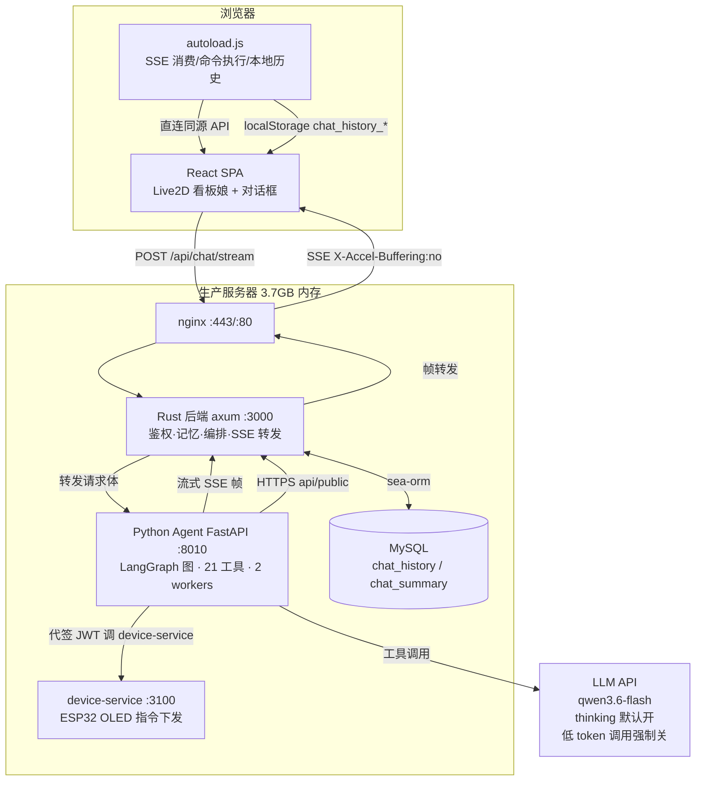
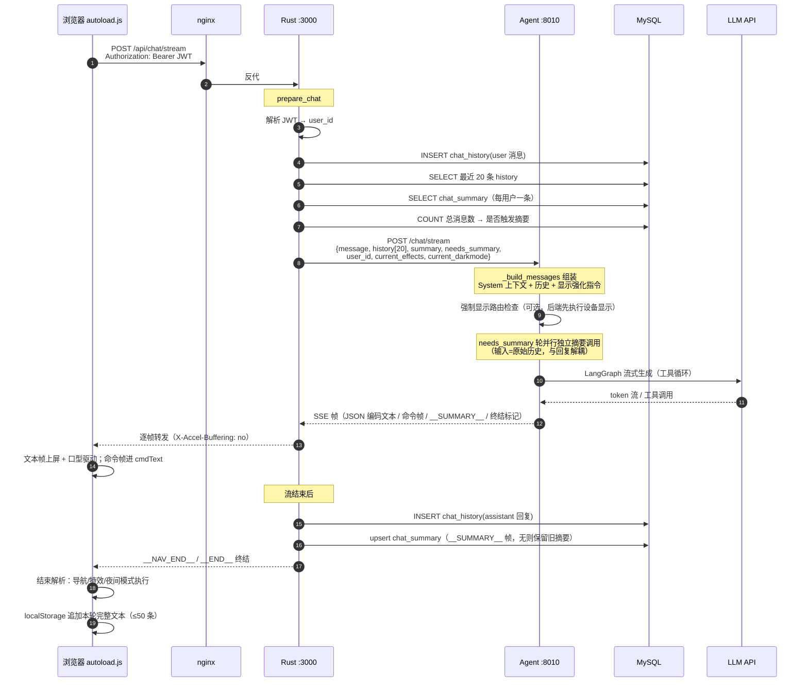
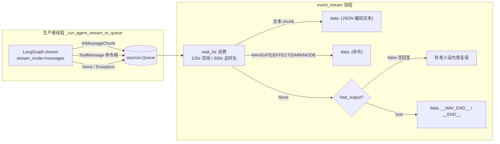
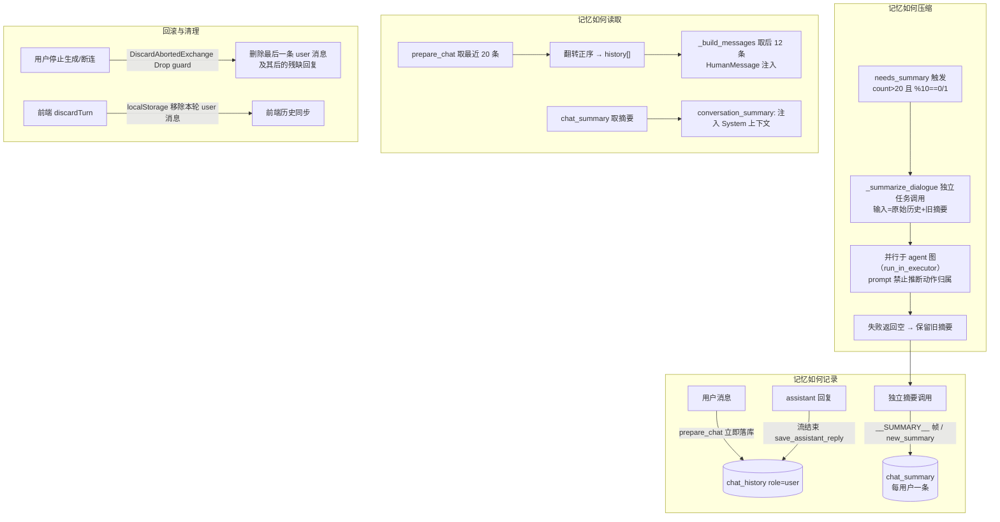
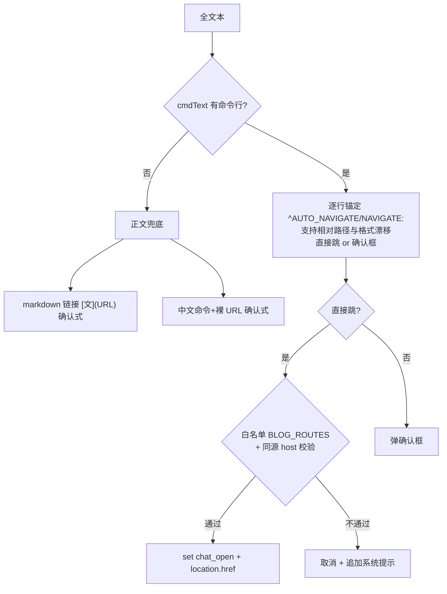

# Saudade Blog AI Agent（泠月喵）架构文档

> 面向维护者的全链路技术文档。覆盖看板娘对话系统的每一个环节：组件拓扑、一次对话的完整时序、
> 记忆机制（记录 / 压缩 / 存储 / 读取 / 回滚）、工具系统、防幻觉与可靠性加固、超时体系、配置与部署。
> 最后更新：2026-08-26（摘要独立化改造同步：§3.1/§3.2/§4 记忆机制重写——对话内 SUMMARY 协议移除，
> 摘要改由后端独立任务调用生成；§1 权衡表与 §10 维护注意事项同步更新）。

---

## 1. 系统总览

博客的 AI 能力由 **三个独立进程** 协作完成，用户看到的"看板娘"是它们加一个前端脚本的合体：

- **React 前端**（浏览器）：看板娘 Live2D 形象 + 对话框 UI + SSE 消费 + 命令执行器。
- **Rust 后端**（axum，端口 3000）：鉴权、记忆落库、对话编排、SSE 转发、中断清理。**记忆的唯一权威来源**。
- **Python Agent**（FastAPI，端口 8010）：LangGraph 图执行、LLM 调用、21 个工具。**无状态**，记忆全靠请求体注入。
- **MySQL**：`chat_history`（消息流水）、`chat_summary`（每用户压缩摘要）。
- **device-service**（端口 3100，独立服务）：IoT 设备（ESP32 OLED）指令下发，agent 以对话用户身份代签 JWT 调用。



**核心设计原则**：Python Agent **不持有任何对话状态**（每请求独立 thread_id、进程内 MemorySaver 形同虚设），
一切连续性由 Rust 从 MySQL 读取后注入请求体实现。这是刻意的架构取舍——曾经 MemorySaver 线程累积导致
长对话上下文与 worker 内存无限膨胀，最终被整体抛弃（详见 §4.6）。

**关键设计决策速览**（每一条都是线上踩坑后的取舍，面试讲述"为什么"的素材）：

| 决策 | 取舍 | 踩过的坑（详见对应章节） |
|---|---|---|
| 记忆权威在 DB，agent 无状态 | 每请求独立 thread_id + 请求体注入 20 条历史 + 滚动摘要 | MemorySaver 线程累积 → 上下文/worker 内存无限膨胀（§4.6） |
| SSE 帧 JSON 编码 + `\n\n` 分隔 | 文本内换行不破坏帧边界；帧协议三端同步 | 曾按行分隔被文本换行破坏（§3.2⑤） |
| 摘要独立任务调用（模型对记忆无写权限） | 摘要由后端独立调用生成（与回复解耦），模型永不输出 SUMMARY 行 | 曾把摘要生成指令注入对话消息流 → 模型在回复里编造"成功调用工具"污染记忆（§4.3） |
| 强制路由 vs 模型自主调用 | "显示"类后端强制执行（保真）；"导航"类恢复模型自主（保体验），仅前端白名单兜底 | 导航强制路由曾上线后因牺牲自主性被撤销；显示类强制保留（§6.3） |
| 命令走"工具返回 → 独立帧 → 前端执行" | 模型只负责调工具，命令由前端按显式意图执行 | 模型"表演调用"把命令写进正文（§6.2） |
| 分层超时体系 | LLM 120s + 空闲 120s + 总时长 300s + recursion_limit 30 + 16 线程 | LLM 挂起占满线程池 → 全体对话排队卡死（§6.4） |
| 空回复/中断兜底 | 后端补发人设内恢复语 + Rust 空回复不存库 + 中断 Drop 清理 | qwen 偶发空内容 / 客户端中断 → 前端"卡死"表象（§3.2⑤⑦ §4.4） |

---

## 2. 组件与目录

> 本文档存放于 agent 仓库（`BigLeopardCat/saudade-blog-agent`）。除本仓库结构外，
> 全链路还涉及**宿主仓库 Saudade-Blog**（博客），以下标注 `Saudade-Blog/` 前缀的路径均相对其根目录。

```
本仓库（saudade-blog-agent）    # ★ Python Agent（独立 git 仓库，线上改动需本地重启 :8010 生效）
├── server.py                  # FastAPI 入口：/chat、/chat/stream、/health；强制显示路由；流式编排
├── main.py                    # CLI 调试入口（交互式 / --ask 单问，同 create_agent 手写图）
├── agent/
│   ├── graph.py               # ★ 手写 LangGraph 图：planner(选技能) → model(模板执行) → tools → reflector(模板质检)
│   ├── agent.py               # create_agent：手写图入口（build_graph，planner → model ⇄ tools → reflector）
│   ├── memory.py              # get_checkpointer：MemorySaver 兼容存根（实际不承担记忆，见 §4.6）
│   ├── skills.py              # ★ 技能注册表：7 技能静态定义 + NAV_MAP 导航映射（业务唯一数据源）
│   ├── prompts.py             # BLOG_ASSISTANT_PROMPT：猫猫女仆人设 + 工具约束（无对话内 SUMMARY 协议）
│   └── __init__.py
├── chains/                    # LCEL chain 组合预留（当前仅占位）
├── tools/
│   ├── base.py                # 21 个 @tool 工具 + _TOOL_REGISTRY + IoT JWT 代签 + 显示幂等去重
│   └── __init__.py
├── models/
│   ├── llm.py                 # get_llm 工厂：provider 三选一（qwen/deepseek/openai）
│   └── __init__.py
├── config/
│   └── settings.py            # pydantic-settings：全部可配项（LLM/超时/JWT/device-service）
├── utils/
│   ├── logging.py             # 日志配置
│   ├── helpers.py             # 通用工具函数
│   └── tts.py                 # edge-tts 语音合成（预留，TTS 未启用）
├── docs/                      # 本文档 + eval-observability.md（评测与可观测性，面试素材）
├── test_gates.py              # 防幻觉闸门回归测试（92 断言）
├── test_fallback_replay.py    # 诚实兜底（__RESET__ 回放）测试
└── .env.example / pyproject.toml / uv.lock

宿主仓库 Saudade-Blog（接口适配层，路径相对其根目录）：
Saudade-Blog/frontend/public/live2d-widgets/
├── autoload.js                # ★ 前端核心：脚本注入、SSE 消费、命令解析、导航白名单、特效/夜间同步
├── waifu.css                  # 看板娘与对话框样式（#waifu 高度锁死等关键防御）
├── waifu-tips.js              # 上游库（压缩）：initWidget、模型加载、quit/toggle 收起机制
├── waifu-tips.json            # 提示语配置
└── chunk/index2.js            # cubism5 运行时（hs.CompleteSetup=22 状态机）

Saudade-Blog/frontend/src/components/Live2dAgent/index.tsx   # 注入 autoload.js（含缓存版本号 ?v=20260824c）

Saudade-Blog/src/routes/chat.rs             # Rust 侧：prepare_chat（记忆读写）+ 流式转发 + 中断清理
Saudade-Blog/src/entity/chat_history.rs     # 消息表实体
Saudade-Blog/src/entity/chat_summary.rs     # 摘要表实体
```

---

## 3. 一次对话的完整链路

### 3.1 时序总览



### 3.2 分段详解

**① 前端发起（autoload.js `sendMessage`）**

请求体携带 5 个字段：`message`、`current_url`（当前页面，供 agent 判断语境）、`page_title`、
`current_effects`（`window.__effectStateList` 实时特效状态，如 `sakura,rain`）、`current_darkmode`（`on|off`）；
JWT 走 **Authorization: Bearer** 头（`localStorage.tokenKey`），不在 body 里。**特效与夜间状态实时上报**——agent 以 context 为准、不依赖自己的调用记忆
（用户可能手动开关过）。无 token 时后端直接返回合规告知文案，不调 agent。

**② Rust prepare_chat（[chat.rs:48](Saudade-Blog/src/routes/chat.rs#L48)）——记忆的读与写**

按顺序做 5 件事：
1. 鉴权：解析 `Bearer` JWT（HS256，`auth_jwt::verify_token`），取 `claims.sub` 为 user_id。
2. **存用户消息**：`chat_history` 插入 `(user_id, role="user", content)`。
3. **读历史**：该用户按 `created_at` 倒序取最近 20 条，再 `rev()` 翻转回正序 → `history[]`。
4. **读摘要**：`chat_summary` 按 user_id 取一条 → `summary`。
5. **统计与清理**：COUNT 总消息数决定 `needs_summary`；超 `CHAT_HISTORY_LIMIT`（默认 500）删最旧。

组装请求体转发给 Agent（`user_id`、`history`、`summary`、`needs_summary` 都在这里产生）。请求体上限 1MB（[chat.rs:58](Saudade-Blog/src/routes/chat.rs#L58)）。

**非流式路径（/chat，内部与兼容用，看板娘走流式）**：Rust 调 agent `/chat`，传输层错误自动重试最多 3 次
（间隔 800ms），**超时不重试**——超时说明生成确实很慢（长回答单次可达 180s，reqwest 超时即 180s），
重试只会从头再生成一遍 [chat.rs:290-310](Saudade-Blog/src/routes/chat.rs#L290-L310)。agent 端在 needs_summary
轮并行独立生成摘要，经 `ChatResponse.new_summary` 字段返回（与回复内容解耦，回复本身**不含** SUMMARY 行）；
Rust 再拼接命令行：EFFECT 追加到回复末尾、NAVIGATE/AUTO_NAVIGATE 前置到回复开头 [server.py:292-298](../server.py#L292-L298)，
命令拼接不受摘要影响。

**③ Python _build_messages（server.py:143）——上下文组装**

按顺序构造消息列表（全部为 `HumanMessage`）：
1. **System 上下文**：`[System: user_id=…, page=…, title=…; current_effects=…; current_darkmode=…; conversation_summary: …]`
   放在**第一条**，是纯状态注记，模型禁止复述。
2. **历史**：`req.history[-12:]`（**只取最近 12 条**，与 Rust 取的 20 条之间留余量）逐条注入，
   assistant 消息加 `[assistant]: ` 前缀以便模型区分说话人。
3. **当前用户消息**，末尾按需追加指令（设备显示强化指令 / 强制显示结果注记，见 §6.3；对话内摘要指令已移除
   ——摘要由后端独立任务调用生成，见 §4.3）。

**④ LangGraph 执行（agent.py + server.py）**

手写图（agent/graph.py `build_graph`，planner → model ⇄ tools → reflector 四节点，见 §6.5），
无 checkpointer（线程 id 每请求 uuid，无状态累积）。执行用 `stream(stream_mode="messages")`：
- `AIMessageChunk` → 文本 token，逐块推入 asyncio.Queue（生产者线程）。
- `ToolMessage` → **命令帧**：`NAVIGATE:`/`AUTO_NAVIGATE:`（导航）、`EFFECT:`（特效）、`DARKMODE:`（夜间）——**这是工具结果**，由前端执行。
- 工具循环：模型 → 调工具 → 工具结果 → 模型，受 `recursion_limit=30` 约束（§6.4）。

**⑤ 流式帧协议（server.py:344 event_stream）**



- **帧分隔 `\n\n`，文本 JSON 编码**（防文本内换行破坏帧边界）。
- **命令帧同时进 nav_line**（用于终结标记：只要有任何命令帧——导航/特效/夜间——就发 `__NAV_END__`，纯文本轮发 `__END__`）。
- **超时双保险**：空闲 120s（每帧重置）+ 总时长 300s（不重置）→ 超时发 `__ERROR__:...` 帧终止。
- **空回复兜底**：整轮无任何输出帧（qwen 偶发空内容）→ 补发 `_RECOVERY_SENTENCE`（人设内恢复语），
  前端不会静默"卡死"。
- **生产者取消**：客户端提前断开（abort/关页）时 `finally` 取消尚未完成的线程池生产者任务，
  避免队列与线程空转 [server.py:404-407](../server.py#L404-L407)。

**⑥ Rust 转发（chat.rs:409 body_stream）**

`find_frame_end` 逐帧切分 → 终端标记（`__END__`/`__NAV_END__`/`__ERROR__`）原样转发 → 文本帧 JSON 解码后
**累积进 reply 变量**（供流结束存库）→ 原样转发。上游中断且未收到终结标记 → 补发
`__ERROR__:"与 Agent 的连接中断"`（否则前端无法区分静默截断），**但已累积的回复仍会正常存库**
（客户端未断开时，残缺回答保留供上下文参考）。响应头带 `X-Accel-Buffering: no`
（防 nginx 缓冲 SSE 到结束才下发）。

**⑦ 前端消费（autoload.js）**

- 文本帧：`textContent` 直写（流式阶段 pre-line 换行）→ 300ms 口型翻转（`__mouthOverride`）。
- 命令帧：按 `COMMAND_LINE_RE` 匹配进 `cmdText`（**不显示**），流结束统一解析执行（§6.2）。
- 终结：完整文本（cmdText + 文本）→ `cleanAgentText` 剔除命令行与 SUMMARY 残留（防御性——正常已不会出现，防注入诱导）→ markdown 渲染
  （复用博客 `__chatRenderMarkdown`）→ localStorage 追加（≤50 条）。
- 双计时器（120s 空闲 / 300s 总时长）与后端对齐，abort 时 UI 3s 内强制恢复。

---

## 4. 记忆机制（重点）

### 4.1 概述

**记忆分三层，各司其职**：

| 层 | 载体 | 作用 | 上限 |
|---|---|---|---|
| 跨请求长期记忆 | MySQL `chat_history` + `chat_summary` | 对话连续性 | 500 条流水 + 1 条摘要/用户 |
| 请求内短期记忆 | 请求体 `history[]` + `summary`（注入 System 上下文） | 模型可见窗口 | 20 条取出 → 12 条注入 |
| 浏览器本地记忆 | `localStorage chat_history_{tokenKey}` | 前端展示完整记录 | 50 条 |



### 4.2 记录：什么时候写、写什么

- **用户消息**：Rust `prepare_chat` 在**转发 agent 之前**就落库（[chat.rs:77](Saudade-Blog/src/routes/chat.rs#L77)）——即使 agent 失败，用户消息也保留。
- **assistant 回复**：流结束（收到终止标记或上游中断）后 `save_assistant_reply`（[chat.rs:235](Saudade-Blog/src/routes/chat.rs#L235)）：
  - 流式路径从 `__SUMMARY__` 帧取独立摘要（见 4.3），**回复本身不含任何 SUMMARY 行**；
  - 存 `(role="assistant", content=回复全文)`；
  - **空回复不存库**（`if !reply.is_empty()`），这是"卡死"表象的来源之一——前端靠 §3.2⑦ 的兜底感知。
- **前端**：每轮结束把**完整文本（含命令行）**存 localStorage——与后端历史一致（命令行随后端历史渲染时被 `cleanAgentText` 过滤）。

### 4.3 压缩：摘要机制全流程

> **2026-08-26 摘要独立化改造**：模型对记忆**无写权限**。旧方案把摘要生成指令注入对话消息流、
> 模型在回复末尾输出 `SUMMARY:` 行、后端双端剥离入库——曾实测模型在无工具轨迹的轮次编造
> "助手成功调用工具"污染记忆（摘要与回复耦合在同一生成调用，模型把摘要当"总结本轮"顺手美化）；
> 且摘要指令与显示强化指令共用 `<系统内部指令-仅供执行` 标记，导致显示请求被 reflector 误判
> REVISE 白烧一轮 LLM。现方案两者一并移除，摘要由后端独立任务调用生成。

**触发条件**（[chat.rs:108](Saudade-Blog/src/routes/chat.rs#L108)）：`total_count > 20 && (total_count % 10 == 0 || total_count % 10 == 1)`。
即从第 21 条起，每 10 条触发一次（21、30、31、40、41…）。计数含 user + assistant 全部消息。

**独立任务调用**（server.py `_summarize_dialogue`，仅 needs_summary 轮触发）：
- 输入 = **原始历史**（`{"访客"/"助手"}: {content}` 行）+ 本轮 `访客: {user_msg}` + 旧摘要；
- prompt 硬约束：只总结客观内容，**不得推断动作归属，不得编造**；旧摘要中的相关事实必须保留
  （滚动式压缩，不丢旧信息）；
- `enable_thinking=False`（与 reflector 同理：thinking 会占满 max_tokens=200 致 content 空）、
  `max_tokens=256`；
- `run_in_executor` 与 agent 图**并行**（零额外延迟）；**失败返回 "" → 保留旧摘要**（静默降级，不阻塞对话）。

**结果传输（双路径，Rust 入库）**：
- 非流式 `/chat`：`ChatResponse.new_summary` 字段随响应返回；
- 流式 `/chat/stream`：agent 在 `__END__` 帧**之前**发 `data: __SUMMARY__:{"json字符串"}\n\n`
  ——不终止流、不进回复；Rust 循环里解析该帧存入 `summary_override`，流收尾时传给
  `save_assistant_reply`（[chat.rs](Saudade-Blog/src/routes/chat.rs)）。
- **约定**：`__SUMMARY__` 帧必须出现在终结帧之前，否则视为无摘要。

**存储**：`chat_summary` 每用户一条，`upsert`（存在则 update，否则 insert），`message_count` 记录触发时点，
供诊断摘要新鲜度。无 `__SUMMARY__` 帧/空摘要时**不覆盖**旧摘要。

**读取**：prepare_chat 每次请求读摘要 → 注入请求体 → `_build_messages` 放进 System 上下文首条。

**双端剥离代码已整体删除**（server.py `_strip_summary_from_reply` / `_looks_like_summary_paragraph`、
chat.rs `strip_summary_from_reply` / `looks_like_summary_paragraph` / `summary_tests`）——不再需要
任何"从回复里找摘要"的特征代码，结构上杜绝摘要泄露给访客。

### 4.4 回滚机制：有没有？

**没有对话级"撤销/回滚"功能**（不存在"撤回上一条回复"或时间旅行恢复）。系统层面只有两类清理：

1. **中断清理（DiscardAbortedExchange，[chat.rs:345](Saudade-Blog/src/routes/chat.rs#L345)）**：
   客户端在**流未正常收尾**时断开（用户点"停止生成"、关标签页、断网）→ SSE 生成器被取消 →
   `Drop` 触发 → 异步删除该用户**最后一条 user 消息及其之后的所有记录**（id 单调递增，残缺回复必在其后）。
   效果：**被终止的对话不进记忆**（不污染 history 窗口与摘要）。正常收尾由 `done` 原子标记关闭清理。
2. **前端丢弃（discardTurn，autoload.js）**：用户停止生成后，localStorage 移除本轮 user 消息 + 重绘；
   3s 强制恢复保险（abort 未触发 catch 时兜底清理）。

另外两个"防污染"机制：
- **设备显示幂等去重**（tools/base.py）：同一用户 30s 内相同显示内容只下发一次——防强制路由与模型自主调用对同一次请求各执行一次，以及 MQTT QoS1 重投。
- **保留策略**：`CHAT_HISTORY_LIMIT=500` 超出删最旧（§4.5）。

### 4.5 存储与清理

- `chat_history`：`(id, user_id, role, content, created_at)`，按 user_id 分片；500 条上限，超限按 id 升序删最旧。
- `chat_summary`：`(id, user_id, summary, message_count)`，每用户最多一条。
- **为什么不删摘要**：摘要滚动合并（4.3），永远保留最新压缩态；500 条流水删掉的不影响连续性（窗口只看最近 20 条）。

### 4.6 MemorySaver 为什么不承担记忆

`agent/memory.py` 返回 `MemorySaver`（进程内），但 **server.py 每请求生成全新 thread_id**
（`user_{id}_{uuid4().hex[:8]}`）——跨请求永不命中同一线程，MemorySaver 实际上**从未积累过任何状态**；
手写图（graph.py）已完全不挂 checkpointer，memory.py 是无人引用的兼容死代码（保留以防旧代码误用）。
历史教训：曾经复用线程累积，长对话（教程连载）导致输入上下文与 worker 内存无限膨胀直至截断/被杀，
于是改为"每请求独立线程 + DB 注入"。**线程复用是禁区，恢复即重蹈覆辙。**

---

## 5. 工具系统（21 个）

| 分类 | 工具 | 行为 |
|---|---|---|
| 文章/笔记 | `list_notes`、`search_notes`、`get_article_detail`、`get_top_notes` | 调博客 `api/public` 接口 |
| 分类/标签 | `list_categories`、`list_tags` | 同上 |
| 公告 | `get_announcements` | 同上 |
| 留言板 | `list_guestbook` | 读 `/api/public/board`（河灯留言） |
| 说说 | `list_talks` | 读 `/api/public/talk` |
| 站点信息 | `get_blog_info`、`get_social_links`、`get_site_map` | 作者信息/社交链/功能地图（静态） |
| 知识库 | `search_knowledge_base` | 读 `/api/public/knowledge` 本地过滤 |
| 时间/天气 | `get_current_time`、`get_weather` | 本地时间；wttr.in |
| 聊天历史 | `get_chat_history` | **占位**：提示"历史已自动注入上下文"（防模型以为要自己查） |
| 导航 | `navigate_to(path, confirm)` | 返回 `NAVIGATE:https://…`（confirm=true）或 `AUTO_NAVIGATE:https://…`（confirm=false） |
| 特效 | `toggle_effect(effect, action)` | 返回 `EFFECT:{effect}:{action}`，前端按显式意图执行 |
| 夜间模式 | `toggle_dark_mode(mode)` | 返回 `DARKMODE:{mode}` |
| IoT 设备 | `list_devices`、`device_oled_display` | 代签 JWT 调 device-service；支持自动选在线设备、幂等去重 |

**工具 → 命令 → 前端执行**是核心交互模式：工具返回带前缀的**命令字符串**，Python 识别后作为独立 SSE 帧
转发，前端解析执行。**不是**让模型把命令写进正文——正文里的命令会被 `cleanAgentText` 当幻觉剔除
（除非命中 §6.2 的兜底解析）。

### 5.1 IoT 工具细节（device_oled_display）

- **用户身份**：`RunnableConfig.configurable.user_id`（server.py 注入）→ 工具用**博客同一个 JWT_SECRET**
  代签 5 分钟有效 HS256 JWT（sub=user_id）→ device-service 校验，保证用户只能操作自己的设备。
- **device_id 可省略**：自动选该用户第一个在线设备——多步工具链（先 list 再操作）是 IoT 工具失败的
  结构性原因（模型无法从 schema 知道运行时才有的 device_id，参数缺失时倾向文本声称），单步化后一次调用即成功。
- **约束**：text ≤ 64 字符；30s 同内容去重；404 = 设备不存在或不属于当前用户。

---

## 6. 防幻觉与可靠性加固（踩坑沉淀）

### 6.1 状态感知：以 context 为准

`current_effects` / `current_darkmode` 由前端**实时**上报（用户可能手动开关过、夜间自动切换过），
prompt 明确要求 agent 以 System 上下文为准、不依赖调用记忆，状态一致时不重复调工具。

### 6.2 前端命令执行器（autoload.js）

流结束后对 `cmdText + displayText` 全文本解析，**命令行优先、正文兜底**：



- **导航白名单** `BLOG_ROUTES`：`/`、`/about`、`/friends`、`/guestbook`、`/talk`、`/times`、`/login`、`/dashboard*`、`/category/*`、`/article/*`、`/device-console/`——幻觉的 `/iot` 之类被拦截（曾导致整站布局丢失、文本框卡死）。⚠️ 历史遗留：commit 30bfba1 声称"白名单 /friends 替换为 /guestbook"，但 **autoload.js 白名单实际未改**（agent 改动不进博客 git，靠手动落盘，该次只落了 prompts.py/tools/base.py）——2026-08-23 文档核对时发现前端白名单仍只有 `/friends`，而 agent 侧（prompt、site_map、navigate_to 示例）已统一为 `/guestbook`，且 `/friends` 路由本身 301 到 `/guestbook`，导致 agent 跳 /guestbook 被白名单拦截。已修复：白名单两者并留（新老地址都放行）。
- **同源校验**：`new URL(navUrl).host === location.host`，跨域降级为确认式（堵 `https://evil.com/talk`）。
- **特效**：`EFFECT:name[:action]`（容忍格式漂移，`\w+` 不匹配中文）；**兜底**：正文里的
  `toggle_effect(effect="sakura", action="on")` 工具调用签名也能解析执行（模型"表演调用"时救场）。
- **夜间**：`DARKMODE:on|off` + 正文 `toggle_dark_mode(mode="on")` 兜底；执行同时标 `darkModeUserChoice`
  （对话调节=访客意愿，23:00-6:00 自动切换让位）。

### 6.3 后端强制路由（_force_display）——"显示"类请求的根治方案

**问题**：qwen 在"把文字显示到设备屏幕"类请求上频繁幻觉——凭历史声称已下发而不调工具，prompt 注入只能缓解。
**方案**（server.py:89-140，**/chat 与 /chat/stream 两个路径都生效**）：命中显示意图（正则 `(屏幕|显示|OLED|设备|大屏|显示器)` 且 user_id>0）→
**后端直接执行** `device_oled_display`（用一个小 LLM 调用提取显示内容，≤64 字符，`NONE`/否定句不执行）→
执行结果以 `[System: 系统已按访客要求执行设备屏幕显示…]` 注记追加到用户消息末尾 →
模型只负责基于事实回复，**无论它说什么，显示动作都已完成**。
辅助：消息末尾定向强化指令（"检测到访客要求操作 IoT 设备屏幕：你必须调用 device_oled_display…不得以文本声称已显示"）。
**注意**：导航的强制路由（_force_navigate）曾短暂上线后**按用户要求整体撤销**——导航恢复 agent 自主调用
（`navigate_to`），仅保留前端白名单兜底（见 CLAUDE.md §3）。

### 6.4 生成有界性

- `RECURSION_LIMIT=30`（env `AGENT_RECURSION_LIMIT` 可覆盖）：手写图显式设置；langchain 1.3 `create_agent`
  时代默认硬编码 9999，幻觉重试循环会烧满流式总时长 300s（前端表现 5 分钟卡死）。压到 30（正常流程
  ≤5 次模型-工具往返），超限走既有 `__ERROR__` 异常路径，卡死窗口缩到 60-90s。
- **超时体系一览**：

| 层 | 超时 | 说明 |
|---|---|---|
| LLM 调用 | `llm_timeout=120s`（OpenAI 客户端 timeout） | API 无响应时结束生成 |
| 流式空闲 | `STREAM_IDLE_TIMEOUT=120s` | 每帧重置；线程池挂起时终止 |
| 流式总时长 | `STREAM_TOTAL_TIMEOUT=300s` | 不重置；工具循环兜底 |
| 前端空闲/总时长 | 120s / 300s | 与后端对齐，abort 流 |
| 线程池 | `ThreadPoolExecutor(max_workers=16)` | 曾 8 线程被挂起占满致全体排队卡死 |

- **空回复兜底**：流正常收尾但零输出 → 补发 `_RECOVERY_SENTENCE`（"喵呜……主人抱歉，泠月喵刚才脑袋卡壳了…"）；
  非流式同样处理。Rust 空回复不存库。

### 6.5 技能注册表 + 受限规划（2026-08-25 重构，planner 修复的根）

固定流程任务（导航/特效/暗色/设备显示/设备查询）落地为**技能注册表**（agent/skills.py，业务唯一数据源）：
每个技能是静态定义——触发条件、参数 schema、固定工具序列模板、完成判定、回复契约。planner 只从注册表
**选技能 + 填参数**（结构化输出 `SKILL: <名>` + `PARAMS: <JSON>`），不再自由写执行步骤；`instantiate_plan`
把参数实例化为计划文本（`SKILL=/PARAMS=/TOOLS: /NOTE: /REPLY:` 五行契约）写入 `state.plan`。

- **导航映射表**（`NAV_MAP`）：页面别名 → 真实路径，"物联网平台→/device-console/"是系统数据而非模型猜测
  （旧版 planner 跑题的根因：看不到工具语义/页面映射）；映射为 None = 页面已下线（友链 → 如实告知、不导航）；
  未识别别名 → 如实说没有。改页面入口只改这一处。
- **planner = 技能选择器**（graph.py `planner_node`）：注入完整技能表 + 工具完整描述（不再 80 字符截断）
  + 低温度快思考（0.2 / 300 tokens / 30s）；输出解析容错（`_loads_tolerant`：单引号/尾逗号/注释/markdown
  围栏逐项修正），解析失败按 chat 技能兜底。
- **executor = 模板执行**（`model_node`）：system prompt = 人设 + 计划文本；TOOLS 行是固定工具序列
  （"（无）"时不调工具直接答）、NOTE 行说明"不调用任何工具"时如实告知、REPLY 行是回复契约。
- **reflector = 模板质检**（`reflector_node`）：LLM 对照技能模板 + 轨迹出 VERDICT（PASS/REVISE）；
  chat 技能走**非空快道**（不花 LLM 钱）；REVISE 预算 `MAX_REFLECTIONS=2`，预算耗尽即接受当前结果收尾。
  检查点 1"TOOLS 行要求的工具是否完成调用"天然覆盖旧版六道程序化闸门的"假装执行"场景（正文伪造命令/
  纯声称到达/空头承诺——TOOLS 要求调用的工具在轨迹中缺失即 REVISE，文本表演过不了模板比对）。
  **确定性检查与 LLM 轨迹均按轮次裁剪**（`_current_round`：最近一次修正注记之后的轨迹）：被 REVISE 的历史轮
  既不能豁免当前轮的缺失，也不参与当前轮判罚。**风格不判 REVISE**：工具已成功调用（帧已产出）后，
  正文链接有无/格式属风格问题。
- **`__RESET__` 协议与历史洁净**：reflector REVISE → server 发 `__RESET__:<原因>` 帧（旧裸 `__RESET__`
  兼容）→ 前端清空 cmdText/displayText 只显示最终轮；**Rust 收到 `__RESET__` 帧会清空已累积 reply**，
  被否定轮次连同重置标记不入 chat_history（否则污染历史注入形成坏 few-shot）。
- **执行过程行**（前端灰色可折叠轨迹）：server 发 `__PROCESS__:<步骤>` 帧（🧭 计划 / 🛠 调用工具 /
  ✗ 质检打回 / ✓ 质检通过）→ 前端气泡内 `<details class="agent-process">` 灰色折叠区；质检打回时被打回
  轮次的完整文本归档为可展开子项（`archiveRejected`）。**Rust 对 `__PROCESS__` 帧只转发、不累积进 reply**
  （过程行不属于最终回复，否则污染 chat_history）。
- **测试**：`test_skills.py`（映射表完整性、instantiate_plan 参数实例化含已下线/未识别区分、plan 编码/解析
  往返与容错）+ golden set 端到端。改技能注册表/plan 契约后必须跑。

---

## 7. LLM 与配置

- **Provider 机制**（settings.py）：`LLM_PROVIDER=qwen|deepseek|openai` 三选一，各配独立 API key/base_url/model；
  当前生产 `qwen` → `qwen3.6-flash`（阿里云 MaaS compatible-mode）。
- **关键参数**：`temperature=0.7`、`max_tokens=8192`、`timeout=120s`。
- ⚠️ `agent_max_iterations=10` / `agent_early_stopping_method` 在 settings.py 有定义但**从未被代码读取**
  （create_agent 时代遗留的 LangChain 参数，手写图不消费）——死配置，实际生成有界性靠 `recursion_limit=30`（§6.4）。
- **enable_thinking 开关化**（settings `llm_enable_thinking=True` 默认开）：Qwen 思维链走独立
  `reasoning_content` 字段返回，不进回复正文；planner（快思考 0.2/300t）与主 model 节点走思考（默认），
  **三个低 token 调用强制关闭**（llm.py per-call 覆写，走 `extra_body`）：reflector 质检（max_tokens=200，
  thinking 占满致 content 截断成空）、`_extract_display_intent`（128t）、`_summarize_dialogue`（256t）。
- **TTS 关闭**（`tts_enabled=false`）：预留字段，未启用。

---

## 8. 前端看板娘（Live2D）关键机制

- **入场动画**：`forceSlideInFromBottom` 等 `waifu-active` + cubism5 `_state===22(CompleteSetup)`（全部纹理
  上传 GPU，下一帧必然绘制）齐备才用 WAAPI 滑入（`fill:'backwards'`，不受"插入 DOM+加类同帧"样式合并影响）；
  25s 兜底。避免空画布滑完角色凭空弹出。
- **收起状态**：quit 工具写 `waifu-display` 24h 标记 → 上游 initWidget 只建收回按钮不建看板娘；
  **autoload.js 初始化前一律清除**该标记（刷新/返回=重新访问，看板娘恢复默认展示；SPA 内路由切换不重跑不受影响）。
- **高度锁死**：`#waifu { height: 300px }`（与 `#live2d` 同高）——display:none 恢复中间态 canvas 高度塌陷为 0 时，
  `min-height` 兜不住 `bottom:calc(100%+12px)` 的对话面板与悬浮按钮错位（2026-08-19 修复不彻底 → 08-22 改固定高度）。
- **口型/动作**：`__setMouthOpen`/`__mouthOverride` + `model.update` 挂钩（loadParameters 之后注入 ParamSpeak/
  ParamMouthOpenY/Tail/耳朵/头发/眨眼），流式输出 300ms 口型翻转。
- **缓存版本号**：改 autoload.js/waifu.css 必须同步 bump `index.tsx` 的 `?v=` 与 autoload.js 内 waifu.css 的 `?v=`
  （当前 20260824c）；nginx 对 `/live2d-widgets/` 等目录 1 年 immutable 缓存，`?v=` 换 query 即换缓存条目。

---

## 9. 部署与运维

- **Agent 仓库独立部署**：改动后**必须本地重启**才生效：
  ```bash
  cd /home/ubuntu/memory_blog_rust/saudade-blog-agent
  .venv/bin/python -m py_compile server.py agent/prompts.py
  kill $(ps aux|grep '[u]vicorn server:app'|awk 'NR==1{print $2}')   # 精确 PID，勿 pkill -f（会误杀自己）
  nohup .venv/bin/uvicorn server:app --host 127.0.0.1 --port 8010 --workers 2 >> /home/ubuntu/memory_blog_rust/server_run.log 2>&1 &
  curl -s http://127.0.0.1:8010/health   # agent_ready: true
  ```
- **前端**：改 autoload.js/waifu.css/index.tsx 后 `NODE_OPTIONS="--max-old-space-size=3072" npx vite build`
  （内存受限必须限堆）→ commit → push `cn_sora_blog` → CI 构建部署。
- **Rust**：改 `src/` 后 `cargo build --release`（CI 里 `RUSTFLAGS="-D warnings"` 严格模式，提交前必跑
  `cargo check` 确保无警告）。
- **2 workers**：4 workers 在 3.7GB 内存下周期性被杀；16 线程 executor 已调优。
- **改 SSE 协议三端同步**：Python 帧格式、Rust 转发、前端解析（`\n\n` 分隔 + JSON 编码 + 终结标记约定）。

---

## 10. 已知边界与坑（维护必读）

1. **qwen 幻觉面**：元消息（"确保按系统提示词调用"）下可能"表演"调用；正文输出变形命令（`SNOW_EFFECT:` 等）
   ——前端格式容忍解析 + cleanAgentText 双保险，非 100%。
2. **导航幻觉回归风险**：强制路由撤销后，模型"去X板块"不调工具只写文本的幻觉回归——前端正文兜底解析
   （markdown 链接/裸 URL 确认式）+ 白名单 + 同源校验救一部分，**不保证全救**。
3. **摘要独立化后的维护要点**（2026-08-26 起，双端剥离代码已删）：改摘要逻辑只看两处——server.py
   `_summarize_dialogue`（独立任务调用，`enable_thinking=False` 是硬性要求）与 Rust `__SUMMARY__` 帧
   解析（帧必须在 `__END__` 之前）；golden `summary_round` 断言"回复不得包含 SUMMARY:"，回归时必跑。
   前端 `cleanAgentText` 的 SUMMARY 过滤是防御性残留（防注入诱导输出），勿删。
4. **线程池挂起**：LLM API 无响应时任务占用线程 120s，16 线程下短时间 16 次对话即占满——超时参数是生命线。
5. **MemorySaver 陷阱**：别恢复"线程复用"——DB 注入已承担全部连续性。
6. **`enable_thinking` 只能走 extra_body**（Qwen 自有参数，model_kwargs 不收）。
7. **本仓库与宿主仓库独立维护**：agent 代码位于独立 git 仓库（remote: `BigLeopardCat/saudade-blog-agent`，原先物理上嵌套于博客项目中并被其 gitignore；本文档随 `docs/` 迁入本仓库后，博客仓库仅保留接口适配层）。注意：30bfba1 之后的落盘改动（prompts.py / server.py / tools/base.py）**尚未 commit**——服务器重建前务必 `git add -A && git commit`（或复制备份）保存，否则丢失。
