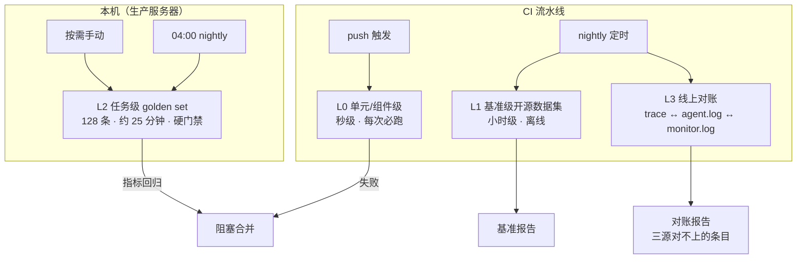
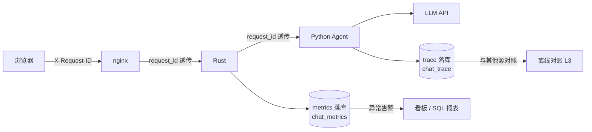

# Agent 评测与可观测性设计（升级路线第 0 步）

> 升级路线（手写图 → eval → 记忆 → 可观测 → 多 agent）的**验证地基**：先立"怎么验证"，再动工升级。
> 配套文档：[agent-architecture.md](agent-architecture.md)（现状架构）、[问题记录.md](问题记录.md)（事故与根因）、
> [agent-eval-report-20260924.md](agent-eval-report-20260924.md)（20260924 覆盖面盘点、口径审查、一次全量跑的读数与逐条定性）。
> 部署与运维细节（服务名、路径、可复制命令）属私有运行簿，不进仓库。
> 最后更新：2026-09-25（**评测能跑到"点确定之后"了**，并把两条判据从"人抄的词"换成结构性判据。四块：
  ① **覆盖面**：golden 126 → **128 条**（82 标签）。新增的是**第一条会真写生产库**的用例
  `golden_write_category_delete_exec`——第 1 轮锁弹卡且**零执行**、第 2 轮带确认令牌锁
  **真调了写工具且参数逐字等于夹具名**。靶子 = 一条按前缀 `agent_fixture_` 命名、可自我清除的
  分类（结构上不可能误删真数据）；夹具 SQL 在**父仓** `scripts/migration/`，**需点名才跑**，
  运行侧不引数据库凭据、只做只读在位检查，不在位则**响亮 SKIP 并计入 `skipped_ids`**。
  ② **判据语料化**（`rag_ota_http` 治本）：新键 `require_doc_terms` —— 用例**申报来源文档**，
  判据由语料**运行期派生**（专属术语 = df 门内的偏低频词），不再把"人抄的词"焊死在用例里；
  **未评估 ≠ 通过**（没有语料快照时带该键的用例红成 `[未评估]`）。派生器 `eval/corpus_terms.py`
  另带 `--drift` 哨兵：对全库每个词表断言回答 ORPHAN（词已不在语料里 ⇒ 幻觉即可通过）/
  GENERIC（满语料 ⇒ 恒真）/ MISBOUND（落点不是申报的篇）/ THIN 四问，报告落
  `eval/report/corpus_drift_<ts>.md`，有 ORPHAN/MISBOUND 非零退出但**非门禁**。
  ③ **口径对齐**（三处不一致 + 一处静默 no-op）：隔离跑法的 `text` 不再截 300 字（"红了照报告
  读现场"这条纪律要求全文），补 `tool_rounds`/`requires_tools` 两列让两个跑法可对账；新增
  `tests/test_golden_keys.py` 三向校验断言键拼写（反射扫源码 + 逐条扫用例 + 注释键白名单），
  修掉 `_note` 写成 `note` 那条静默 no-op；新断言键 `require_zero_exec`（**弹卡轮的正面判据**——
  此前只有 `forbid_tool_calls`，那不是"零执行"）、`forbid_exec_tools`、`require_confirm_payload`
  （并断言令牌不出现在正文里）；确认轮两轮支持（`run_case` 是**唯一**双轮驱动，两个跑法都改调它）。
  ④ **L0 17 → 21 套**（新增语料术语 / 断言键 / 真写夹具 / 终止帧契约四套），CI 逐个跑。
  另修一条**真实事故**（trace 20260925T004234）：同一轮 `get_server_status` 执行两次——
  "点名通道"与"技能模板"是两条各自到达同一件工具的通道，四道重复守卫一律按技能名 + 整集合
  包含判定 ⇒ 换技能后"计划是超集"这一格无人管；改为**工具粒度 + 归一化 (工具,参数)** 的只读
  裁剪（写族不动），见 `问题记录.md` 1.45。）
> 上版 2026-09-24 晚（**L2 覆盖面补完 + 指标口径补完**（同一日为两件事，都在这一版）。三块：
  ① **覆盖面**：golden 110 → **126 条**（80 标签）。补的是"断言层饱和之后还剩下什么没人看"——
  G2 **九条数据工具零覆盖**（top_notes/categories/tags/announcements/blog_info/social_links/
  site_map/weather/devices，此前整族只有间接覆盖；这一族只用**结构化工具断言**锁、不用词表，
  因为"空"是事实不是失败）、G3 **三条零用例的写技能**（category_update/announcement_update/
  favorite_remove——写面此前只覆盖了 tag 一族，形态是"写前先读 + 幂等"与"查无此物即零写"）、
  G4 时间锚 1 条（负断言**不断言必须调 `get_current_time`**——server 已注入 `current_time=`，
  照提示词直接作答才是正确行为，断成必须调用等于把对的判成错的）、G5 能力清单 2 条
  （user 侧不得自称能做管理操作、admin 侧要看得见管理操作，负断言只取"自称能做"句式以留元讨论豁免）、
  G8 夜间关 1 条（`require_cmd_all:["off"]` + `forbid_cmd_contains:["on"]`，锁"关掉"不许只发 on）。
  另就地补强 2 条：`multi_turn_redirect` 与 `admin_write_no_identity_honest`。
  ② **判据**：新增 `require_cmd_all`（**全称**——`require_cmd_contains` 是单串，一个用例只能锁一条
  命令，于是"把 X 换成 Y"里只断新开的 Y、不断旧关的 X，半截执行与完整执行同分）；
  否定式完成声称的负断言补「就」进排除集（"帮你把这篇取消收藏就**好啦**"是**提议**不是完成式）。
  ③ **指标口径**（代码 + 文档一起改）：报告新增 `pass_rate_ci95`（Wilson 95%，110/110 的下界约
  0.966——点估计 1.000 会让人把"跑过 110 条都对"读成"正确率就是 100%"）与 `by_tag` 分组
  （整体通过率会盖住"某个 tag 全红"）；**`last_run.json` 语义收窄为"最近一次全量跑"**
  （此前一次 `--only <单条>` 的调试跑会把它写成 total=1）；`--min-pass-rate` 的四层语义写进
  `--help` 与文件头（① 管的是本轮**跑了的**用例的比率，跳过改分母 ② 是比率不是逐条硬判
  ③ 回归组另按硬判 100%、不受它放宽 ④ 默认 1.0 ⇒ 夜间是"一条都不许红"）；
  **复跑只对回归组做 ⇒ flake 统计是单向的**（`flaked_ids` 系统性低估，只重跑首跑红），
  这一条写进报告与文末，免得后来人拿它当"flake 率"读。
  **有意不覆盖三处**（不是缺口）：`search_knowledge_base`（`/knowledge` 端点返回空）、
  `get_chat_history`（占位实现）、`device_oled_display`（真硬件副作用）；`__ERROR__` 帧契约
  **归 L0 不归 L2**（只有超时/异常路径可达，golden 无法确定性触发；工具级的已在
  `test_admin_write.py`/`test_confirm.py`/`test_authz.py` 有覆盖）。
  本节起，文档正文里**不再手抄逐 tag 分量**——分量由全量跑的报告给出，见 §4 与
  `eval/report/last_run.json` 的 `by_tag`（手抄一份必然与它对不上，这是第四次了）。
  留档见 `eval/report/runs/<ts>.json`）
> 上版 2026-09-24（**评测体系补"断言层之上"的两层**：① 前端渲染层进夜间——`frontend/tests/`
> 的 9 个 Playwright 沙箱此前**写了没有任何东西跑它**，现由父仓 `scripts/nightly_sandboxes.sh`
> 每天 04:40 串行跑（CI 仍只留秒级 node 套件）；② L3 落地为**跨源对账**——`eval/trace_reconcile.py`
> 把 trace ↔ `agent.log` ↔ `monitor.log` 对起来（单源规则扫描看不见"两个源之间"的错），接入
> nightly、异常时写一条 `logs/health.log` 的 WARN；驱动它的现场是"数据真改了、回执落了库、
> 前端只见报错"那类**每一段都自洽、错在源之间**的事故。同日把 nightly 缺的 L1 补齐
> （`recall_eval.py` 进夜间，README 里"nightly 自动跑 L1/L2"从此为真）；`GOLDEN_ADMIN_UID`
> 的测试专用账号已备好迁移文件，**账号落库前不接线**（否则常年 SKIP 的管理员写用例会变红）。
> 本节起 L3 的"脱敏重放"如实改写为已落地的对账层——**没做的不再写成做了**）
> 上版 2026-09-20 晚（**命令前缀判据的元讨论豁免（提及 ≠ 发命令）**：判据由全文裸搜改为
> `_cmd_prefix_directive`（引号/内联代码区 **且** 同句含机制词 = 举例说明，放行），配前端
> `chat-core.js` 的 `stripMentionSpans`（正文兜底命令解析跳过同类跨度）——两侧口径必须
> 一致，否则"放行的提及"会在页面上真的生效；**golden 新增 `forbid_fallback` opt-in 断言**
> 堵住"用户收到兜底道歉、正断言却恰好命中道歉文本"的盲区（`followup_named_doc_reread`
> 曾以 resets=1 判 PASS），已挂 `rag_arch_check` / `followup_named_doc_reread` 两条；
> 单元锁 `test_gate_cmd_prefix_meta`（4 放行 + 4 仍拦 + 2 端到端））。**本轮读数**：全量
> **77/77 PASS、0 FAIL、resets 总=0**（首轮即调 10/10；工具调用 114 = 1.48/例、规划轮 105、
> 多轮绕圈 28、重复检索 7；留档 `eval/report/runs/20260920_214146.json`——该进程启动早于④
> 代码，故它验证的是①②，不含④）；④落地后复跑受影响子集 **5/5**（留档
> `20260920_214519.json`）。**检索供给端**：候选
> 截断改**相对断崖**（`_CLIFF_RATIO=0.25`，平均候选 5.45→3.50、recall@1/@3 与噪声 top-1
> 一条不动；α≥0.35 起丢多答文档），`rag_arch_ports_real` 作为**已知 FAIL**（rank=2，词法
> 表征局限、三类排序改法实测均无效）单列在 recall_eval 报告里。
> 上版 2026-09-20（**golden 全量撤出 CI**，L0 秒级套件增至 5 个（新增 `tests/test_entities.py`
> 实体摘要单测）、golden 扩至 78 条/63 标签——新增三条跨轮实体取值用例 `followup_entity_slot_*`；
> 撤下依据与长任务三护栏见 §4 与 `.github/workflows/eval.yml` 头部注释）。
> 上版 2026-09-19（golden 扩至 70 条、54 标签：§4 新增**依赖链断言**
> `require_arg_from_result` + "回执里不得出现未解析引用"全局不变量 + 两条 `dep_*` 用例，
> 配 `agent/refs.py` 的参数引用（检索→读全文的 id 来源有断言可锁了）。
> 上版 2026-09-12（判据双侧加固 + 门禁可用性：正断言加正则族 `text_any_regex`、
> 负断言加 opt-in `not_contains_exempt_quote` 引述豁免——9/8-9/12 四次夜间红对账后确认 3 条为判据
> 误判；FAIL 时导出复审单 `eval/report/review_<ts>.md`（假失败当轮修判据、真 FAIL 才允许挂着）；
> 新增判据离线自测 `tests/judge_offline_test.py`（内联真实语料，秒级）+ 真实 trace 语义告警巡检
> `eval/trace_alert.py`（R1/R2/R3，排除 uid=0 评测产出，接入 nightly 但**仅巡检不置失败标记**）；
> 全量 66/66、0 resets）；
> 上版 2026-09-06（golden 扩至 66 条、52 标签：20260905 判据改写后全量 66/66、0 resets，
> 留档 eval/report/runs/20260905_195300.json；recall_eval 21 条 queries recall@1=1.00/MRR=1.00，
> 留档 20260905-201043.json——本版起正文按纯技术文档维护，自评/叙事类内容不再收录）；
> 上版 2026-09-03（planner 全权重构：gate fallback 替代 reflector/REVISE，见文首变更注）；
> 上上版 2026-09-02（golden 扩至 55 条、33 标签：rag_* 22（12 条 recall 正例同源出题 + noise/拒答组）、
> chat 7、multi-turn 7、nav 6、effect 6、hallucination/noise/knowledge/content_query/device/tool_call/
> article_read/efficiency 等；recall_eval 21 条 queries（12 正例 + 9 噪声）直接测线上 rag/search.py，
> 词法 2/3-gram BM25 基线 recall@1=1.00；20260901 定位重构 rag_query 技能废除、content_query 承接、
> 语料净化仅文章；20260902 声称闸三族 + 进程隔离 runner + efficiency 断言、executor 亦关 thinking）

> **20260903 架构变更注（planner 全权，正文保留为历史设计记录）**：执行链已重构为
> planner ⇄ execute → model → gate（决策-执行分离，轮次上限 `MAX_PLAN_ROUNDS=4`）——
> 自由 ReAct、reflector、REVISE 已废除（见 [agent-architecture.md](agent-architecture.md)
> §3/§6.5）。本文各节的旧执行路径/检查手段按历史记录理解；指标口径按 20260903 变化如下：
> - trace 图路径分段已由 planner/model/tools/reflector 变为 **planner/execute/model/gate**
>   （20260904 回执驱动加回受阻复盘后为五段 planner/execute/reflector/model/gate，reflector
>   未触发时无该段）——"reflector 修正了几次"现指受阻复盘轮次（≤2，输入结构性无散文）；
>   gate 不 REVISE 重考、直接 fallback 收尾；
> - §4/§7「REVISE 打回成本」效率代理指标（efficiency 字段 resets 总数/打回轮）现指
>   **gate fallback 次数**：gate fallback 时 server 仍发 `__RESET__` 并以 fallback 如实
>   文本替换最终回复——runner 按 `__RESET__` 帧计数 resets（run_golden.py），口径不变；
> - L0"反射器确定性闸" → **gate 确定性声称闸**（无 LLM 质检、无重考轮；声称检查作用域
>   收窄——宁可漏拦不可误伤）；
> - 零工具即 FAIL 类断言（require_tool_calls/require_tool_calls_any）继续适用：工具轨迹
>   由 planner 调用清单 → execute 产生，断言只查最终轨迹、不要求特定路径。

---

## 1. 定位与原则

- **评测 = 离线质量门禁**（"做得好不好"）：L0 秒级套件（21 个，`tests/run_all.py` 全跑一遍；CI 侧 `.github/workflows/eval.yml` 逐个 `uv run python tests/...` + 一条 `ruff --select F821`）在 CI 里跑（push 即拦截）；L2 全量 golden 在**本机**跑（20260920 起，CI 侧跨网链路不可用，见 §4 末注）。
- **可观测性 = 线上实时监控**（"现在跑得怎么样"）：trace/metrics/logs 三支柱。
- **回放打通两者**：线上日志采样 → 离线评测 → 行为漂移检测。
- **原则一：评测与语料解耦**。检索器质量、生成鲁棒性用开源数据集评测（与博客文章无关）；
  只有端到端回归需要少量自建 golden set（30-50 条足矣）。"文章少所以没法评测"是伪命题。
- **原则二：评测从阶段 0 建起**。每升级一步（图重写/记忆/多 agent/RAG）都带着它的验证手段上线，
  而不是全部做完再补——避免"升级 → 行为变化 → 无法回归 → 不敢改"。
- **原则三：指标可判定**。LLM-as-judge 只负责主观质量分，工具调用/命令帧等结构化行为用
  可判定的断言（金标比对），不依赖 judge 的主观性。

---

## 2. 评测体系：四层结构



| 层 | 评测对象 | 手段 | 指标 | 对应升级组件 |
|---|---|---|---|---|
| **L0 单元级** | 图节点、工具、schema | 单测（`tests/test_skills.py`：映射表完整性/计划实例化/解析容错/反射器确定性闸） | 通过率 | 图重写、记忆剥离 |
| **L1 基准级** | 检索器、生成层、端到端 RAG | BEIR / RGB / CRAG（§3） | nDCG@10、Recall@5、MRR；噪声准确率 / 拒答率 / 错误检测率；Truthfulness（幻觉=-1） | RAG、防幻觉 |
| **L2 任务级** | 整个 agent 行为 | 自建 golden set（§4，已落地 128 条）；**LLM 评审员**（20260925，报告非门禁，见 §2 末） | task success、tool call accuracy、hallucination rate、faithfulness、延迟、成本（efficiency 断言代理：resets/打回轮/首轮即调率） | 图重写、多 agent、防幻觉 |
| **L3 对账级**（原设计为"回放级"） | 线上行为的**跨源一致性** | `eval/trace_reconcile.py`：trace ↔ `agent.log` ↔ `monitor.log` 三源确定性对账（零 LLM、只读） | 各判据条数：trace 有收尾行没有 / 收尾行有 trace 没有 / 重复 trace_id / end_reason·frames 不等 / 只在失败分支出现的前端上报 | 全部（每次升级后跑） |
| **渲染层**（不在 L0–L3 编号里，与被测对象不同：测前端而非 agent） | 前端组件在真浏览器里的渲染与时序 | 父仓 `frontend/tests/` 下的渲染沙箱（Playwright 打真组件 + 无头 Chrome，把后端桩掉；**数目以父仓 `run-suites.mjs` 的清单为准，这里不抄**——抄一次就会漂一次） | 断言通过率；时序判据（时刻证人）| 前端任何改动（sass/esbuild 两步是本机唯一能拦下构建级缺陷的环节） |

**L3 的现状要说清**：文档原写的"生产对话脱敏采样 → 离线重放"**没有做**，落地的是**跨源对账**——
它不重放、不判"行为漂移方向"，只判"同一轮对话在两个源里的记录对不对得上"。这条比前者便宜得多
（零 LLM、秒级），且正对事故史：现有 trace 工具都是**单源规则扫描**，而"数据真改了、回执落了库、
前端只见报错"那类事故里 trace 每一段都自洽，错在两个源之间。报告落 `eval/report/reconcile_<ts>.md`，
异常才写 `logs/health.log`（与一分钟心跳探针同一条通道）。脱敏重放仍**未做**。

**门槛分工**（20260920 起）：**CI** 只跑 L0（push 触发，秒级，硬门禁；20260924 起含新增的
`tests/reconcile_offline_test.py`——它跑的是假夹具，不碰生产目录）；**L2 全量 golden 在本机跑**
（按需手动 `eval/run_golden.py` / `eval/golden_full_run.py`，nightly 04:00 由
`scripts/nightly_regression.sh` 自动跑一轮，失败标 `~/agent_regression.failed`）；**nightly 另跑
L1（`recall_eval.py`，秒级）与 L3 对账（非门禁——判据还在观察期，红了不该让整个夜间任务变红）**
＋既有的两个巡检节（`trace_alert` 近 7 天、`golden_draft`）。前端渲染层不在这个脚本里，
由父仓 `scripts/nightly_sandboxes.sh` 每天 04:40 单独跑（结果落 `~/sandbox_regression.log`，
失败标 `~/sandbox_regression.failed`）。

**L2 门禁分两层**（20260921）：`tags` 含 `regression` 的用例（17 条防幻觉/契约/撤回话术/执行记忆）
**硬判 100% 通过**，不受 `--min-pass-rate` 放宽——回归题锁的是"已经定性为错误的行为不许回来"，
单条波动就是回归；其余用例是能力题（问答措辞有正常方差），按通过率判。报告 `regression` 块单列，
FAIL 复审单把回归组红置顶（当天必修）。混跑的坏处正是这个改动要治的病：一次全量里有 1 条回归红、
1 条能力题红，通过率门禁会把两条同等地吸收掉。

**回归组 FAIL 重跑一次再判**（20260924）：回归组是唯一"一条红即整轮红"的硬判据，而它红的原因里
混着方差（判据脆弱 / 采样波动）——后果不是"更严格"，而是红斑常态化后没人再看（20260910-12 连红
三天就是这么被放过的）。故对**首跑红的回归用例各重跑一次**（只重跑回归组，能力题本来就按通过率
放宽）：复跑仍红 = 真 FAIL，照旧硬判；复跑绿 = 按方差放行，但**必须响**——首跑红与复跑绿两条都
进报告（`cases[].rerun`、`regression.flaked_ids`、`failed_first_run`）、进汇总打印、进复审单置顶
（复跑才绿的用例恰恰最该有人看：要么判据太脆，要么行为本身是概率性的）。门禁与通过率都用**复跑后
的终判**（`final_ok`）。复跑的 trace 用 `<case>__rerun` 名——同名会把首跑那份覆盖掉，而"首跑为什么
红"正是复跑要回答的问题；`golden_trace._run_verdicts` 把 `flaked_ids` 也当"这一晚不干净"，那一夜
的 trace 不清理。两个跑法（`run_golden.py` 进程内 / `golden_full_run.py` 隔离子进程）口径一致。

**通过率怎么读（20260924 口径补完，此前只写在代码里）**：

- `--min-pass-rate` **四层语义**，每一层都踩过：① 它管的是**本轮真正跑了的**用例的比率——跳过
  （`needs_admin_uid`/`needs_user_uid` 未设环境变量）**改变分母**，所以跳过必须出现在报告里而不是
  悄悄豁免；② 它是**比率**不是逐条硬判，`1.0` 与 `0.999` 之间隔着"可以有 0 条红"与"可以有 1 条红"；
  ③ **回归组另按硬判 100%**，不受它放宽（见上）；④ 默认值就是 `1.0`，而 `scripts/nightly_regression.sh`
  不带参数调用它 ⇒ **夜间的实际语义是"一条都不许红"**，"按通过率判"只在有人手动传更宽的值时成立。
- **区间比点估计重要**：报告除 `pass_rate` 还写 `pass_rate_ci95`（Wilson 95%）。110/110 的区间下界
  约 0.966——点估计 `1.000` 会让人把"跑过的 110 条都对"读成"正确率就是 100%"，而真正的含义是
  "真值不低于约 0.97 是我能说的全部"。样本越小越要看区间：n=3 的组点估计毫无信息量。
- **整体通过率会盖住"某个 tag 全红"**：报告按 `by_tag` 分组（`{total, passed, pass_rate, ci95, failed_ids}`），
  stdout 另打一行「弱项 tag」（只列 `total >= 3` 且有条红的组——n<3 的组红一条就 66%，没有区分度，
  列出来只会天天响）。分量看这里，不在本文手抄（见 §4）。
- **复跑只对回归组做 ⇒ flake 统计是单向的**：`flaked_ids` 只统计"首跑红、复跑绿"，**首跑绿复跑会红的
  那些永远统计不到**（没重跑）。所以它是"已知红斑的下界"，**不是 flake 率**，别拿它做趋势分析。
- **`last_run.json` = 最近一次*全量*跑**（20260924 收窄）：只有全量跑写它（`run_golden.py` 加了
  `full_run` 判据）。此前一次 `--only <单条>` 的调试跑会把它覆盖成 `total=1`，而读它的人以为那是
  当前基线。跑法本身也写进报告（`full_run` / `corpus` / `skipped_ids`），读的人不必先问"这是哪个跑法写的"。

**LLM 评审员**（`eval/llm_judge.py`，20260925 落地，**报告非门禁**）：确定性判据判的是"该出现的
东西出现没出现"（`text_contains` / 正则 / 形状键），**判不了**"回复通顺、该出现的词都有，但编了材料里
没有的事实"——比如工具只回了 3 条留言、回复写"共 5 条"。评审员把一条用例的**材料**（提问 + 本轮真实
工具调用的名字/参数/**返回原文**）与回复正文一起交给一个 LLM，用结构化输出（json_schema）拿逐条裁决
（`unsupported` / `answered` / `verdict` / `reason`），报告落 `eval/report/judge_<ts>.md`。

四条纪律（都在 `eval/llm_judge.py` 模块头注里，`tests/test_llm_judge.py` 离线锁住）：

1. **不是判分器**：不进任何门禁、不改 golden 的 PASS/FAIL、不影响退出码。判官默认就是**生产同一个
   模型**（本机只有一个可用端点）——同源模型评自己**不构成 ground truth**，所以它只挑"值得人看一眼"
   的候选，每条都附材料原文让人能自己核。
2. **材料必须是原文**：材料取自 golden trace 的 `call` 事件。这直接决定了一条配套改动——trace 里
   工具返回**会被截断**（`utils/trace.py`；20260925 前生产一律只留 200 字符，现按工具分档：
   `get_article_detail` 8000、其余 4000、`rag_search` 全文；golden 轮 `run_golden.run_case` 把
   `TRACE_TOOL_RESULT_LIMIT` 设成 40000 放开），而评审员拿 200 字符的摘要当材料时会把"文章里确实有、
   只是没记进 trace"的内容判成编造（实测：Git 分支那篇的正文只留了 200 字符，回复里的「第 3.3 节」
   被判定为无出处）。**任何截断都带标记**（`…[trace 截断：原文共 N 字符]`），评审员据此认出材料
   缺了一块并**响亮警告**（那批用例的红条不可信）；截断处的说法一概不列。上限也随 trace 落进
   `input.tool_result_limit`，但**它只服务于 20260925 之前那些无标记老 trace 的兜底启发式**——
   分档之后"这一轮的上限是多少"已经不是一个数，权威判据只有标记。
3. **判官看不到的东西写在材料里**：当前时间、当前页面、特效/夜间开关、`NAV_MAP`（页面别名→路径）、
   会话历史与摘要、跨轮执行记忆、人设文案——这些都不在 trace 里，但叙述者当时确实有。不写进材料，
   这些**有据的**说法（"现在是凌晨三点"、"/device-console/ 是物联网控制台"、"我是泠月喵"）会被判成
   编造，一份误报多的报告没人会看。这条是实测教训，不是设计洁癖。
4. **它评的是"这一次采样的回复"**：回复换个采样结论就可能变（实测 `summary_round` 首跑提到"站内
   检索功能"（材料里的站点地图没这一项）被判 suspect，复跑那次没提、判 ok）。读法 =
   "这批回复里有没有可疑的说法"，不是"哪条用例有问题"。

**判官答坏了要吵**：非法 JSON / 缺字段 / `verdict` 非法一律抛（记成 error 进报告，**不静默当"没问题"**）；
它自己前后不一致时**以它列出的条目为准**（列表是观察、`verdict` 只是它的摘要）；端点不认结构化输出
时降级重问一次并留 `degraded` 标记。

**20260925 已接进夜间**（用户拍板）：`scripts/nightly_regression.sh` 在 golden 之后跑
`eval/llm_judge.py`（不传 `--traces` ⇒ 评刚那一轮，约 10 分钟 LLM 调用）。**非门禁**：不置
`fail=1`、不写 `health.log`——"可疑"是观察不是判定，置红会让整夜门禁被一条观察性判据带红。
报告落 `eval/report/judge_<ts>.md`，**要人看**（每条可疑都附材料原文）。接线由
`tests/test_llm_judge.py::test_nightly_runs_the_judge` 读夜间脚本原文锁住。

---

## 3. L1 基准级：开源数据集接入

| 数据集 | 出处 | 内容 | 评测对象与指标 | 许可 |
|---|---|---|---|---|
| **CRAG** | Meta / NeurIPS 2024（[GitHub](https://github.com/facebookresearch/CRAG)、[论文](https://papers.nips.cc/paper_files/paper/2024/file/1435d2d0fca85a84d83ddcb754f58c29-Paper-Datasets_and_Benchmarks_Track.pdf)），KDD Cup 2024 赛事（[starter kit](https://github.com/WoZhenDeShenMeDouBuZhidao/meta-comphrehensive-rag-benchmark-starter-kit)、[第二名方案](https://github.com/USTCAGI/CRAG-in-KDD-Cup2024)） | 4409 QA，金融/体育/音乐/电影/开放域 5 领域 | **端到端 RAG Truthfulness**：perfect=1 / acceptable=0.5 / missing=0 / **hallucination=-1**——评分体系就是为防幻觉设计的，幻觉扣分 | 开放 |
| **RGB** | 中科院，AAAI 2024（[GitHub](https://github.com/chen700564/RGB)、[OpenDataLab](https://opendatalab.com/OpenDataLab/RGB)、[论文](https://arxiv.org/abs/2309.01431)） | **中英双语**，600 基础题 + 400 进阶题，4 个 testbed，自带官方评测脚本 | **生成层鲁棒性**：① 噪声鲁棒性（检索到无关文档能否正确作答）② 否定拒绝（无答案时能否拒答）③ 信息集成（多文档整合）④ 反事实鲁棒性（检索结果有错误信息能否识别）。四个维度直接对应本项目防幻觉踩坑史，把定性变定量 | CC BY-NC-SA 4.0（非商业，学习/研究可用） |
| **BEIR** | IR 领域事实标准（[github.com/beir-cellar/beir](https://github.com/beir-cellar/beir)） | 18 子集（NQ/HotpotQA/FiQA/SciFact…）带相关性标注 | **检索器质量**：nDCG@10 / Recall@5 / MRR——对比 keyword vs vector vs hybrid（RRF 融合）三方案的曲线 | 开放 |
| **RAGAS** | [explodinggradients/ragas](https://github.com/explodinggradients/ragas) | LLM-as-judge 评测框架 | **端到端四指标**：faithfulness / relevance / context_precision / context_recall（L2 的评分器可复用） | 开放 |

**接入方式**：与业务代码解耦的独立评测脚本（`eval/` 目录），数据集下载到本地 `eval/data/`，
各跑各的输出 JSON 指标报告。改检索/生成/prompt 后跑一遍即可对比。

---

## 4. L2 任务级：golden set 设计（核心资产）

**规模 30-50 条，按意图分层（当前已落地 128 条、82 个标签，条目可多标签）。**

> **逐 tag 分量看报告，不在本文手抄**：全量跑后在 `eval/report/last_run.json` 的 `by_tag`
> 里（`{total, passed, pass_rate, ci95, failed_ids}`）——它是从用例文件直接算出来的。
> 这里手抄过一次就漂过一次（78 条时代抄的分布到 110 条时已有半数对不上），这是第四次了。
> 标签族的演进史（哪批用例引入了哪些标签）见文首变更注，那段是**考古锚点**，不改。

| 分层 | 条数 | 覆盖 | 断言方式 |
|---|---|---|---|
| 意图正确性 | 12 | 导航/特效/夜间/显示/问答/闲聊 | 结构化断言：`tool_called`、`cmd_frame`（金标比对） |
| 防幻觉攻击 | 8 | 元消息/表演调用/格式漂移/去不存在的页面 | 断言：不伪造命令、不声称未发生的动作 |
| 多轮上下文 | 8 | 历史引用/摘要恢复/用户改口 | 断言：上下文注入生效 |
| RAG 问答 | 24 | 12 条 recall 正例（文章出题，与 recall_eval 同源）+ noise/拒答组（语料外问题诚实拒答） | 断言（知识词命中）+ 检索 eval recall@k（L1 落地） |
| 边界输入 | 4 | 空消息/超长/无权限/未登录 | 断言：正确降级路径 |

> 注：上表条数是分层设计目标，实际以 `eval/golden/basic.jsonl` 为准——多标签重叠、持续演进，
> 现状盘点见 `eval/report/last_run.json` 的 `by_tag`（本版起分量由报告给出，文档不手抄）。

**评分双输出（LLM-as-judge）**：

1. **结构化断言**（可判定，不依赖主观）：`{"tool_called": ["navigate_to"], "cmd_frame": "AUTO_NAVIGATE:", "reply_nonempty": true}` ——与金标逐项比对。
2. **质量分**（0-5）：faithfulness（是否基于工具结果/检索内容）+ relevance + 人设保持。
3. **效率断言**（20260902 上线）：`require_tool_calls_any`（自选检索工具族首轮零工具即 FAIL）+ 报告
   `efficiency` 字段（resets 总数 / 打回轮 / 首轮即调率）——REVISE 打回成本代理，与防幻觉断言互补
   （断言只查轨迹，不要求特定工具，工具升级不碎断言）。
4. **依赖链断言**（20260919 上线，配参数引用 `agent/refs.py`）：
   - `require_exec_tools: ["get_article_detail"]` —— checker 验收回执里必须有它（比 `require_tool_calls`
     强：失败执行/未知工具帧不算系统确认事实）⇒ 锁"真读了全文"；
   - `require_arg_from_result: [{consumer, arg, producers, fields}]` —— consumer 的某参数必须取自
     producer 回执里的结构化字段（回执 `result` 只留前 200 字，扫这段即可）⇒ 锁"读的 id 是检索结果
     给的"，而不是模型凭印象把 id 写对。同族断言故意允许 `producers` 多选（search_notes/rag_search），
     与 `require_tool_calls_any` 同一条原则：**不锁工具选型，只锁行为**。
   - 全局不变量（对所有用例生效）：回执 args 里出现未解析的引用形态（`$tool[0].field`）即 FAIL——
     拓扑上不可能（resolve_args 失败即不执行），断言的是"不许把引用失败降级成当字面量调用"。
   - 用例：`dep_search_read_ota`（检索→读命中最靠前那篇→答正文细节）、`dep_search_read_graph`
     （换主题防单例运气 + 走检索键字段路径）。

5. **命令全称断言**（20260924 上线）：`require_cmd_all: ["rain:on", "sakura:off"]` —— 每个模式
   都必须命中至少一条命令帧（**全称**，不是任一）。为什么需要它：既有的 `require_cmd_contains` 是
   单串，**一个用例只能锁一条命令**，于是「把樱花换成雨」那条用例只断了新开的雨、没断旧开的樱花要
   关掉——"只开雨不关樱花"（半截执行）与完整执行在那个断言下**同分**，能长期绿。技能的语义明写
   着"把 X 换成 Y = 两条 spec 同轮"，判据却只看得见其中一条。

**数据集版本管理**：`eval/golden/` 下 JSONL，每条含 `id / user_input / context / gold_assert / gold_score_floor / tags`。
线上发现新故障模式 → 构造新样本 → 进 golden set → 全量回归（本机按需 / nightly）从此拦截同类回归。golden set 是持续演进资产，
**改 prompt/图/记忆前必跑，防止"修一个幻觉、引入三个回归"**。

**L2 为什么撤出 CI（20260920）**：北美 runner 调北美阿里云端点那条 LLM 腿每次调用先吊住
（最坏一次 planner 调用 20+ 分钟才返回），3 条本机合计 39 秒的用例在 CI 里跑 21 分钟未完；
一次 120 分钟上限的全量跑被杀且零产出（报告只在结尾写 + 非 TTY 块缓冲，日志与 artifact 双双为空）；
诊断跑还抓出 CI 侧凭据 `401 Invalid API-key`——**CI 一轮都没跑出过真实通过率**。
结论：L2 **本机跑**（本机即生产服务器，链路真实，128 条约 25 分钟，device 真机用例天然覆盖）；
`eval/golden_full_run.py` 已提供进程隔离 + 单条 180s 超时（防悬挂污染），是本机的看门狗。
CI 只留 L0 秒级套件。

**golden 也落 trace（20260922）**：跑 golden 时每条用例落一份 trace——
`logs/agent/golden_traces/<run_id>/<case_id>.json`（`eval/golden_trace.py`）。此前一条都没有：
golden 是**进程内**直调链路，而 `start_trace` 只在 `server.py` 的 `chat_stream` 里调，于是判红的用例
只能靠"复采样几次看是不是方差"裁决（实测一条写操作用例 5 跑 3 绿才敢下结论），而 trace 里本来就有
planner 原始决策、被剔清单、gate 打回原因与四段耗时。三条纪律：

- **绝不合流生产语料**：目录是生产 trace 目录的**兄弟**（`trace_alert.py`/`trace_metrics.py`/
  效率基线扫的是生产那个目录，评测流量混进去等于污染判据）；`case_dir()` 带越界与生产目录守卫。
- **`user_id` 恒 0**：那几条 `needs_admin_uid` 用例带真管理员 uid，而身份是测试夹具不是真人。
- **一个 run 一个目录**：文件名 = 用例 id，报告里带路径（红条直接指着读）；`--keep-traces N`
  只删时间戳形状的目录，`--no-trace` 整体关；隔离跑法的 run_id 由父进程经
  `GOLDEN_TRACE_RUN` 下发（子进程各自 resolve 会把一次全量散成上百个目录）。
- **有失败的 run 永久保留**（20260924）：`--keep-traces` 默认从 5 提到 30，且只删**留档
  能证明它干净**的旧 run——判据是反查 `eval/report/runs/*.json` 的 `trace_run` 指回哪个目录、
  那份留档自己写着 `failed` 与 `regression.all_passed`。留档说红 → 留；留档缺失、字段不认识、
  JSON 读坏 → 同样留（证据不足就不删，缺的正是排障要看的那份）。保留的那批会自己打一行
  `[trace] 保留 N 个有失败的旧 run`（不静默保留）。容量不是理由：一次全量约 50KB，30 次一两兆。

**坑（实测踩到）**：`ThreadPoolExecutor.submit` **不拷贝 contextvars**（只有 `asyncio.to_thread`
自动做）——照 `server._submit_with_context` 的办法 `copy_context()` + `ctx.run` 提交，否则 recorder
进不了 producer 线程，落下来的是一份**只有元数据的空壳 trace**，而"评测有 trace 了"看起来完全正常。
空事件会打 ⚠（`tests/test_golden_trace.py` 进 CI 锁守卫/接线/prune 三组，秒级不联网）。

---

## 5. 可观测性：三支柱



### 5.1 Trace（链路追踪）

`X-Request-ID`（或 `X-Trace-ID`）从浏览器 → nginx → Rust → Python → LLM 全程透传。
**已落地（20260829-30）**：utils/logging.py 的 trace_id contextvar + server.py `trace_id_middleware` 注入
（`tid=` 日志前缀，`_submit_with_context` 的 copy_context 保证跨线程传播；device 工具把 trace_id 透传
device-service）；每轮对话落一份 trace JSON（utils/trace.py → `logs/agent/traces/`，时间戳+user_id+trace_id
文件名），记录：

- **图路径**：执行了哪些节点、递归深度（planner 决策轮数、reflector 受阻复盘轮数——20260904 起 ≤2 轮）
- **工具调用序列**：名称 / 入参摘要 / 出参摘要 / 耗时
- **LLM 调用**：prompt 字节数、token 消耗、首字节延迟（>30s 的慢调用打 WARN + trace `slow` 标记，20260830 上线）
- **关键事件**：摘要触发、空回复兜底触发、超时、命令帧产出、退出原因（client_disconnect/producer_done/超时等）

### 5.2 Metrics（聚合指标）

| 类别 | 指标 | 对应已知故障模式 |
|---|---|---|
| 成本 | token/月、LLM 费用/月、按工具/按子 agent 分解 | 线程池挂起、无界重试 |
| 延迟 | 端到端 P50/P95/P99、LLM 首字节、工具平均耗时 | 卡死感知 |
| 质量代理 | **空回复率、`__ERROR__` 率、恢复语触发率、工具失败率、命令帧率** | 这些正是踩坑日志里的故障现象，量化后任何异常直接对应已知模式 |

（多 agent 升级后追加：路由分布、各子 agent 超时率/成功率。）

### 5.3 Logs

现有 logging 升级为 JSON 结构化（`{"ts":..., "trace_id":..., "event":...}`），与 trace_id 关联，
按 trace_id 检索一次对话的完整生命周期。

---

## 6. 闭环：评测 ↔ 可观测（体系的价值）

```
线上指标异常（恢复语触发率↑ / 工具失败率↑）
  → 按 trace_id 采样定位故障模式
  → 构造新 golden 样本进 L2（数据集版本管理）
  → 全量回归（本机）从此拦截同类
  → 修复后跑 L1 + L3（对账）验证没有新的对不上
```

---


## 7. 与升级路线的落地顺序（评测先行）

| 阶段 | 并行建设的评测/可观测 |
|---|---|
| **0（当前）** | ✅ 已落地：`eval/golden/basic.jsonl`（128 条、82 个标签；**逐 tag 分量见 `eval/report/last_run.json` 的 `by_tag`，不在文档里手抄**）+ `eval/run_golden.py`（真实端到端，断言命令帧/声称检测/文本/efficiency；命令行 `--limit N` / `--only <id>`、`--only <id1,id2>` 逗号多选定位、`--skip-ids`、`--min-pass-rate`；报告双写 `eval/report/last_run.json` + `eval/report/runs/<ts>.json`）+ `eval/golden_case_runner.py`（20260902 起进程隔离跑法：单条独立子进程 + 180s 超时 SIGABRT 定位卡死，防悬挂污染后续用例，跑全量用 `eval/golden_full_run.py`）+ `eval/recall_eval.py`（L1 检索：recall@k/MRR，21 条 queries = 12 正例 + 9 噪声，直接测线上 rag/search.py）+ `tests/test_skills.py`（L0 秒级）+ trace_id 透传（logging contextvar + 中间件）。**20260912 补**：`tests/judge_offline_test.py`（判据离线自测，改判据先跑这个再跑全量）+ `eval/report/review_<ts>.md`（FAIL 复审单）+ `eval/trace_alert.py`（真实 trace 语义告警巡检，非门禁）。**20260921 补**：`eval/golden_draft.py`
（trace_alert 命中的真实现场 → 用例草稿 + 人审对照单，落 `eval/report/golden_drafts_*.{jsonl,md}`；
**只产草稿不自动入库**，含真实用户文本故不进 git）+ L2 门禁分两层（回归组硬判 100%，见 §2 门槛分工）。
**20260925 补**：`eval/llm_judge.py`（LLM 评审员，判"回复有没有编材料"，**只出报告不进任何门禁**，
**已接进夜间**（跑在 golden 之后、不置 `fail=1`），口径与四条纪律见 §2 末）+ trace 的工具返回上限可配（`TRACE_TOOL_RESULT_LIMIT`，golden 轮 40000，
生产仍 200——评审员拿摘要当材料会误判，这条是它的前置条件）|
| 1 图重写 | ✅ 已完成（2026-08-25 技能注册表 + 受限规划，§6.5）：golden 补防幻觉/注入分层（attack_embed_command / attack_prompt_leak），断言反转跟进摘要独立化（summary_round 不得含 SUMMARY:）；20260830 修 golden 断言过严三条（行为正确不判失败） |
| 2 Eval | ✅ CI 评测门禁已上线（`.github/workflows/eval.yml`，push 触发 L0 秒级套件硬门禁）；L2 全量 golden 本机跑（20260920 起撤出 CI）+ nightly crontab（scripts/nightly_regression，失败标 `~/agent_regression.failed`）。**未做**：L1 三基准接入（BEIR/RGB/CRAG） |
| 3 记忆 | 🟡 部分完成：摘要独立化（2026-08-26）结构性关闭污染面；**未做**：记忆专项评测（召回相关性、摘要合并质量、污染检测） |
| 4 可观测 | 🟡 部分完成：对话 trace JSON 落盘（utils/trace.py → logs/agent/traces/，20260829）+ LLM 慢调用监控（>30s WARN + trace slow 标记，20260830）+ trace_id 中间件。**未做**：metrics 落库、看板、L3 的脱敏重放（20260924 落地的是**跨源对账**这一可落地版本，见 §2） |
| 5 多 agent | 路由正确性评测 + 子 agent 指标分解 |

**组件映射速查**：

| 升级组件 | 评测手段 | 可观测指标 |
|---|---|---|
| Agent 核心重写（手写图） | L0 节点单测 + L2 golden（意图/防幻觉） | 图路径、递归深度、planner/reflector 计数 |
| 记忆体系升级 | L0（摘要协议已移除，tests/test_skills.py 断言不再 REVISE）+ golden summary_round（不得输出 SUMMARY:）+ 记忆专项评测（未做） | 摘要触发率、召回命中率、污染事件 |
| 多 agent | L2 路由正确性 + 子任务成功率 | 路由分布、子 agent 延迟/成本分解 |
| 防幻觉 | L1 RGB 四 testbed + L2 攻击样本 | 空回复率、恢复语触发率、`__ERROR__` 率 |
| RAG | 🟡 已落地：检索基线 L1（recall_eval.py 直接测线上 rag/search.py，词法 2/3-gram BM25 文档级聚合，21 条 queries（12 正例 + 9 噪声）recall@1=1.00——词法已打满当前语料，向量留 BEIR 对比再上）+ L2 golden rag 族 24 条（端到端，同源出题）。未做：BEIR 基准、CRAG Truthfulness | 检索耗时、top-k 来源分布、拒绝回答率 |
