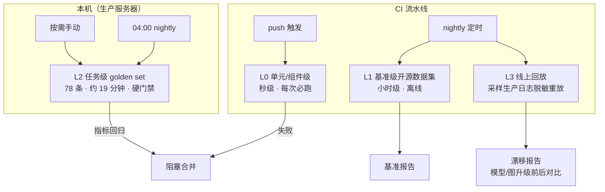
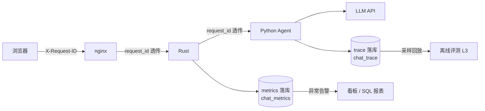

# Agent 评测与可观测性设计（升级路线第 0 步）

> 升级路线（手写图 → eval → 记忆 → 可观测 → 多 agent）的**验证地基**：先立"怎么验证"，再动工升级。
> 配套文档：[agent-architecture.md](agent-architecture.md)（现状架构）、[问题记录.md](问题记录.md)（事故与根因）。
> 部署与运维细节（服务名、路径、可复制命令）属私有运行簿，不进仓库。
> 最后更新：2026-09-20 晚（**命令前缀判据的元讨论豁免（提及 ≠ 发命令）**：判据由全文裸搜改为
> `_cmd_prefix_directive`（引号/内联代码区 **且** 同句含机制词 = 举例说明，放行），配前端
> `chat-core.js` 的 `stripMentionSpans`（正文兜底命令解析跳过同类跨度）——两侧口径必须
> 一致，否则"放行的提及"会在页面上真的生效；**golden 新增 `forbid_fallback` opt-in 断言**
> 堵住"用户收到兜底道歉、正断言却恰好命中道歉文本"的盲区（`followup_named_doc_reread`
> 曾以 resets=1 判 PASS），已挂 `rag_arch_check` / `followup_named_doc_reread` 两条；
> 单元锁 `test_gate_cmd_prefix_meta`（4 放行 + 4 仍拦 + 2 端到端））。**本轮读数**：全量
> **77/77 PASS、0 FAIL、resets 总=0**（首轮即调 10/10；工具调用 114 = 1.48/例、规划轮 105、
> 多轮绕圈 28、重复检索 7；留档 `eval/report/runs/20260920_214146.json`——该进程启动早于④
> 代码，故它验证的是①②，不含④）；④落地后复跑受影响子集 **5/5**（留档
> `20260920_214519.json`）。**检索供给端**：候选
> 截断改**相对断崖**（`_CLIFF_RATIO=0.25`，平均候选 5.45→3.50、recall@1/@3 与噪声 top-1
> 一条不动；α≥0.35 起丢多答文档），`rag_arch_ports_real` 作为**已知 FAIL**（rank=2，词法
> 表征局限、三类排序改法实测均无效）单列在 recall_eval 报告里。
> 上版 2026-09-20（**golden 全量撤出 CI**，L0 秒级套件增至 5 个（新增 `test_entities.py`
> 实体摘要单测）、golden 扩至 78 条/63 标签——新增三条跨轮实体取值用例 `followup_entity_slot_*`；
> 撤下依据与长任务三护栏见 §4 与 `.github/workflows/eval.yml` 头部注释）。
> 上版 2026-09-19（golden 扩至 70 条、54 标签：§4 新增**依赖链断言**
> `require_arg_from_result` + "回执里不得出现未解析引用"全局不变量 + 两条 `dep_*` 用例，
> 配 `agent/refs.py` 的参数引用（检索→读全文的 id 来源有断言可锁了）。
> 上版 2026-09-12（判据双侧加固 + 门禁可用性：正断言加正则族 `text_any_regex`、
> 负断言加 opt-in `not_contains_exempt_quote` 引述豁免——9/8-9/12 四次夜间红对账后确认 3 条为判据
> 误判；FAIL 时导出复审单 `eval/report/review_<ts>.md`（假失败当轮修判据、真 FAIL 才允许挂着）；
> 新增判据离线自测 `eval/judge_offline_test.py`（内联真实语料，秒级）+ 真实 trace 语义告警巡检
> `eval/trace_alert.py`（R1/R2/R3，排除 uid=0 评测产出，接入 nightly 但**仅巡检不置失败标记**）；
> 全量 66/66、0 resets）；
> 上版 2026-09-06（golden 扩至 66 条、52 标签：20260905 判据改写后全量 66/66、0 resets，
> 留档 eval/report/runs/20260905_195300.json；recall_eval 21 条 queries recall@1=1.00/MRR=1.00，
> 留档 20260905-201043.json——本版起正文按纯技术文档维护，自评/叙事类内容不再收录）；
> 上版 2026-09-03（planner 全权重构：gate fallback 替代 reflector/REVISE，见文首变更注）；
> 上上版 2026-09-02（golden 扩至 55 条、33 标签：rag_* 22（12 条 recall 正例同源出题 + noise/拒答组）、
> chat 7、multi-turn 7、nav 6、effect 6、hallucination/noise/knowledge/content_query/device/tool_call/
> article_read/efficiency 等；recall_eval 21 条 queries（12 正例 + 9 噪声）直接测线上 rag/search.py，
> 词法 2/3-gram BM25 基线 recall@1=1.00；20260901 定位重构 rag_query 技能废除、content_query 承接、
> 语料净化仅文章；20260902 声称闸三族 + 进程隔离 runner + efficiency 断言、executor 亦关 thinking）

> **20260903 架构变更注（planner 全权，正文保留为历史设计记录）**：执行链已重构为
> planner ⇄ execute → model → gate（决策-执行分离，轮次上限 `MAX_PLAN_ROUNDS=4`）——
> 自由 ReAct、reflector、REVISE 已废除（见 [agent-architecture.md](agent-architecture.md)
> §3/§6.5）。本文各节的旧执行路径/检查手段按历史记录理解；指标口径按 20260903 变化如下：
> - trace 图路径分段已由 planner/model/tools/reflector 变为 **planner/execute/model/gate**
>   （20260904 回执驱动加回受阻复盘后为五段 planner/execute/reflector/model/gate，reflector
>   未触发时无该段）——"reflector 修正了几次"现指受阻复盘轮次（≤2，输入结构性无散文）；
>   gate 不 REVISE 重考、直接 fallback 收尾；
> - §4/§7「REVISE 打回成本」效率代理指标（efficiency 字段 resets 总数/打回轮）现指
>   **gate fallback 次数**：gate fallback 时 server 仍发 `__RESET__` 并以 fallback 如实
>   文本替换最终回复——runner 按 `__RESET__` 帧计数 resets（run_golden.py），口径不变；
> - L0"反射器确定性闸" → **gate 确定性声称闸**（无 LLM 质检、无重考轮；声称检查作用域
>   收窄——宁可漏拦不可误伤）；
> - 零工具即 FAIL 类断言（require_tool_calls/require_tool_calls_any）继续适用：工具轨迹
>   由 planner 调用清单 → execute 产生，断言只查最终轨迹、不要求特定路径。

---

## 1. 定位与原则

- **评测 = 离线质量门禁**（"做得好不好"）：L0 秒级套件（5 个）在 CI 里跑（push 即拦截）；L2 全量 golden 在**本机**跑（20260920 起，CI 侧跨网链路不可用，见 §4 末注）。
- **可观测性 = 线上实时监控**（"现在跑得怎么样"）：trace/metrics/logs 三支柱。
- **回放打通两者**：线上日志采样 → 离线评测 → 行为漂移检测。
- **原则一：评测与语料解耦**。检索器质量、生成鲁棒性用开源数据集评测（与博客文章无关）；
  只有端到端回归需要少量自建 golden set（30-50 条足矣）。"文章少所以没法评测"是伪命题。
- **原则二：评测从阶段 0 建起**。每升级一步（图重写/记忆/多 agent/RAG）都带着它的验证手段上线，
  而不是全部做完再补——避免"升级 → 行为变化 → 无法回归 → 不敢改"。
- **原则三：指标可判定**。LLM-as-judge 只负责主观质量分，工具调用/命令帧等结构化行为用
  可判定的断言（金标比对），不依赖 judge 的主观性。

---

## 2. 评测体系：四层结构



| 层 | 评测对象 | 手段 | 指标 | 对应升级组件 |
|---|---|---|---|---|
| **L0 单元级** | 图节点、工具、schema | 单测（`test_skills.py`：映射表完整性/计划实例化/解析容错/反射器确定性闸） | 通过率 | 图重写、记忆剥离 |
| **L1 基准级** | 检索器、生成层、端到端 RAG | BEIR / RGB / CRAG（§3） | nDCG@10、Recall@5、MRR；噪声准确率 / 拒答率 / 错误检测率；Truthfulness（幻觉=-1） | RAG、防幻觉 |
| **L2 任务级** | 整个 agent 行为 | 自建 golden set（§4，已落地 78 条）；LLM-as-judge 未做 | task success、tool call accuracy、hallucination rate、faithfulness、延迟、成本（efficiency 断言代理：resets/打回轮/首轮即调率） | 图重写、多 agent、防幻觉 |
| **L3 回放级** | 线上行为漂移 | 生产对话脱敏采样 → 离线重放 → 与 golden 指标对齐 | 漂移方向/幅度 | 全部（每次升级后跑） |

**门槛分工**（20260920 起）：**CI** 只跑 L0（push 触发，秒级，硬门禁）；**L2 全量 golden 在本机跑**（按需手动 `eval/run_golden.py` / `eval/golden_full_run.py`，nightly 04:00 由 `scripts/nightly_regression.sh` 自动跑一轮，失败标 `~/agent_regression.failed`）；nightly 另跑 L1 全量 + L3 回放（小时级，出基准报告）。

**L2 门禁分两层**（20260921）：`tags` 含 `regression` 的用例（16 条防幻觉/契约/撤回话术/执行记忆）
**硬判 100% 通过**，不受 `--min-pass-rate` 放宽——回归题锁的是"已经定性为错误的行为不许回来"，
单条波动就是回归；其余用例是能力题（问答措辞有正常方差），按通过率判。报告 `regression` 块单列，
FAIL 复审单把回归组红置顶（当天必修）。混跑的坏处正是这个改动要治的病：一次全量里有 1 条回归红、
1 条能力题红，通过率门禁会把两条同等地吸收掉。

---

## 3. L1 基准级：开源数据集接入

| 数据集 | 出处 | 内容 | 评测对象与指标 | 许可 |
|---|---|---|---|---|
| **CRAG** | Meta / NeurIPS 2024（[GitHub](https://github.com/facebookresearch/CRAG)、[论文](https://papers.nips.cc/paper_files/paper/2024/file/1435d2d0fca85a84d83ddcb754f58c29-Paper-Datasets_and_Benchmarks_Track.pdf)），KDD Cup 2024 赛事（[starter kit](https://github.com/WoZhenDeShenMeDouBuZhidao/meta-comphrehensive-rag-benchmark-starter-kit)、[第二名方案](https://github.com/USTCAGI/CRAG-in-KDD-Cup2024)） | 4409 QA，金融/体育/音乐/电影/开放域 5 领域 | **端到端 RAG Truthfulness**：perfect=1 / acceptable=0.5 / missing=0 / **hallucination=-1**——评分体系就是为防幻觉设计的，幻觉扣分 | 开放 |
| **RGB** | 中科院，AAAI 2024（[GitHub](https://github.com/chen700564/RGB)、[OpenDataLab](https://opendatalab.com/OpenDataLab/RGB)、[论文](https://arxiv.org/abs/2309.01431)） | **中英双语**，600 基础题 + 400 进阶题，4 个 testbed，自带官方评测脚本 | **生成层鲁棒性**：① 噪声鲁棒性（检索到无关文档能否正确作答）② 否定拒绝（无答案时能否拒答）③ 信息集成（多文档整合）④ 反事实鲁棒性（检索结果有错误信息能否识别）。四个维度直接对应本项目防幻觉踩坑史，把定性变定量 | CC BY-NC-SA 4.0（非商业，学习/研究可用） |
| **BEIR** | IR 领域事实标准（[github.com/beir-cellar/beir](https://github.com/beir-cellar/beir)） | 18 子集（NQ/HotpotQA/FiQA/SciFact…）带相关性标注 | **检索器质量**：nDCG@10 / Recall@5 / MRR——对比 keyword vs vector vs hybrid（RRF 融合）三方案的曲线 | 开放 |
| **RAGAS** | [explodinggradients/ragas](https://github.com/explodinggradients/ragas) | LLM-as-judge 评测框架 | **端到端四指标**：faithfulness / relevance / context_precision / context_recall（L2 的评分器可复用） | 开放 |

**接入方式**：与业务代码解耦的独立评测脚本（`eval/` 目录），数据集下载到本地 `eval/data/`，
各跑各的输出 JSON 指标报告。改检索/生成/prompt 后跑一遍即可对比。

---

## 4. L2 任务级：golden set 设计（核心资产）

**规模 30-50 条，按意图分层（当前已落地 78 条、63 个标签，条目可多标签；主要标签分布：rag_* 22
（含 recall 正例 10 + noise/拒答组）/ chat 8 / multi-turn 7 / nav 6 / effect 6 / hallucination 8 /
noise 5 / content_query 5 / knowledge 4 / tool_call 4 / device 3 / regression 7 / exec_memory 2 /
truth_query 2 / idempotency 2 / summary 2 / display 2 / image 2 / deep 2 / article_read 2 /
efficiency 2 等——20260901 起新增 article_read/content_query 分层，20260902 起新增
efficiency/claim/thinking-leak/cover/concurrent/boundary 标签，20260904 起新增
exec_memory/truth_query/todo 等回执驱动用例，20260905 起新增 repeat-ask/anti-verbatim/
sticker/planner 等判据改写用例，20260919 起新增 dep/refs 标签（依赖链：检索→读全文））**：

| 分层 | 条数 | 覆盖 | 断言方式 |
|---|---|---|---|
| 意图正确性 | 12 | 导航/特效/夜间/显示/问答/闲聊 | 结构化断言：`tool_called`、`cmd_frame`（金标比对） |
| 防幻觉攻击 | 8 | 元消息/表演调用/格式漂移/去不存在的页面 | 断言：不伪造命令、不声称未发生的动作 |
| 多轮上下文 | 8 | 历史引用/摘要恢复/用户改口 | 断言：上下文注入生效 |
| RAG 问答 | 22 | 12 条 recall 正例（文章出题，与 recall_eval 同源）+ noise/拒答组（语料外问题诚实拒答） | 断言（知识词命中）+ 检索 eval recall@k（L1 落地） |
| 边界输入 | 4 | 空消息/超长/无权限/未登录 | 断言：正确降级路径 |

> 注：上表条数是分层设计目标，实际以 `eval/golden/basic.jsonl` 为准——多标签重叠、持续演进，
> 现状盘点见上文分布（78 条/63 标签）。

**评分双输出（LLM-as-judge）**：

1. **结构化断言**（可判定，不依赖主观）：`{"tool_called": ["navigate_to"], "cmd_frame": "AUTO_NAVIGATE:", "reply_nonempty": true}` ——与金标逐项比对。
2. **质量分**（0-5）：faithfulness（是否基于工具结果/检索内容）+ relevance + 人设保持。
3. **效率断言**（20260902 上线）：`require_tool_calls_any`（自选检索工具族首轮零工具即 FAIL）+ 报告
   `efficiency` 字段（resets 总数 / 打回轮 / 首轮即调率）——REVISE 打回成本代理，与防幻觉断言互补
   （断言只查轨迹，不要求特定工具，工具升级不碎断言）。
4. **依赖链断言**（20260919 上线，配参数引用 `agent/refs.py`）：
   - `require_exec_tools: ["get_article_detail"]` —— checker 验收回执里必须有它（比 `require_tool_calls`
     强：失败执行/未知工具帧不算系统确认事实）⇒ 锁"真读了全文"；
   - `require_arg_from_result: [{consumer, arg, producers, fields}]` —— consumer 的某参数必须取自
     producer 回执里的结构化字段（回执 `result` 只留前 200 字，扫这段即可）⇒ 锁"读的 id 是检索结果
     给的"，而不是模型凭印象把 id 写对。同族断言故意允许 `producers` 多选（search_notes/rag_search），
     与 `require_tool_calls_any` 同一条原则：**不锁工具选型，只锁行为**。
   - 全局不变量（对所有用例生效）：回执 args 里出现未解析的引用形态（`$tool[0].field`）即 FAIL——
     拓扑上不可能（resolve_args 失败即不执行），断言的是"不许把引用失败降级成当字面量调用"。
   - 用例：`dep_search_read_ota`（检索→读命中最靠前那篇→答正文细节）、`dep_search_read_graph`
     （换主题防单例运气 + 走检索键字段路径）。

**数据集版本管理**：`eval/golden/` 下 JSONL，每条含 `id / user_input / context / gold_assert / gold_score_floor / tags`。
线上发现新故障模式 → 构造新样本 → 进 golden set → 全量回归（本机按需 / nightly）从此拦截同类回归。golden set 是持续演进资产，
**改 prompt/图/记忆前必跑，防止"修一个幻觉、引入三个回归"**。

**L2 为什么撤出 CI（20260920）**：北美 runner 调北美阿里云端点那条 LLM 腿每次调用先吊住
（最坏一次 planner 调用 20+ 分钟才返回），3 条本机合计 39 秒的用例在 CI 里跑 21 分钟未完；
一次 120 分钟上限的全量跑被杀且零产出（报告只在结尾写 + 非 TTY 块缓冲，日志与 artifact 双双为空）；
诊断跑还抓出 CI 侧凭据 `401 Invalid API-key`——**CI 一轮都没跑出过真实通过率**。
结论：L2 **本机跑**（本机即生产服务器，链路真实，78 条约 19 分钟，device 真机用例天然覆盖）；
`eval/golden_full_run.py` 已提供进程隔离 + 单条 180s 超时（防悬挂污染），是本机的看门狗。
CI 只留 L0 秒级套件。

---

## 5. 可观测性：三支柱



### 5.1 Trace（链路追踪）

`X-Request-ID`（或 `X-Trace-ID`）从浏览器 → nginx → Rust → Python → LLM 全程透传。
**已落地（20260829-30）**：utils/logging.py 的 trace_id contextvar + server.py `trace_id_middleware` 注入
（`tid=` 日志前缀，`_submit_with_context` 的 copy_context 保证跨线程传播；device 工具把 trace_id 透传
device-service）；每轮对话落一份 trace JSON（utils/trace.py → `logs/agent/traces/`，时间戳+user_id+trace_id
文件名），记录：

- **图路径**：执行了哪些节点、递归深度（planner 决策轮数、reflector 受阻复盘轮数——20260904 起 ≤2 轮）
- **工具调用序列**：名称 / 入参摘要 / 出参摘要 / 耗时
- **LLM 调用**：prompt 字节数、token 消耗、首字节延迟（>30s 的慢调用打 WARN + trace `slow` 标记，20260830 上线）
- **关键事件**：摘要触发、空回复兜底触发、超时、命令帧产出、退出原因（client_disconnect/producer_done/超时等）

### 5.2 Metrics（聚合指标）

| 类别 | 指标 | 对应已知故障模式 |
|---|---|---|
| 成本 | token/月、LLM 费用/月、按工具/按子 agent 分解 | 线程池挂起、无界重试 |
| 延迟 | 端到端 P50/P95/P99、LLM 首字节、工具平均耗时 | 卡死感知 |
| 质量代理 | **空回复率、`__ERROR__` 率、恢复语触发率、工具失败率、命令帧率** | 这些正是踩坑日志里的故障现象，量化后任何异常直接对应已知模式 |

（多 agent 升级后追加：路由分布、各子 agent 超时率/成功率。）

### 5.3 Logs

现有 logging 升级为 JSON 结构化（`{"ts":..., "trace_id":..., "event":...}`），与 trace_id 关联，
按 trace_id 检索一次对话的完整生命周期。

---

## 6. 闭环：评测 ↔ 可观测（体系的价值）

```
线上指标异常（恢复语触发率↑ / 工具失败率↑）
  → 按 trace_id 采样定位故障模式
  → 构造新 golden 样本进 L2（数据集版本管理）
  → 全量回归（本机）从此拦截同类
  → 修复后跑 L1 + L3 验证无漂移
```

---


## 7. 与升级路线的落地顺序（评测先行）

| 阶段 | 并行建设的评测/可观测 |
|---|---|
| **0（当前）** | ✅ 已落地：`eval/golden/basic.jsonl`（78 条、63 标签：rag 24/chat 8/hallucination 8/multi-turn 9/nav 8/effect 6/noise 5/content_query 5/device 3/exec_memory 2 等）+ `eval/run_golden.py`（真实端到端，断言命令帧/声称检测/文本/efficiency；命令行 `--limit N` / `--only <id>`、`--only <id1,id2>` 逗号多选定位、`--skip-ids`、`--min-pass-rate`；报告双写 `eval/report/last_run.json` + `eval/report/runs/<ts>.json`）+ `eval/golden_case_runner.py`（20260902 起进程隔离跑法：单条独立子进程 + 180s 超时 SIGABRT 定位卡死，防悬挂污染后续用例，跑全量用 `eval/golden_full_run.py`）+ `eval/recall_eval.py`（L1 检索：recall@k/MRR，21 条 queries = 12 正例 + 9 噪声，直接测线上 rag/search.py）+ `test_skills.py`（L0 秒级）+ trace_id 透传（logging contextvar + 中间件）。**20260912 补**：`eval/judge_offline_test.py`（判据离线自测，改判据先跑这个再跑全量）+ `eval/report/review_<ts>.md`（FAIL 复审单）+ `eval/trace_alert.py`（真实 trace 语义告警巡检，非门禁）。**20260921 补**：`eval/golden_draft.py`
（trace_alert 命中的真实现场 → 用例草稿 + 人审对照单，落 `eval/report/golden_drafts_*.{jsonl,md}`；
**只产草稿不自动入库**，含真实用户文本故不进 git）+ L2 门禁分两层（回归组硬判 100%，见 §2 门槛分工）。
LLM-as-judge 未做 |
| 1 图重写 | ✅ 已完成（2026-08-25 技能注册表 + 受限规划，§6.5）：golden 补防幻觉/注入分层（attack_embed_command / attack_prompt_leak），断言反转跟进摘要独立化（summary_round 不得含 SUMMARY:）；20260830 修 golden 断言过严三条（行为正确不判失败） |
| 2 Eval | ✅ CI 评测门禁已上线（`.github/workflows/eval.yml`，push 触发 L0 秒级套件硬门禁）；L2 全量 golden 本机跑（20260920 起撤出 CI）+ nightly crontab（scripts/nightly_regression，失败标 `~/agent_regression.failed`）。**未做**：L1 三基准接入（BEIR/RGB/CRAG） |
| 3 记忆 | 🟡 部分完成：摘要独立化（2026-08-26）结构性关闭污染面；**未做**：记忆专项评测（召回相关性、摘要合并质量、污染检测） |
| 4 可观测 | 🟡 部分完成：对话 trace JSON 落盘（utils/trace.py → logs/agent/traces/，20260829）+ LLM 慢调用监控（>30s WARN + trace slow 标记，20260830）+ trace_id 中间件。**未做**：metrics 落库、看板、L3 回放 |
| 5 多 agent | 路由正确性评测 + 子 agent 指标分解 |

**组件映射速查**：

| 升级组件 | 评测手段 | 可观测指标 |
|---|---|---|
| Agent 核心重写（手写图） | L0 节点单测 + L2 golden（意图/防幻觉） | 图路径、递归深度、planner/reflector 计数 |
| 记忆体系升级 | L0（摘要协议已移除，test_skills.py 断言不再 REVISE）+ golden summary_round（不得输出 SUMMARY:）+ 记忆专项评测（未做） | 摘要触发率、召回命中率、污染事件 |
| 多 agent | L2 路由正确性 + 子任务成功率 | 路由分布、子 agent 延迟/成本分解 |
| 防幻觉 | L1 RGB 四 testbed + L2 攻击样本 | 空回复率、恢复语触发率、`__ERROR__` 率 |
| RAG | 🟡 已落地：检索基线 L1（recall_eval.py 直接测线上 rag/search.py，词法 2/3-gram BM25 文档级聚合，21 条 queries（12 正例 + 9 噪声）recall@1=1.00——词法已打满当前语料，向量留 BEIR 对比再上）+ L2 golden rag_* 22 条（端到端，同源出题）。未做：BEIR 基准、CRAG Truthfulness | 检索耗时、top-k 来源分布、拒绝回答率 |
