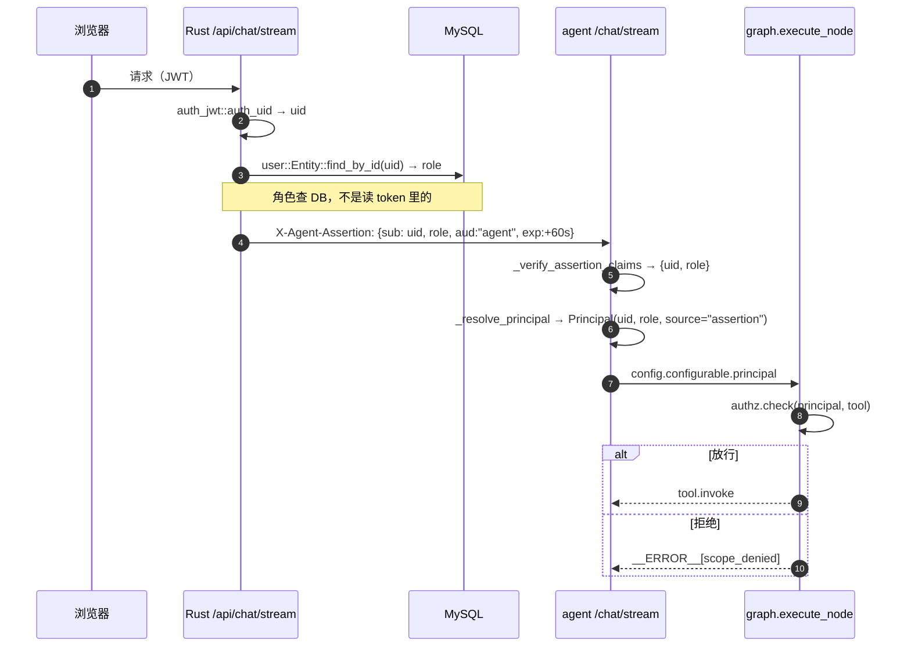

# 身份与权限：框架与现状（20260920 起）

> 状态：**框架已落地、默认不拦（shadow）**。本文件是这套东西的唯一事实源：
> 已建成什么、为什么这样建。它原本是为"秘书"那一档角色写的地基文档；秘书一档
> **已于 20261011 撤掉**（它的两项独占 scope 一个工具都没挂上、生产上也从未被使用），
> 底下的身份 / 权限 / 同意闸 / 管理助手这几层原样在用，因此文件保留、改名换定位。
> 代码：`agent/principal.py`（身份）、`agent/authz.py`（权限）、`agent/graph.py::execute_node`
> （唯一判据点）、`server.py::_resolve_principal`（身份来源）、Rust 侧 `src/authz.rs`（角色取值域）。
>
> **分节地图**（跨档，判据按节走）：**§3–§5、§7 是现状型**——已落地的框架（§3.1–§3.6）、
> 一次带角色的对话走哪些点（§4）、管理助手各批的**能力清单与纪律**（§5）、建号操作指南（§7）。
> 索引标签 = 现状型。

## 3. 已落地的框架

### 3.1 身份：`Principal`

```python
Principal(uid=7, role="user", source="assertion")
```

- **唯一构造点**是 `server.py::_resolve_principal`，两条来源：
  - `source="assertion"`：Rust 签的 60s 断言，**role 取自 DB**（`chat.rs::prepare_chat` 单次
    `find_by_id`，与 `middleware::auth_guard` 同一条纪律：不信登录 token 里可能 7 天前的角色）；
  - `source="body"`：回退信任请求体（`AGENT_REQUIRE_ASSERTION=0` 时的旧路径）——
    **这条路径上 role 恒为 `None`**，绝不因为"读不到角色"而默认授予。
- 取不到 principal（老调用方、直调图的单测）→ `UNKNOWN`（uid=0、role=None）。
- 角色名与取值域：`superadmin` / `admin` / `user` / `zako`，两侧同名（`agent/principal.py` ↔ `src/authz.rs`）。
  （`superadmin` = 超级管理员，20260926 新增；`zako` = 杂鱼，20261002 新增，见 §3.6）

### 3.2 范围：scope manifest（`agent/authz.py`）

scope 词汇表（`<动作>.<对象>`）：`read.public` / `read.own` /
`write.page` / `write.device` / `write.own` / `write.console` / `admin.console`。

| 角色 | 授予 | 与今天的关系 |
|---|---|---|
| `user`（访客/体验号） | read.public、read.own、write.page、write.device、write.own | **= 今天的行为**（设备归属由 device-service 按 uid 校验，是既有事实） |
| `admin`（博主） | 全部 | = 今天的行为 |
| `superadmin`（超级管理员） | 全部 | 与 `admin` 同授予（不新开一档）；多出来的那部分不是"更多 scope"，而是**对人操作**的策略豁免，只在 Rust 侧实现一次 |
| `zako`（杂鱼） | **无**（空集） | 20261002 新增：**零工具**身份。这一格不是"还没配"，是结论——它的能力边界真正的硬保证在 `graph.planner_node` 的短路（见 §3.6），零 scope 只是第三道 |

工具级的 `TOOL_SCOPE`（注册表里的工具一个不漏，**完备性由 `tests/test_authz.py` 在 CI 层锁死**：
新增工具忘了声明会红，不靠运行时宽容）。这里**刻意不写件数**——工具数每加一件就要来改一次
（本文曾长期写着"22 个"，实际已是它的近三倍），件数由那条测试与注册表自己保证。`write.*` 三档单独成集（`WRITE_SCOPES`），
留给"人在回路确认"挂钩。

### 3.3 判据：只有一个点

`graph.py::execute_node` 在**调用工具之前**执行 `authz.check(principal, tool)`，与断连检查、
参数引用解析同一层（确定性、无 LLM、无一例外）。**拒绝在结构上不可能被绕过**：执行层没有
第二条路径能碰到工具（这是 20260903 架构裁决的红利——执行器本来就没有自由意志）。

- **shadow（默认）**：决策照算，只把**拒绝**记进 trace（`execute.authz_shadow` 事件），
  行为完全不变。先跑一段真实流量，看谁会撞上授予表边界——用证据校准，而不是拍脑袋配表。
- **enforce（`AGENT_AUTHZ_ENFORCE=1`）**：拒绝产 `__ERROR__: 权限不足[<原因码>]` 帧 →
  checker 判 BLOCK（`reason=scope_denied`）→ 走既有受阻链路（planner 如实收尾 / reflector
  受限复盘）。**不新增决策分支**，也不静默吞掉。
- 失败取向：未知角色、未声明工具一律**拒绝**（fail-closed）。从不默认放行、从不默认管理员。

### 3.4 人在回路：权限之后还有一次"同意"

**权限回答"这个人能不能做"，确认回答"这一次他到底要不要做"**。两者都在同一个确定性点上，
但判的是不同的事——`authz.check()` 通过之后，`execute_node` 还会问一次：

```
requires_consent(principal, tool)         # 只看 scope 是否在 CONSENT_SCOPES —— 声明驱动
  └─ 命中 → consent_granted(principal, tool, 用户本轮消息)   # 确定性正则，无 LLM
        └─ 未获确认 → 产 __ERROR__: 待确认[consent_required] 帧，**不调用工具**
```

- **只对"离开用户眼前"的写入要确认**：`CONSENT_SCOPES = {write.console, write.own}`
  ——`write.console` 改的是**对外可见状态**（一篇文章从公开变私密，读者立刻打不开）；
  `write.own` 的效果只在自己账号里，但它满足那条措辞背后的**真判据**："这一次到底要不要
  做"需要一个确定性答案（详见 `agent/authz.py` 那段注释）。`write.page` / `write.device`
  的效果就发生在用户眼前（看得见、也改得回来），既有行为一条不动。
- **确认 = 用户本轮消息里说了才算**（`_CONSENT_PATTERNS`，刻意收窄到"确认发布"这类明确
  说法）。fail-closed：一个需确认的 scope 若没配确认语表 → **一律不放行**（不默认同意）。
- **拒绝形态复用既有 blocked 链路**：`__ERROR__` 帧 + `consent_required` 原因码 → checker
  判 BLOCK → planner 去问用户。用 `__ERROR__` 而不是普通文本是有意的：gate 分支 5a
  （错误帧 + 完成式声称 → fallback）因此自动生效，**叙述侧无法把"没执行"说成"已发布"**
  （需要"已经帮你发布好啦"这类句子被判据认出来，见 `_WRITE_CONTENT_CLAIM_RE` 三支的取舍）。
- **闸是声明驱动的**：将来新增一个取需确认 scope 的工具会自动落在闸下，
  不需要有人记得来改这段代码（`requires_consent` 只看 scope 是否在 `CONSENT_SCOPES`）。

**两个消费者，两张分开写的判据表**：`write.console`（管理助手写三件，见 §5.2）与
`write.own`（收藏/取消收藏/标记已读，20260923）。同一个闸门、同一个判据函数形态，差分只在
`_CONSENT_PATTERNS`：前者是一条**判据函数**（`_console_command`），后者更严一档——它额外拿到
**工具名**（`_own_command`），判的是"这句是不是在命令**这一个**工具"，防的是"用户命令 A、
planner 填了 B"的误靶写。

- **同意语义（用户 20260921 拍板）= 同轮命令即确认**：管理员说「把《架构文档》设为私密」
  就是命令、也是确认，**不再要第二句"确认"**。所以这个判据回答的是"**本轮有没有明确命令**"，
  **不是**"有没有第二次确认"——措辞与文档都要说准，否则下一个人会以为漏了一层。
- **判据必须是命令式的**（动作词 + 目标词），并**排除疑问/假设/转述**。成对断言锁在
  `tests/test_authz.py` 与 `tests/test_admin_write.py`：`"把文章 12 设为私密"` → 放行；
  `"把文章 12 设为私密会有什么影响？"` / `"如果我把文章 12 设为私密的话"` → **不放行**。
- **fail-closed 的方向 = 判不出来就先追问**（多问一次，不误写）。这一条与 §3.4 顶部那句
  同源：确认闸宁可挡下一次合法写，也不能放行一次没被要求的写。
- **`write.console` 同样进 `_HARD_SCOPES`**（不吃 shadow）：写能力纯新增、没有观测期。
  ⚠️ 只进 `CONSENT_SCOPES` 而**不进** `_HARD_SCOPES` 是本轮最危险的一处——`authz_enforce=False`
  时 `decision.allowed=False` 会直接落到 invoke。两个集合都进，`tests/test_admin_write.py` 用
  `authz_enforce=False` 下的非 admin 断言把这条锁死。
- **叙述侧的第二道网**：同意闸挡的是执行，narrator 还有可能把"没执行"讲成"已经置顶啦"。
  因此新写动词进了 gate 的两族判据（err 帧轮走 5a 的 `_WRITE_CONTENT_CLAIM_RE`，
  零帧轮走 洞① 的 `_STATE_ACTION_CLAIM_RE` ④支），**且两处都必须带疑问豁免**——
  未获确认那轮的正确回复恰好就是一句追问（"需要我现在帮你执行吗？"），少了豁免会把
  设计好的正确答案判成"声称已执行"。教训写进了 `graph.py` 的注释（这两支是**独立备选**、
  各自带完成标记，豁免必须两处都挂）。`_EXECUTION_CLAIM_RE` 刻意**不收**这批动词：
  它只在零帧 `content_query` 宽查，加进去会把合法的疑问句打成声称（实测：三个动词
  在 516 条历史 trace 上的命中差异为 0，这条改动零历史影响）。

**20260921 第三轮：闸判 False 不再等于死路（弹窗），并修掉一个把判据整个架空的壳**。
生产实测暴露了两件事，都是这一段的直接后果：

- **判据看到的是包装过的文本**。`server.py` 给本轮用户消息加了 `[当前问题]: ` 锚点
  （20260901，防"把历史旧问题当当前问题回答"），而 §3.4 这一族判据**全是锚定的**
  （句首 把/将、句首动词、句首假设词）——带着壳一条都命不中。后果实测到两条：
  **教科书式的明确命令**「把文章 12 设为私密」判 False（连"同轮命令即确认"这条快道
  也从未真正生效过），假设句「如果我把文章 12 设为私密」也判不出提问。修法 =
  判据入口先剥系统方括号注记，`tests/test_authz.py` ⑨f 用"带壳与不带壳判定一致 +
  剥完仍是对的那个判定"两句锁住（只测透明度的话，"两边都判 False"也能过）。
  20260930 补第二层：**句首称呼壳**（「小猫咪，把…」——主人的说话习惯，生产语料 22.7%
  的消息带），它架空的是同一批句首锚定判据（同意闸 6 条翻正、弹窗分叉 8 条）。
  两层壳的剥法现在只有一份：`authz.strip_user_shell`（⑨h 锁住"三处判据同一口径、
  剥壳不放宽提问/假设/陈述"）。**教训**：判据函数有测试 ≠ 判据在真实输入形态上有测试；
  真实输入形态既是 server 拼出来的、也是主人的说话习惯，测试必须按它们喂。
- **判 False 的出口从"再问一轮"改成"点一下"**（§5.3）：非命令措辞的意图 → 弹确认框
  （零 LLM、零执行）；提问/假设照旧走追问。判据本身**没有放宽**——为明确命令补的是
  「确认…」短回声骨架（agent 自己建议、用户照抄的那句），其余一律继续 fail-closed。

**20260923 第三个消费者：`write.own`（用户**自己**的私有数据：收藏文章、标记通知已读）**。
它与前两个的差别不是"更松"，而是**判据的粒度不同**——本轮新增了一条结构性判据：

- **一个 scope 挂多个工具 ⇒ 谓词必须看得到工具名**。前两个 scope 各自只有一个语义方向
  （"发出去" / "改后台"），而 `write.own` 底下是三个动作（加收藏 / 取消收藏 / 标记已读）。
  同意闸是按 scope 查表的，若判据只看消息，用户说「把通知都标记已读」而 planner 填错成
  `add_favorite` 时，**scope 级同意会照样放行**——那是 20260921 golden 抓过的**误靶写**
  在一个本为防它而设的闸门里溜过去。所以 `consent_granted` 对**可调用**的判据多传一个
  参数（工具名），`_own_command(msg, tool)` 据此判"这句是不是在命令**这一个**工具"；
  `_console_command` 收下不用（后台写的靶子由技能模板与目标校验管，那里更硬）。
  回归锁 = `tests/test_authz.py` ⑨g 的"同一句话对不同 own 工具结论相反"。
- **工具 → 动作家族是完备映射**（`_OWN_TOOL_FAMILY`，仿 `TOOL_SCOPE` 的完备性纪律）：
  没登记的工具一律 False，**不用"反正都是 own"兜底**（那正是上面那条要防的）。
- **三档角色都授予、不进 `_HARD_SCOPES`、不进 `_ALWAYS_CONFIRM_TOOLS`**：它写的是调用者
  自己的东西（自己看得见、一键能撤），且"在页面上点收藏"本来就是每个登录用户都能做的事
  ——满足 shadow 的"观测既有流量"前提，没有"纯新增能力"那个理由。写面的守卫落在
  scope + 同意闸 + 工具层写后复核三道，全部确定性。
- **判据刻意比 `write.console` 更窄**（宁可落回弹窗）：陈述句（"我已经把这篇文章收藏了"）、
  名词用法（"帮我看看收藏"——这里的"收藏"是页面名）、量词型打听（"我收藏了哪些文章"）
  一律判非命令；同一句里出现另一族动作（"取消收藏这篇，收藏那篇"）也判不准。

### 3.5 观测：怎么读 shadow 的结果

```bash
# trace 里的 shadow 拒绝事件（一轮一文件，见 docs/eval-observability.md）
grep -l authz_shadow /home/ubuntu/Saudade-Blog/logs/agent/traces/*.json | wc -l
```

判据读法：**拒绝只应来自"身份不明"**（Rust 还没发 role 的过渡期，`reason=unknown_role`）。
若出现 `reason=denied`（角色已认、scope 未授予），说明既有角色撞上了授予表——那要么是
授予表配错了（改表），要么是真越权（保持拒绝）。**这就是打开 `AGENT_AUTHZ_ENFORCE` 前
必须拿到的那份证据。**

### 3.6 零工具身份：`zako`（杂鱼，20261002）

**产品语义一句话**：和杂鱼对话时 agent **拒绝调用任何工具**，只用「雌小鬼」的口吻闲聊
（喊对方"杂鱼"、得意地挖苦，但按拍板的**轻度**档：不涉脏话、家人、外貌）。

**"零工具"是四层收口，而只有一层是硬的**——这份表要照着读，别把前三条当成保证：

| 层 | 落点 | 拦什么 | 硬度 |
|---|---|---|---|
| ① 技能可见性 | `skills.visible_skills`（`role in CHAT_ONLY_ROLES and not s.chat`） | planner 菜单 / native schema / narrator 能力清单三处**同源**只剩 `chat` | **软**：`instantiate_plan` 不校验可见性，LLM 点名不可见技能照样成行 |
| ② native schema | `native_plan.build_tool_schema` | native 档模型只点得出 `chat` | **软**：只对 native 档生效，而默认档是 `text` |
| ③ authz 空 scope | `authz._ROLE_SCOPES[ROLE_ZAKO] = frozenset()` | 执行前的 `authz.check` | **软**：`execute_node` 在 shadow 档下（`not allowed and not enforcing`）**只记账不拦**，而 `zako` 会拿到的那些 scope 没有一个在 `_HARD_SCOPES` |
| ④ planner 短路 | `graph.planner_node` 顶部 | 结构上不产出 TOOLS 行 ⇒ `execute` **永不被进入** | **硬**（确定性、无 LLM、无配置开关） |

失效链（不加 ④ 就会真发生）：planner 点名一个已不可见但仍在 `SKILL_MAP` 里的技能 →
`execute` → authz 判 deny → shadow 下**照 invoke**。所以"前三层兜住了"是错的。

- **两条反直觉的核验结论**（都写进了 `tests/test_zako_role.py`）：
  - `build_tool_schema("zako")` **不是空数组**——`chat` 技能对任何角色可见、且它不按
    `plan` 过滤 ⇒ 数组恒为 `[chat]`。**反过来不能把 chat 也摘掉**（那才会产出 `tools: []`）。
  - 口吻**只能**放 `prompts.audience_block` 的第三支（走既有的 `{audience}` 槽）：
    放 `BLOG_PERSONA_PROMPT` 会打到所有角色，给 `_EXECUTOR_PROMPT` 加 format 槽位会
    让 `tests/test_prompt_prefix.py` 立刻 KeyError。
- **连带**：`graph._FREEZE_ALLOWED_TARGETS` 两行都要含 `ROLE_ZAKO`——不加则管理员冻
  杂鱼会被 agent **提前拒**并回一句**说错政策**的话（"管理员之间不能互相冻结"），
  而后端 `check_freeze` 本来是 `Ok`。
- **账号怎么来**：后台建普通账号 → 跑 `scripts/migration/zako_role_20261002.sql` 升角色。
  杂鱼**会出现在后台账号列表里**（`is_listable_role` 的判据是"已知角色且非超管"），
  这正是设计：博主看得见它、能冻它、能改它的身份。

## 4. 布线图（一次带角色的对话）



> 这张图原来是手画的字符图（箭头是靠空格对齐的），中文注释一进去就错位；
> 换成 mermaid 后顺序与分支都由渲染器算。

## 5. 管理助手：能力清单与落地纪律（20260921 起）

这一节按**批次**记管理助手（以发起人身份代调后台）已落地了什么、每条判据守在哪。
原本这里还有一张"还差什么才能上线一个秘书"的需求表，随秘书一档撤掉（20261011）：
① 秘书角色落库、② 断言收口、③ 同意闸、④ 写通道、⑥ 审计**全部已落地**，
⑤（前端角色模型）不再是任何东西的前置。

### 5.1 管理助手：只读三件（20260921 落地，读侧）

博主（role=admin）问运维/审核/用户数据时，agent 现在**真的去读后台**，而不是答"我看不到"：

| 能力 | 数据源 | 通道 |
|---|---|---|
| 服务器健康度（CPU/负载/内存/swap/磁盘/开机时长） | agent 本机自采（`/proc`、`shutil.disk_usage`） | **不经后台门**——agent 与 Rust 同机，自己读就行（`agent/hostinfo.py`） |
| 服务健康（三个 systemd 单元 + 心跳日志 + 今日 trace 异常） | `systemctl show`、`logs/health.log`、`logs/agent/traces/` | 同上 |
| 留言审核状况（待审/AI 拦下/交叉表 + 最近明细） | `GET /api/protected/board` | 以发起人身份代调（`get_moderation_status`：**按审核状态切三份名单的报表**） |
| 留言后台名册（逐条，含待审/未通过，**每条带真实发表账号**） | 同上 | 同上（`list_admin_board`，20261001）：公开的 `list_guestbook` 只有留名框里填的自由文本——**那不是账号**；放灯强制登录 ⇒ 匿名留言一样溯得到是谁发的（§agent-architecture 6.7） |
| 用户数据报表（用户数/角色分布/会话消息量/近 7·30 天活跃） | `GET /api/protected/stats/users`（本轮新增，见父仓 `src/routes/stats.rs`） | 以发起人身份代调 |

**三条判据（都在同一个点上，与 §3.3 一致）**：

1. **新 scope `admin.console`**，且**不吃 shadow 开关**（`_HARD_SCOPES`）：shadow 的目的是"观测
   既有流量会不会被拦"，而这批能力是纯新增、没有观测期——shadow 期越权是可被利用的窗口，
   所以硬拦。全局 `AGENT_AUTHZ_ENFORCE` 仍关，那件事要有自己的 shadow 证据。
2. **结构性不可达**：四个工具不进 planner 点名白名单（`_EXPLICIT_TOOLS`/`_CALLABLE_QUERY_TOOLS`），
   非 admin 的 planner 上下文里根本看不到这三个技能（`build_planner_context(role)` 按角色过滤）。
3. **越权的措辞要如实**：403/401 → `unavailable("当前身份无权访问后台数据")`，不返回空、
   不假装成功（空结果会被下游读成"没有待审留言"）。

**数字在工具侧算好**：报表返回的是**渲染好的中文报表文本**，不是原始 JSON 让模型自己数——
LLM 计数是幻觉源。这是对既有 `_shape(data)` 惯例的有意偏离（理由写在 `agent/reports.py` 头注）。

**注入面（写给下一个改的人）**：agent 从此会读**攻击者可控的文本**（待审留言原文会进工具帧）。
本轮全是只读，注入最多导致**答错**、不导致**做错**；工具侧对这类文本做了命令前缀消毒
（`sanitize_untrusted`，插 U+200B 零宽符断开 `EFFECT:`/`AUTO_NAVIGATE:` 的命令形态，两侧
`\s` 都不匹配该字符）。**下一轮做写操作（标签创建/文章状态变更）之前，consent 闸必须先真正
跑通**——它已就位且同样不吃 shadow（§3.4）。

**写操作两件为什么留下**（用户 20260921 拍板「先只读三件」）：写要同时有 ① 授权（谁让我做的）、
② 确认（这一轮他确认了吗）、③ 记录（审计），今天只齐了 ①；缺 ②③ 的写通道等于没有防护。

### 5.2 管理助手：写三件（20260921 第二轮，写侧 + 审计）

第一轮把"写"留下的公开理由是"写要同时有 ① 授权 ② 确认 ③ 记录，当时只齐了 ①"。这一轮把三件
补齐——写操作**第一次真的走通了那条同意闸**（§3.4 从"空转"变成"承重"）。

| 能力 | 工具 | scope | 通道 | 关键约束 |
|---|---|---|---|---|
| 读后台文章清单（**含草稿/私密**） | `list_admin_notes` | `admin.console` | `GET /api/protected/notes/list` | 这是草稿/私密文章**唯一的可达读口**——公开 `list_notes`/`search_notes`/详情都硬过滤 `is_public && status!='draft'`，没有它，"把草稿发布出来"这半个能力在 planner 侧永远拿不到 id |
| 建标签（一级/二级） | `create_tag` | `write.console` | `POST /api/protected/tagone` / `tagtwo` | **先查后建**（同名同层 → 复用不写库）+ **建后复核**（按返回 id 读回，名字一致才算成）；颜色按名字哈希，与前端 `NoteTagSelect` 的 `colorForName` 同算法 |
| 改文章状态/置顶 | `set_article_status` | `write.console` | `POST /api/protected/notes/:id` | **只发点名的字段**；绝不发 title/content（会触发 `from_editor` 分支：重定向 + 级联删修改稿）、不发 isPublic（由 status 联动）；已是目标值时**不发请求**（`update_note` 会无条件刷新 `updated_at`，空改动把文章顶到列表最前） |
| 加/去/替换文章标签 | `set_article_tags` | `write.console` | 同上 | `noteTags` 是"传了就写"、`""` = 清空 ⇒ **只有 `replace=[]` 才可能清空**；未点名的标签**永不被顺手摘掉**；标签按名字精确匹配，找不到就如实说（不自动新建） |

**三道门，都在确定性点上**（无一道依赖 LLM 自觉）：

1. **授权**：`authz.required_scope(tool)` = `write.console`，进 `_HARD_SCOPES`（不吃 shadow，
   理由同 §5.1）+ 进 `CONSENT_SCOPES`。`_ROLE_SCOPES` 一行没改：admin 自动含全部 scope，
   **非管理员角色刻意拿不到**（后台写与 `admin.console` 同域，Rust 那道门也只认 admin）。
2. **确认**：同轮命令即确认（判据见 §3.4）。
3. **目标有据**：写工具的 `article_id` 必须来自 ①本轮某个读类工具帧 ②页面上下文 `/article/<id>`
   ③用户本轮消息里显式点到的数字；否则产 `__ERROR__: 目标未经确认[unknown_target]` 帧 →
   planner 先读再写。**如实定位**：它拦的是"整轮没读过任何东西却写一个凭记忆的 id"，
   **不保证 id 一定对**（后者靠回执回显 + 管理员复核）。

**读写都走 `/api/protected/notes/list`（一条口径，不是随手选的）**：`/api/protected/draft/editor/:id`
对**修改稿**行会解引用成原文章，而 `update_note` 只发 `{status,isTop}` 时 `from_editor=False`、
**写的是被点的那行本身**——读的行与写的行不是同一行，前值/回显全假；更坏的是把修改稿行写成
`status=public` 后，公开列表（只滤 `is_public`/`draft`，**不滤 `draft_of`**）会多出一篇同标题文章。
`/notes/list` 过滤 `draft_of is null` ⇒ 修改稿在这里**读不到** ⇒ 写工具**如实拒绝**
（"这不是一篇文章本体"），而不是猜。

**一条硬纪律：一切"没做成"都必须 `unavailable()`**。checker 对**非空文本**一律判 PASS，而 PASS
会被记成**系统确认事实**落进回执 → `execution_log` → 下轮注入 narrator——`ok("创建失败…")` 会被
下一轮的自己念成"已创建"。反过来 `empty("")` 会被判 `empty_result` 而 BLOCK ⇒ **"零写成功"的返回
也不能是空串**（如"标签已存在，复用 id=13"走的是 `ok`）。另：Rust 的 `ApiResponse::error` 是
**HTTP 200 + code 500**，所以 `_admin_post` 必须看业务码，只判状态码会把"创建失败"读成成功。

**执行去重是 args-aware 的**：既有收尾判据只比工具名，对写不够——planner 第二轮补做"另一篇"
（同一工具名）会被静默收尾，而 narrator 手握第一条真回执必然说成"都改好了"。新增
`_EXECUTED_ONCE_SKILLS`（不改 `SNAPSHOT_SKILLS` 的语义与断言），判据改成 **`(tool, args)` 整体**，
并给写技能一条**独立收尾文案**（不能复用"快照型只读、重复调用拿回同一份数据"）。
`_CONTENT_TOOLS` **只加 `list_admin_notes`**：那个集合的语义是"跑过 ⇒ 检索/读取声称有据"，
塞写工具会让"建了个标签"变成"我检索过"的证据。

**记录（审计，零迁移）**：写回执顶层带 `principal_role`/`op`/`before`/`after`（跨语言契约键，
Python 写 / Rust 读，`src/routes/chat.rs::render_exec_row` 四个新臂），渲染成
`以管理员身份 · 修改文章 12：私密 → 公开` 整行进既有 `detail` 列——**不加列、不做迁移**。
写行**刻意不带《标题》**（回执会经 `recent_executions` 注入下一轮，带《标题》会被读成
"我读过这篇"的指代证据）。`actor_prefix` 取不到角色时返回**空串**而不是"访客"：
写操作从不由访客发起，把管理员的操作标成访客是伪造审计记录。

**验证（三件套，口径不同）**：
- `tests/test_admin_write.py`（秒级、零网络、**进 CI**）= 本轮回归主力：假 httpx 验 `_admin_post`
  的 `uid<=0` 不发请求 / 401 / 403 / HTTP 200+code 500 一律 unavailable；假工具 + 假 principal
  直接驱动 `execute_node`，验三道门（疑问句/假设句 → 零调用 + `consent_required`；
  非 admin → `denied`；**`authz_enforce=False` 下非 admin 也必须被硬拦**；目标无据 →
  `unknown_target`；非法参数不发请求）；checker 三态；去重 args-aware；`color_for_name` 与
  前端对拍。
- **golden 只加"不写"的三条**（真写用例会改生产库，一律不进 golden）：`admin_write_question_no_exec`
  （问影响 → 零写 + 无完成式声称 + 真有影响说明）、`admin_write_denied_user`（访客下写命令 →
  零写 + 如实无权）、`admin_write_no_identity_honest`（uid=0 打不存在的 id → 不许声称成功）。
  三条都带 `forbid_fallback` + 负向正则族——**正向一律用形态正则族而不是词表**（实测：
  "没有权限"这种连续串命中不了"没有修改文章权限"，词表追不上措辞）。
- `eval/probe_admin_write.py`（**不进 CI**，需要真实管理员 uid）：默认只跑零真写的三步
  （非管理员写指令 / 管理员疑问句 / 打不存在的 id），真写（草稿置顶来回、标签加减、
  经生产入口真写一轮 + 跨轮复述）需显式 `--allow-write`，删临时标签还需 `--allow-tag-delete`；
  **断言读后端真值**（探针自己现签 JWT 直查 `/api/protected/*`），不看工具返回值。

**诚实备注（缺口）**：

① 上面那三条 golden 与探针的安全步在 `uid=0` 下结构上安全（`uid<=0` 守卫 ⇒ 请求走不出
进程），但**"管理员 200 路径"要等真实管理员 uid 才算验过**（同 §5.1）。

② 探针的 `--allow-tag-delete` 会触发 `DELETE /api/protected/tag` 里**全表**
`prune_note_tags`（清理 `note.tags` 悬空引用），**不可回滚、与探针本身无关**——默认不跑，
跑前披露。

③ **残余波动：`admin_write_no_identity_honest` 约每 6 次有 1 次走 gate 打回**（`forbid_fallback`
如实把它记成 FAIL）。复核：narrator 写了「本轮没有执行任何工具」，而本轮**确实执行过**
公开读工具（`receipts` 非空）⇒ 命中 20260920 落地的洞③（假阴性声称），gate 换成兜底文本。
**判据没坏、是模型措辞的波动**，且**不在回归组**（按通过率计）。兜底文本本身如实（"其实
执行过工具、只是返回是空的"），但**偏题**——用户问的是"把文章 999999 设为私密"，回复却在
问"要不要换一组关键词再查一遍"。**20260921 第三轮已收口**：兜底文案按**原因码**分
（`_FALLBACK_CONSENT` / `_FALLBACK_UNKNOWN_TARGET`，gate 5a 用 `authz.consent_error_reason`
与 `adminops.target_error_reason` 取回），不再套用通用的检索话术。

④ 复核一条**作废的旧读数**：早先一轮（判据还是**词表阳性**时）测得"访客写命令只有六到七成
给出明确拒绝"，看上去像"拒答不稳"。改用形态正则族后复跑 6 次（golden `admin_write_denied_user`）
+ 探针非管理员三问 6 次，**全部干净拒绝、零写工具**——那条读数的绝大部分是**判据侧问题**
（"没有权限"这种连续串命中不了"没有修改文章权限"），不是模型行为。教训与 §5.2 开头一致：
正向断言要用**形态正则族**，词表永远追不上措辞。

### 5.3 写操作的确认弹窗：一次点击代替一轮对话（20260921 第三轮）

**用户实测的原话**：「实测根本不行，还有确认机制非常有问题，需要再执行一次对话浪费 token
而且会被认为是再次请求吧……需要操作授权或者二次确认或其他方案等用户输入时，弹出类似于
泠月喵建议去：xxx 同类型的窗口，还有 agent 对话窗口加上颜色预览」。三条缺陷：① §3.4 的
判据认不出人话（连 agent 自己建议的「确认创建标签 X」都判 False ⇒ 死路）；② 唯一的确认
通道是**再发一条消息**（烧一轮 planner+narrator，且在前端呈现为一条新请求）；③ 颜色参数
根本不存在（说了"粉色"也进不了链路，颜色由名字哈希决定）。

用户拍板四条：**① 弹窗点确定 = 隐藏确认请求 + 跳过 planner；② 文字命令快速路径留，但只认
明确命令；③ 颜色 = 站内 8 色板 + 中文色名映射；④ 弹窗 = 通用协议，先只接写操作。**

#### 协议：`__CONFIRM__:<json>` 帧 + HMAC 待办令牌

帧体是**通用形状**（本轮只用第一种）：`{"id","q","opts":[{"label","value","kind"}...],"token"}`。
转发路径与 `__PROCESS__` 同族——Python 侧走 `event_stream` 的 JSON 编码分支，Rust 侧
（`chat.rs`）**只转发、不累积进 reply、不落库**。⚠️ 这是必须三端同步的强约束：漏了 Rust
那条分支，帧体（含令牌）会被拼进 assistant 回复并持久化——用户看到一坨 JSON，令牌还会
进入下一轮上下文。

令牌（`agent/confirm.py`）是**无状态的 HMAC 签名串**，不是内存里的待办表：uvicorn 跑
**2 个 worker**，内存表在另一个 worker 上不存在；落库要迁移。payload = `{v,uid,conv,exp,
skill,specs}`，`base64url(json).hmac_sha256(jwt_secret, _DOMAIN + body)`，TTL **600 秒**，
`_DOMAIN = b"saudade-confirm-v1"`。`verify()` 是 **fail-closed**：签名/版本/uid/会话（含
"签发时有会话、现在是 None"）/过期任一不符 → `None`；密钥空缺时**既不签也不验**（绝不降级
成"无签名令牌"）。**`specs` 里不许残留 `$ref`**（引用依赖签发那一轮的工具帧，执行轮早已
不在）——检出即不签发、不弹窗，退回如实追问。令牌**不落 trace、不进日志、不进回执**。

#### 三条路径（判据都在确定性点上，无一道靠模型自觉）

```
execute 遇到写 spec 卡在同意闸上
  ├─ 这句是提问/假设（authz.is_question_like）→ 照旧：__ERROR__ 帧 + planner 追问（绝不弹窗）
  ├─ 已是明确命令（同轮命令即确认）        → 照旧：直接执行（快道，不弹窗）
  └─ 有意向、只是没判成命令                → 弹窗：pending_confirm + confirm_text，
                                             route_after_execute → END（**零 LLM、零执行**）
                                             用户点「确定」→ 隐藏确认请求 → 跳过 planner 执行签名里的动作
```

- **弹窗轮零 LLM 且路由到 END**：叙述层的 LLM 结构上不参与，所以"已经建好啦"这类谎称
  在这一轮**不可能发生**（文案是 `adminops.render_confirm_text` 的确定性中文）。
- **点确定之后**：前端发一条**隐藏确认请求**（`confirm_token` + `conversation_id`）。Rust 见
  `confirm_token` 就**不落用户消息**（历史里不留空 user 行——否则占掉注入窗口、干扰标题
  派生），但仍照常落 assistant 回复与执行回执（那是真发生过的执行）。agent 侧验签失败 →
  **零执行** + 如实说"确认已过期"。
- **planner 被跳过**：`planner_node` 最前面的确定性短路径用令牌里的 `skill` + `specs` 直接
  拼计划（技能名取自签名、**不猜**；参数一字不改；技能名与工具对不上 → 整单拒绝，防令牌
  被换工具）。execute 的两道确定性门（同意闸 / 目标有据）对确认轮**放行**——"用户点的确认"
  本身就是凭据，而"有据"已在签发时校验；**授权不放行**：非 admin 即便持有有效令牌，
  仍被 `_HARD_SCOPES` 硬拦（`tests/test_confirm.py` ⑤ 锁着）。
- **弹窗只弹该弹的**：`_confirm_popup` 要求"授权过 ∧ 未判成命令 ∧ 非提问 ∧ 参数能实例化 ∧
  无 `$ref` ∧ 文章写有目标有据"，任一不满足都不弹（退回既有链路）。**目标无据不弹**尤其
  重要：弹出来的是"要不要改文章 12"，而 12 是编的——确认框会把一个幻觉洗成一条已授权的写。
- **取消不发请求**：点「取消」只关窗 + 在气泡末尾追一行灰字，令牌自然过期（零 token、
  零副作用、无服务端往返）。

#### 颜色：站内 8 色板 + 中文色名映射（三处同源）

`_COLOR_CANON` 的中文名与 `NEW_TAG_COLORS` 同源同序（蓝/绿/橙/粉/紫/青/红/黄绿 →
`#1677ff/#52c41a/#fa8c16/#eb2f96/#722ed1/#13c2c2/#f5222d/#a0d911`），前端
`NoteTagSelect/index.tsx`、`chatMarkdown.ts::chatColorPalette` 与 agent 三处必须一起改。
`match_tag_color` **刻意不做子串/模糊匹配**（"天蓝/浅蓝"含"蓝"→ 会被换成一个用户没说的
颜色，而界面上看不出来），认不出就**不认**；`resolve_tag_color` 在"没说颜色"时回落到
`color_for_name`（既有"同名同色"契约一字不变）。工具层第二道 fail-closed：用户点了名但
认不出的颜色 → `unavailable`，**绝不静默换成哈希色**。回程渲染成「粉色（#eb2f96）」，
前端按色板白名单把色值画成色块（色板外不装饰）。narrator 纪律 17 要求提到颜色必须同时给
中文色名 + 色值（色块由前端画，不许自己画符号）。

#### 验证与**诚实缺口**

- 离线（进 CI）：`tests/test_confirm.py`（令牌往返/篡改/换 uid/换会话/过期/空密钥/`$ref` 拒签 +
  弹窗触发矩阵 + 点确定后的执行轮 + 颜色表）、`tests/test_authz.py` ⑨d/⑨f、`tests/judge_offline_test.py`
  新增帧级判据的 fixture。
- golden（**点不了按钮**）：`admin_write_natural_confirm_popup` 只能验"该弹窗时弹了窗、
  且什么都没写"——帧级断言 `require_frame_prefix: ["__CONFIRM__:"]` + 零写工具 + 文本里
  色名与色值齐全 + `forbid_fallback`；另两条既有写用例补 `forbid_frame_prefix`（问句/非
  admin/目标不存在时**不许弹窗**）。
- 活体（`eval/probe_admin_write.py` ⑧⑨⑩，**需真实管理员 uid**）：非命令措辞 → 确认帧
  （**20260922 探针侧盲区已修**：⑧⑨⑩ 的判据从"整名匹配 / token 子串"改成
  **请求前快照、请求后差分**——新出现的行就是这一腿造的，无论它叫什么名字；腿⑤ 的"复原"
  从"循环跑完"改成"按库真值核对"。此前⑩ 曾因 planner 把下划线当 markdown 强调剥掉而
  假 FAIL、⑭ 的兜底清理也认不出。**修的是探针自身，不是被测系统**）
  → 带令牌的隐藏确认请求 → **库真值**变了 → 明确命令复原（顺带验快道不弹窗）；篡改/过期
  令牌 → 必拒且零写；经弹窗确认建带颜色的标签 → 库真值颜色 = 点名的色值。
  **20260922 已真跑并全绿**：授权后首跑（⑧⑨⑩⑯ 第一次真正走到该走的路）抓出 5 项不符，
  归因 = 探针自身 2 处（`_tampered` 篡改末位 1/16 无效 + ⑨ 子腿基线级联）+ 断言过窄 1 处
  （⑮ 原因词表缺「无法」）+ **被测系统 1 处真回归**（探针腿⑭：`_name_arg_fix` 把 planner
  写对的新名字覆写成目标自己，见 `问题记录.md` 1.41）。三处探针侧与那一处回归修完后复跑
  **①–⑯ 全部符合预期、警告 1 条**（警告 = 删分类那句措辞没走命令快道而弹了窗、点确定走完
  ——同意闸词表缺词，fail-closed 方向，不改判据）。
- **令牌是 bearer 凭据**：拿到帧就等于拿到一次已授权的写。防线是"帧只发给发起它的那个
  会话"（uid + `conversation_id` 绑定）+ 10 分钟 TTL + 服务端零状态。**它防的是被诱导的
  越权写，不防"本地能读到自己 SSE 的人"**——那个人的身份本来就是令牌的 uid。
- **弹窗是通用协议、今天只接了写确认**：将来接别的用途（例如"要不要重新检索"）不用改帧格式，
  但**每接一种就必须想清楚它的令牌能授权什么**（令牌里带着 `specs`，执行轮照它执行）。

### 5.4 管理助手：标签/分类写六件（20260922，写侧的第二次扩容）

§5.2 的三件只覆盖"文章状态/文章标签/建标签"。用户实测「把已有标签 Asyncio 改成编程的子标签」
六轮全错——**改标签、删标签、碰分类在系统里根本不存在**（narrator 建议的"先删再建"也不存在，
而且删了重建会把标签从所有文章上摘掉、不可回滚）。本轮把写面补全：

| 能力 | 工具 | 通道 | 关键约束 |
|---|---|---|---|
| 改标签（改名/改色/换父级/换层级） | `update_tag` | `PUT /tagone|tagtwo/:id`（仅改名改色）/ **`POST /api/protected/tag/move`**（动了层级或父级） | PUT 的 title+color **都是必填** ⇒ 只改名时把**当前色**从索引原样回传，**不猜** |
| 删标签 | `delete_tag` | `DELETE /api/protected/tag` | **任何标签都能删**（用户拍板），代价写进确认卡：会从 N 篇文章上摘掉引用 + 子标签连坐；`prune_note_tags` **不可回滚** |
| 建/改/删分类 | `create_category` / `update_category` / `delete_category` | `POST /api/protected/category`、`POST …/category/:id`、`DELETE …/category` | 建分类**不回 id**（复核靠重拉列表按名找）；改分类**空串 = 不改**；删分类 `ON DELETE SET NULL`（文章变成没有分类） |

**这一轮真正的机制改动是"名字通道"**（用户拍板 ②）：写技能参数一律写**名字**——人嘴里说的就是
名字，跨轮执行记忆里也只有名字（回执行摘要**刻意不带 id**）；工具在 execute 阶段对着**实时标签
字典**解析成 id。解不出就**响亮零写**（唯一命中才动手 / 歧义追问并列出候选 / 查无此名如实说），
**绝不猜、绝不顺手新建**。副作用是好的：planner 侧再没有"必须知道 id 才能写"的动作，
技能描述里 `$list_tags[N].tagKey` 那种写轮永远满足不了的引用示例被删掉。

**同轮修的另一个洞（①）**：`refs.resolve_args` 改成**递归**（嵌套引用此前既解析不出、
又会让弹窗拒绝签发令牌），且写技能分支的引用**原样透传**给 execute 报错误码——
旧行为是把 `"$list_tags[3].tagKey"` 静默变成 `None`，注记还肯定地写下「（一级标签）」。

**审计口径不变**（同 §5.2 ⑥）：回执行仍走 `execution_log.detail` 的渲染定稿，新 op 在父仓
`render_exec_row` 补分支（`修改标签「X」` / `删除标签「X」` / `新建分类「X」` …），零迁移。

**验证**：`tests/test_tag_admin.py`（离线、进 CI）+ golden 4 条零真写用例 + 探针腿 ⑪–⑮（真写，全部复原；
**统一读到连接关闭才算干净收尾**——20260921 那次"库改了、回执落了、前端只看到一行报错"就是
旧盲区放过去的）。**诚实备注**：① 腿⑭ 建分类时 planner 会把名字里的**首尾下划线当 markdown 强调
吃掉**（trace 实证：说 `_探针分类_0922…`、传 `title="探针分类_0922…"`）⇒ 探针改成按 token 认人、
不当 FAIL（功能本身正常，纯粹是模型转写名字）；② 腿⑮ 曾发现**目标解不出来时仍会弹确认框**
（卡片诚实、零写安全，但用户点确定只会拿到一句拒绝）——**20260922 用户拍板后已改**，见下。

**20260922 收口（用户拍板后落地，`16e2e4d`）**：

- **② 不弹窗了**：planner 决策后先做一次**按名字的目标预演**（`graph._write_target_refusal`，
  与工具**同一套解析器**、`level=None` 更宽松 ⇒ 它拦下的一定是工具也会失败的），解不出即
  **零工具 + 确定性如实收尾**（写明原因、候选名单、该补什么，并明说"一个字节都没有改动"）。
  字典读不到时不拦（那是"读不到"不是"没有"，仍走既有的弹窗路径）。
  ⚠️ 这个分支**必须 `return` 而不是 `break`**：收尾路径要读只有 `instantiate_plan` 才会产出的
  `params` 键，`break` 过去必抛 `KeyError`——20260922 实测正是它把这一轮打成 `__ERROR__`
  （与 20260921 的 `KeyError('model')` 同一类：**分支走通了、收尾路径没走通**）。已补假 LLM
  整轮回归锁（`test_skills.test_write_target_refusal_round`）。
- **快道动词表补「改名 / 改名叫」**：腿⑭ 实测「把分类「X」改名叫「Y」」这句教科书式命令
  **命不中快道**（表里只有「改名为」「改成」）⇒ 落进弹窗那条路，用户明明下的是命令却被多问一次。
- **腿⑮ 由 WARN 升为 FAIL**：断言从"没有弹窗"扩到"逐标签都要给出具体原因"；腿③ 的找不到措辞
  补「查不到」（判据假失败当轮修）。
- **仍待拍板**：`删除标签/删除分类` 的措辞（删掉/删除）**不在**快道动词表里，于是也走弹窗。
  **倾向保持现状**——删除是这套写面里唯一不可回滚的动作（`prune_note_tags`），
  多问一次是想要的 fail-closed 取向；改与不改都要用户点头。

### 5.5 管理助手：公告三件（20260922，写侧的第三次扩容）

代发 / 修改 / 删除**站内公告**（`create_announcement` / `update_announcement` /
`delete_announcement`，scope `write.console`）。这是写面里唯一**对全体访客可见**的动作
（公告挂在首页），所以它比 §5.2/§5.4 那批多一道**结构性限制**：

| 约束 | 做法 | 为什么 |
|---|---|---|
| **同意快道永久关闭** | `agent/authz.py::_ALWAYS_CONFIRM_TOOLS`（三件）在 `consent_granted` 里被**第一顺位**短路 ⇒ 永不判"同轮命令即确认" | 「发个公告说今晚维护」是教科书式命令，快道会给它免问；而对全站说的话，多问一次正是想要的取向。**收窄只落在这三件上**（`test_authz` 锁：同一句话对别的后台写仍判命令） |
| **正文分两种情形**（20261006 改口径） | 主人**明确给了原文**（「正文写：…」）⇒ 一字不改地照录（`graph._announcement_text_fix` 校正回原话）；**只给了意思**（「以你的口吻发个公告祝大家国庆快乐」）⇒ 由 planner 按他的意思成文，**可以润色**。缺 content 一律追问，**两种情形都不许编一件他没让你说的事** | 原先写的是"他给几个字就写几个字、不许替他润色"——那**把只给意思的那种也一起禁了**，现场代价见 trace `20261001T061023`（主人点名要"以你的口吻"，模型只回声一句「祝大家国庆节快乐！」，主人下一句就是「太干巴了」）。**改的是措辞归谁，不是允许编造**：编出来的公告仍是以主人名义对全体访客说的假话 |
| **正文必须印全文**（20261006 改） | 确认卡上 `clip(content, 60)` **取消**，与通知族（`render_notice_action`，`tests/test_user_notice.py` ⑪）同判据：卡面一格不截 | 正文改由模型成文之后，判据判不了措辞 ⇒ 主人的签字是这一族**唯一**的人眼复核点；只印前 60 字＝让他在看不见的那半句上签字（真机 trace `20261001T024530` 卡面实见省略号） |
| **身份只有标题** | 工具按标题在实时公告表里定位（`_find_named_announcement`），查无此名即零写 + 如实说 | 公告没有稳定 id 指称，用户从来只说标题；与 §5.4 的"名字通道"同一取向 |

**三个端点的既有事实（已写进 `docs/agent-architecture.md` §5.4）**：建公告**不回 id**（复核靠重拉
列表按标题找）；改公告的 `PUT` **title+content 都是必填**（只改正文要把当前标题原样回传）；
删公告传一个不存在的 id **静默无操作**（所以删除必须自己按标题定位、并把"没删到"响亮报出来）。

**验证**：离线锁 `test_authz`（快道关闭 + 收窄不外溢）+ 活体探针腿⑯（建 → 只改正文 → 删，
三步都按**后端真值**断言，`finally` 兜底删除，不留残留）。

### 5.6 管理助手：留言复核与删除（20260922，写侧的第四次扩容）

人工复核（驳回/隐藏 · 通过/放行）与删除河灯留言（`audit_board_comment` / `delete_board_comment`，
scope `write.console`，技能 `board_audit` / `board_delete`）。这一族的靶子**不是主人的东西**——
是**访客写下的内容**，所以判据与取向都比前几族更紧：

| 约束 | 做法 | 为什么 |
|---|---|---|
| **身份：两件不同**（20260929 批 H） | **复核按 `talkId`**（编号出自系统摊开的待办台账，`graph._ledger_target_refusal` 现场校验：解得出 / 这一行在 / 这一行仍待审）；**删除仍按正文片段** | 复核治的是"队列里等着办的那一行"，编号是系统给的、可验证；删除动的是主人点着名要删的那一条（可能是已通过/已驳回的），而那些**不在**待办台账里 ⇒ 改成只认 id 会让"删掉那条老留言"结构上不可达 |
| **片段先校正、再预检** | 主人引号里那段就是身份（`_board_quote_fix`，见 `docs/agent-architecture.md` §6.6） | planner 的转写会截短（「好笨」）、会填成主人给的**理由**（「有点乱」），甚至把技能描述抄成参数值 |
| **两件都进 `_ALWAYS_CONFIRM_TOOLS`** | 结构性关闭"同轮命令即确认"：模型选的目标一律弹卡 | 动的是访客的东西，删了没有回收站；而**复核在批 H 起也一律弹卡**——目标改成 id 之后，"命令式措辞可免问"那条路不可达（`consent_granted` 恒 False），留着它只会变成一句说得到做不到的承诺 |
| 请求体 **0/1** vs 落库值 **1/2** | 两张表**分开** | 发 `2` 会被端点读成「通过」——方向正好相反 |
| 删除对不存在的 id **静默 no-op** | 删后读不回 = 没删掉 ⇒ 响亮报 `unavailable` | 同 §5.5 的公告删除 |

**验证**：离线 `test_admin_write` ⑰（身份地基 + 弹窗回落）+ `test_skills`（片段校正三态、台账
豁免锚）；golden 四条（复核弹窗 / 删除弹窗 / 疑问句不弹窗 / 目标落不到唯一一行如实收尾，末一条
需真管理员 uid）；活体探针腿⑧⑨⑩（弹窗链路）**20260922 已真跑并全绿**（详见 §5.3 末条）。
阻塞点不在代码：复跑要真写（一次性标签/分类/公告 + 指定草稿文章的置顶往返），其中 `--allow-tag-delete`
会触发**不可回滚**的全表 `prune_note_tags`，属生产写操作，必须由主人逐字授权后才能跑。
20260922 探针侧的两处盲区（见 §5.5 上方）已在离线修好，重跑时 ⑧⑨⑩ 才第一次真正走到该走的路。

### 5.7 管理助手：账号管理四族（20260926 起，含 20261002 的变更身份）

写面里唯一**靶子是"人"而不是内容**的一段（后台账号名录 = `tools.base._user_directory`，
按**账号名**唯一命中，**不开 uid 通道**）。四个技能共用五段式（读名录 → 按名字解析唯一命中 →
写 → **写后重读同一份名录按 id 复核** → 出口只有 `ok`/`not_found`/`policy_frame`/`unavailable`）：

| 技能（工具） | 做什么 | 落点 | 关键约束 |
|---|---|---|---|
| `account_freeze` / `account_unfreeze`（`freeze_account` / `unfreeze_account`） | 关掉 / 恢复一个账号的登录能力 | `POST /api/temp-users/:id/status` | 解冻**换不回被踢的会话**（代次只增不减）；`_FREEZE_ALLOWED_TARGETS` 含 `zako`——**agent 侧不做权限预检**（见下） |
| `notice_send`（`send_user_notice`） | 给单个账号发一条站内通知 | `POST /api/temp-users/:id/notice` | 正文由模型**整理**、卡面印全文；站内没有删除已发通知的通道（发出去收不回） |
| `quota_approve` / `quota_reject` / `quota_reset` | 对话额度：批准 / 驳回 / 主动重置 | `POST /api/protected/quota/requests/:rid/review`；重置走 `POST /api/temp-users/:id/quota-reset` | 批准 = 再给 500 轮；驳回要带**必填理由**（会作为站内通知发给申请人） |
| `account_set_role`（`set_account_role`，**20261002 批 J**） | 变更一个后台账号的**权限身份**（例如把普通用户改成杂鱼） | `POST /api/temp-users/:id/role` | 后果是**换档**而非关掉：降成杂鱼 = 他以后什么站内操作都做不了、只能闲聊，升回普通用户 = 把能力还给他，两种都会**当场踢下线**、重登后才是新身份 |

三条同族纪律：

1. **一律弹卡**（`authz._ALWAYS_CONFIRM_TOOLS`）：动的都不是主人的东西，且目标由模型从名录
   解析 ⇒ 结构性关闭"同轮命令即确认"这条捷径。变更身份的卡面必须印全「账号名 + id + 现在
   是什么身份 → 要改成什么身份」（`adminops.render_account_role`）。
2. **拒绝话术逐字转述、策略只有一份**：允许/拒绝全由后端 `src/authz.rs` 说了算（冻结
   `check_freeze`、变更身份 `check_role_change`），agent 侧**不写第二份权限表**——连
   "这个目标能不能改、能改成哪几档"都不预检。理由是有教训的：冻结刚上线时 agent 侧
   自己判了一遍（更保守），结果对着合法请求回了一句**说错政策**的话。非 200 一律读成
   `policy_frame`，文案逐字转述后端原话（见**父仓** `docs/security-boundary.md` §7⑫c–f）。
   **变更身份不能复用冻结那份目标白名单**（`_FREEZE_TOOLS` / `_FREEZE_ALLOWED_TARGETS`）：
   冻结是"关掉"、变更是"换档"，把合法变更拦成假政策正是上面那个坑的翻版。
3. **写后复核按 id 重读同一份名录**：不一致（读回不是目标身份 / 名录读不到 / 命中变了）一律
   `unavailable("…本次改动未确认生效")`，绝不按"请求发出去了"算成功。

**验证**：`tests/test_account_role.py` ⑬ 节（五段式、四种复核不一致、政策拒绝逐字、
一律弹卡、meta 白名单、reached_specs 三态、authz 声明与行为一致）；同族的
`test_account_freeze.py`。**20261002 批 J 尚未跑真链路**（需主人配合用一个真管理账号
改一次真普通账号）——本批不含任何生产库写操作，权限面变化全在代码里。

## 7. 怎么建账号：管理员账号（命令行 + 一条 SQL，20260921 定稿）

**结论先说**：**不新增任何建号代码**——`create_temp_user` 的 `role` 保持写死 `"user"`、
不上注册接口、也不做任何"自动配账号/自助提权"的路径（理由见 §7.5）。管理员账号一律
**命令行直接写库**；本文档就是这条路径的**唯一说明**，"默认是什么"就是 §7.1 那张表。
（20261011 起不再有"配套助手账号"这一档——`secretary` 角色已撤，见文件头。要给人后台
读权限就建 `admin`；要"能读会写但进不了后台"的中间档，等真有需求时另立。）

> 本文件在公开仓库里，**一律用占位符**：真账号名、真口令、真哈希都不入库。

### 7.1 默认值（唯一一份声明）

| | 管理员（博主本人） |
|---|---|
| 谁 | 一个（`superadmin` 是同一档的另一个值，见 §3.2） |
| `role` | `admin`（或 `superadmin`） |
| `nickname` | 留空字符串 |
| 口令 | 建号者当场定的**强随机**口令（≥20 字符） |

- `nickname` 留空是**有意的**：`auth.rs` 的 profile 逻辑是 `if nickname.is_empty() { username }`
  ⇒ 空串自动回落到账号名，不会显示成空白。
- 角色名是**跨语言契约**：Rust 侧 `src/authz.rs` 的 `KNOWN_ROLES`
  （`superadmin`/`admin`/`user`/`zako`，大小写敏感、无旧别名）与 agent 侧
  `agent/authz.py` 的授予表必须一致，改一侧须同步另一侧 + 两侧单测。
- **后台面只认管理员族**：agent 侧的 `admin.console` 只授予 `admin`/`superadmin`，
  Rust 侧 `auth_guard` 也只认这两个值（`authz::can_access_console`）。也就是说
  "谁进得了后台"不是一份配置，是**两侧各有一处判据**。

### 7.2 口令在 DB 里只认两种格式（命令行建号只能用第二种）

| 格式 | 说明 |
|---|---|
| `$argon2id$v=19$...`（PHC，含算法/参数/随机盐） | 现行格式（20260917 起）。`utils::hash_password` 产出 |
| 无盐单轮 SHA-256 十六进制 | **旧格式，但 `verify_password` 仍认**，且**登录成功那一刻自动升级成 Argon2id**（`auth.rs` 的 `needs_rehash` 分支） |

- 命令行建号用第二种：MySQL 的 `SHA2('<口令>', 256)` 正好等于 `utils::encrypt_password`
  （`hex::encode`，小写十六进制）。**不要去找"生成 PHC 的一行命令"**——本机没有 argon2 CLI、
  agent venv 也没有 argon2 模块（20260921 实测），走 SHA-256 路径即可，首次登录就完成升级。
- 这条路真的在跑：`user` 表现存**所有行**的 `password` 前缀都已是 `$arg`（惰性升级的实证）。
- 代价与纪律：SHA-256 口令在 SQL 文本、终端历史、`mysql` 客户端日志里都是**可离线爆破**的 ⇒
  强随机口令 + 建号 SQL 放父仓 `scripts/migration/`（父仓是公开仓库，迁移文件只留 `REPLACE_ME`
  模板，**真口令/真哈希绝不入库**）+ 建完第一次登录即升级，此后行里不再有弱哈希。

### 7.3 步骤（可复制；建号是**生产库写入**，仍按既有约定说清「库名 + 迁移文件」再动）

```bash
# 1) 写迁移文件（模板见下），口令从环境变量代入，别写进命令行（argv 会进 ps/history）
#    scripts/migration/admin_and_assistant_<日期>.sql
```

```sql
-- 幂等取向：**只新增，不自动改已有账号**（见下）
SELECT id, username, role FROM user
 WHERE username IN ('REPLACE_ME_ADMIN');
-- ↑ 先跑这一句。必须为空才继续；已有行时**不要**用 ON DUPLICATE KEY 自动提权，
--   要改角色就单独写一条带 WHERE 的 UPDATE，并先看清它命中了谁。

INSERT INTO user (username, nickname, password, role) VALUES
  ('REPLACE_ME_ADMIN', '', SHA2('REPLACE_ME_ADMIN_PW', 256), 'admin');
```

```bash
# 2) 落库 → 3) 核对（只查角色，不查口令）
#    SELECT id, username, role FROM user WHERE username = 'REPLACE_ME_ADMIN';
#    记下 id（删除接口按 id 操作，见 §7.4）

# 4) 登录冒烟——口令走 stdin，不进 argv / history
read -r -s -p "口令: " ADMIN_PW; echo
curl -s -X POST http://127.0.0.1:3000/api/login \
  -H 'Content-Type: application/json' --data-binary @- <<JSON | head -c 200
{"username":"REPLACE_ME_ADMIN","password":"$ADMIN_PW"}
JSON
unset ADMIN_PW
# 期望：{"code":..,"data":"<JWT>"}；这一登录的同时该行 password 已变成 $argon2id$...
```

- 登录有 **IP+用户名限流**（`rate_limiter`）：口令打错几次会被挡（"账号或密码错误"或限流提示），
  别把它当建号失败——先核对口令再等限流窗口。
- 加 `superadmin` 档的话同样照这条路径建（`role` 换值即可），`nickname`/口令纪律一字不变。

### 7.4 建完之后要知悉的副作用（都不是 bug）

- **20260926 起列表的过滤条件变了**（此前那条"过滤 `role = 'user'` ⇒ 管理员不出现在
  后台列表里"**已作废**）：`list_temp_users` 现在返回**全部已登记角色**（管理员、普通用户，
  见 `authz::is_known_role`），行上带 `role` 与 `status`。改这一条是因为"后台有谁"
  本身就该看得见——博主想知道管理员账号在不在、是不是被冻结，不必去翻库。**未登记的角色名
  仍然不列**（大小写敏感，不收模糊匹配）。
- **删除仍然只认普通账号**（同日起后端自己拦）：`delete_temp_user` 会校验
  `role == 'user'`，非普通账号返回"该账号不是普通用户，不能在这里删除"；前端那一侧
  那些行的"删除"按钮也干脆不渲染。所以**管理员账号不会从这个入口被删掉**了——早先"按 id
  就能删、列表里看不到不等于删不掉"的那条提醒已作废。要删管理员账号得另开一条
  明确命名的通道，别让删除从这个入口漏过去。
- 断言里的 `role` 是 Rust **每请求查库**得到的（不是读 token）⇒ 改了 `role` 立即生效、不必重新登录；
  反过来把 `admin` 降成 `user`，已登录的后台会话**下一次请求**就会被 `auth_guard` 挡下。
- **`AGENT_AUTHZ_ENFORCE` 仍**未设**（shadow 期只记不拦），而 `AGENT_REQUIRE_ASSERTION=1`
  已在生产生效（不带断言头直连得 401）。要让它真的"拦下什么"，得先收 shadow 证据再打开
  enforce。

### 7.5 为什么不做代码（20260921 拍板记录）

- **没有"产生管理员账号"的代码路径可挂**：全库唯一的建号接口是 `src/routes/temp_user.rs` 的
  `create_temp_user`（`POST /api/temp-users`），`role` **写死 `"user"`**、不是请求参数；
  `auth.rs` 只有 `login`/`profile`（**无注册**）。管理员账号一直是直接写库产生的
  （本次角色变更操作就是这一类）。要"自动配账号"就得先补一条建号路径 = 新增一个高危接口，
  而它该有的审计还没做——顺序反了。
- **注册账号保持不开放**：`create_temp_user` 的 `role` 写死就是这条的后端一半，前端入口
  由页面侧处理（登录页只给提示、不给注册流程）。
- **不要做的事**：不要让 agent 自己去建账号——那是写操作，且"谁授权"（④/⑥）都还没做。

